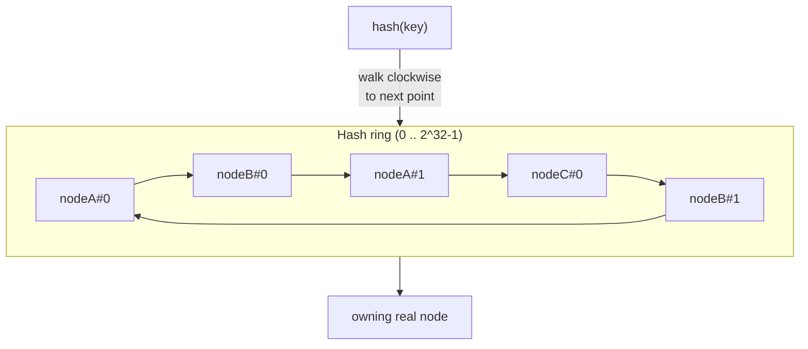

# Consistent Hashing — Cross-Cutting Concept

*(Not one of the 16 core designs — this is a building block referenced by sharding, load
balancing, and distributed-cache designs throughout this learning path, e.g. [Distributed Cache](../lru-distributed-cache/README.md), database sharding in week 3, and load balancer routing in week 2.)*

## References
- Read first: [Consistent Hashing for System Design Interviews — Hello Interview](https://www.hellointerview.com/learn/system-design/core-concepts/consistent-hashing)
- Quick reference: [Consistent Hashing Quick Reference — Hello Interview](https://www.hellointerview.com/learn/system-design/core-concepts/consistent-hashing/quick-reference)
- Watch: [Consistent Hashing Explained: Interview Guide for Distributed Systems Mastery (YouTube)](https://www.youtube.com/watch?v=CfwmTPzTdUc)

## Practice prompt
Whiteboard why naive `hash(key) % N` sharding is a disaster when N changes: with 10 servers, adding
an 11th remaps ~91% of keys. Then design a ring-based scheme where adding or removing one node only
remaps keys owned by that node — and explain why a single hash point per node isn't enough (hot spots)
and what virtual nodes fix.

## 1. Requirements

**Functional**
- Map an arbitrary key (cache key, shard key, request) to one of N nodes, deterministically.
- Support adding/removing nodes without a full remap of all keys.

**Non-functional**
- Minimal key movement on membership change: ideally only ~1/N of keys move when a node is added or removed.
- Even load distribution across nodes even with a small number of physical nodes.
- O(log N) lookup (interview-friendly: binary search over sorted hash points).

## 2. API

```
ring.AddNode(nodeID string)
ring.RemoveNode(nodeID string)
ring.Get(key string) (nodeID string, ok bool)
```
This is a library/algorithm used inside a routing layer (load balancer, cache client, shard router) —
not a client-facing HTTP API.

## 3. High-level design



- Hash both nodes and keys onto the same circular space (e.g. `[0, 2^32)`, via CRC32/MD5/xxhash).
- A key is owned by the first node hash point encountered walking clockwise from the key's hash
  (wrapping around past the maximum back to zero).
- **Virtual nodes**: each real node is hashed multiple times (e.g. 100-200 replicas: `"nodeA#0"`,
  `"nodeA#1"`, ...) and placed at each resulting point. Without this, a handful of real nodes produce
  an uneven, clumpy ring (some nodes get much more of the keyspace than others by chance). Virtual
  nodes smooth this out — this repo's Go demo verifies distribution stays within ~15% of even across
  4 real nodes with 200 virtual nodes each.

## 4. Deep dives

- **How much data moves on add/remove?** Only the keys that fall between the new/removed node's
  ring position(s) and the previous node clockwise. For N nodes, expected fraction moved is ~1/N —
  this repo's test (`TestMinimalRemappingOnNodeAdd`/`Remove`) empirically confirms this on a 4-5 node
  ring, in contrast to the ~(N-1)/N churn that modulo hashing would cause.
- **Choosing the number of virtual nodes**: too few (e.g. 1 per node) risks hot/cold nodes from
  random clustering; too many (e.g. 10,000) costs memory and slows the sorted-list lookup. 100-200 is
  a common interview-safe number; production systems like Cassandra/DynamoDB tune this per workload.
- **Weighted nodes**: a bigger/faster node can be given proportionally more virtual node replicas so
  it absorbs a proportionally larger share of the keyspace — useful when the cluster is heterogeneous
  (e.g. mixed instance sizes during a rolling upgrade).
- **Where this shows up**: distributed caches (Memcached/Redis Cluster) partitioning keys across
  cache nodes, database sharding (Cassandra/DynamoDB) choosing which shard owns a row, and some load
  balancers routing requests to backend pools with sticky, minimal-disruption assignment.

## 5. Trade-offs

| Approach | Remap on node add/remove | Load evenness (few nodes) | Lookup cost |
|---|---|---|---|
| Modulo hashing (`hash(key) % N`) | ~(N-1)/N of all keys | Even (by construction) | O(1) |
| Consistent hashing, no virtual nodes | ~1/N of keys | Poor (clumpy) with few nodes | O(log N) |
| Consistent hashing + virtual nodes | ~1/N of keys | Good, smooths with ~100+ replicas/node | O(log N) over N×replicas points |

This repo's Go demo implements **consistent hashing with virtual nodes** using `crc32` and a sorted
slice + binary search for the ring lookup.

## 6. How to narrate this in the interview

**Time budget (45 min)**
- 5 min: requirements & clarifying questions.
- 5 min: scale estimation (node count, keys, expected churn rate).
- 5 min: API (it's a small library interface — don't over-spend here).
- 15 min: high-level design — build the ring on the whiteboard step by step, this is most of the value.
- 15 min: deep dives — virtual node count, remap-fraction math, weighted nodes; this design is almost
  entirely deep-dive content once the ring concept is on the board.

**Clarifying questions to ask early**
- "Is this a standalone question, or is it the partitioning layer inside a bigger system (cache, DB
  shard router, load balancer) I should design around?"
- "Do nodes need weighted capacity (heterogeneous instance sizes), or can I assume uniform nodes?"
- "How dynamic is membership — occasional planned scaling, or frequent node churn/failures I need to
  handle gracefully?"

**Whiteboard reveal order**
1. Draw the ring with a handful of real nodes and show the modulo-hashing failure mode first (why
   `hash(key) % N` is wrong) — this motivates everything that follows.
2. Add key placement and clockwise-lookup on the same ring.
3. Introduce virtual nodes last, showing the "before" (clumpy, uneven) and "after" (smooth) load
   distribution — this is the payoff moment of the whole design.

**Scale/failure follow-up**
*"What if one physical node keeps failing and rejoining repeatedly (flapping)?"*
Model answer: each add/remove event triggers a ~1/N remap and re-sync of the affected key range, so
flapping causes repeated, wasted re-sync traffic for that node's virtual node positions. Mitigate with a
short grace period/hysteresis before actually removing a flapping node from the ring (treat brief
unavailability as a transient failure served by a replica, not a membership change), so the ring only
reshapes on a genuinely sustained failure — this avoids churn-induced thrashing while still detecting real
failures within a bounded time.

**Common mistake**
Candidates often explain consistent hashing correctly but skip virtual nodes entirely, leaving a ring
with only a handful of points that's badly load-imbalanced by chance. Avoid this by proactively
introducing virtual nodes as part of the base design, not as an afterthought only raised if prompted.

## Run it

```bash
cd interview-prep
go test ./hld/designs/consistent-hashing/go/... -v
```
