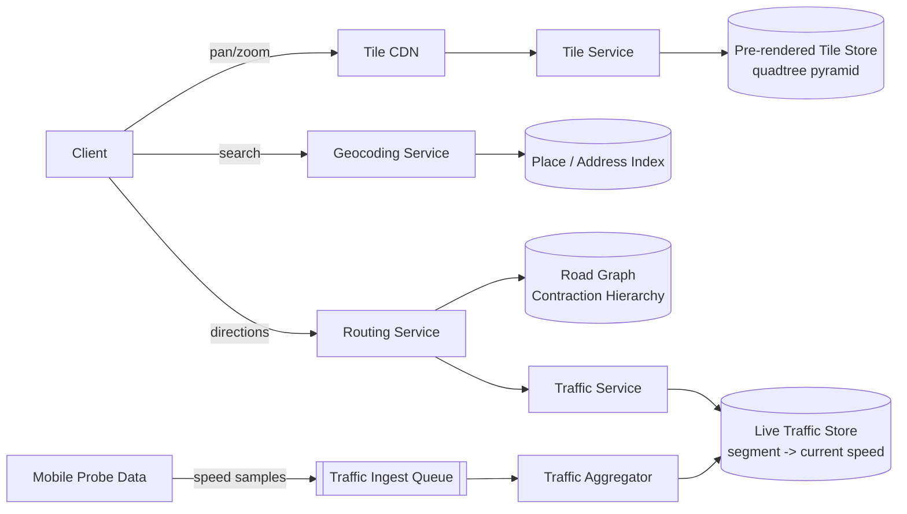

# Google Maps — High Level Design

🎯 Asked at: Google

## References
- Read first: [Design Google Maps — Hello Interview Community](https://www.hellointerview.com/community/questions/map-service-design/cm7wcazsa010t133rbusc7igc)
- Background: [Proximity Search in System Design Interviews — Hello Interview](https://www.hellointerview.com/learn/system-design/deep-dives/proximity-search) — the geo-indexing deep dive (geohash, S2, H3) this design leans on
- Watch: [Google Maps System Design Interview Question (YouTube)](https://www.youtube.com/watch?v=1pmcoh4hc_A)

## Practice prompt
Before reading further: whiteboard how you'd serve a "get directions from A to B" request across a road
network with ~1 billion edges, where the response must come back in well under a second and must reflect
traffic conditions that changed in the last few minutes. Decide how the map itself is stored/served as
you zoom (you can't ship the whole planet's roads to a phone at once), and how a shortest-path algorithm
that's normally O(V log V + E) can possibly run fast enough on a graph that large.

## 1. Requirements

**Functional**
- Render a map of a given viewport at a given zoom level (pan/zoom like the real product).
- Given an origin and destination, return one or more routes with turn-by-turn directions and an ETA.
- Search for a place/address (geocoding) and reverse-geocode a lat/lng back to an address.
- Incorporate live traffic conditions into routing and ETA.

**Non-functional**
- Map tile/viewport loads must feel instant (<100ms) while panning/zooming.
- Route computation should return in well under a second even for long cross-country routes.
- Scale: global road network (~billions of road segments), hundreds of millions of daily active users,
  route requests on the order of 100K+/sec at peak.
- Traffic data is inherently approximate and constantly changing — routing must tolerate slightly stale
  data rather than blocking on perfectly fresh data.

## 2. API design

```
GET /tiles/{zoom}/{x}/{y}
  -> binary/vector tile data for that zoom level and tile coordinate

GET /geocode?address={text}
  -> { lat, lng, formattedAddress, placeId }

GET /reverse-geocode?lat={lat}&lng={lng}
  -> { formattedAddress, placeId }

GET /directions?origin={lat,lng}&destination={lat,lng}&mode={driving|walking|transit}
  -> { routes: [{ polyline, distanceMeters, etaSeconds, steps: [...] }] }

POST /traffic/ingest   (internal, from probe/telemetry pipeline)
  body: { segmentId, avgSpeed, timestamp, sourceDeviceCount }
```

## 3. High-level design



- **Map rendering**: the world is pre-rendered offline into a **tile pyramid** (see deep dive) and served
  from a CDN; the tile service only needs to run on cache miss, since tiles change far less often than
  they're read.
- **Geocoding**: address search and reverse-geocoding are served from a separate inverted/spatial index
  over place data — this is decoupled from routing since it's a different access pattern (fuzzy text
  match / point lookup vs graph traversal).
- **Routing**: the routing service runs shortest-path over a preprocessed road graph (not a naive
  Dijkstra over the raw graph — see deep dive), and consults the traffic service for current edge weights
  before/during the search.
- **Traffic ingestion**: anonymized speed samples stream in continuously from mobile clients, get
  aggregated per road segment (median speed over a recent time window), and are written to a store the
  routing service reads from — this pipeline is fully decoupled from the request-serving path.

## 4. Deep dives

- **Map tile pyramid / quadtree tiling**: the map is pre-rendered at multiple discrete zoom levels
  (0 = whole world in one tile, up to ~20 for street-level detail); at each zoom level the world is cut
  into a grid of fixed-size tiles (typically 256x256px), addressed by `(zoom, x, y)`. This is a quadtree:
  each tile at zoom `z` covers exactly the area of 4 tiles at zoom `z+1`. Panning/zooming the client just
  fetches the small set of tiles covering the new viewport by CDN key — no server-side rendering happens
  on the read path, since tiles were rendered once offline and are immutable until the map data changes
  (which triggers re-rendering just the affected tiles, not the whole pyramid).
- **Routing at scale — Dijkstra vs A\* vs Contraction Hierarchies**:
  - *Dijkstra*: correct shortest path, but explores outward in all directions from the source — on a
    continent-scale graph with billions of edges this is far too slow for an interactive product.
  - *A\**: adds a heuristic (straight-line/great-circle distance to the destination) to bias the search
    toward the goal, pruning a lot of Dijkstra's wasted exploration — much faster in practice, still
    guarantees shortest path if the heuristic is admissible (never overestimates), but is still a full
    graph search and doesn't scale to sub-second continent-wide queries alone.
  - *Contraction Hierarchies (CH)*: a preprocessing step that ranks and "contracts" nodes (removes a node
    from the graph, adding shortcut edges between its neighbors that preserve shortest-path distances),
    building a hierarchy from local roads up to highways. At query time, search only needs to go "up" the
    hierarchy from both source and destination and meet in the middle over a vastly smaller set of
    shortcut edges — this is what makes sub-second routing over a planet-scale graph possible. The
    trade-off is expensive offline preprocessing and that shortcuts need periodic recomputation as the
    road network changes (new roads, closures).
  - Interview-safe answer: mention Dijkstra/A\* as the conceptual baseline, then pivot to "in practice,
    production routing engines like Google's/OSRM's use Contraction Hierarchies (or similar
    hub-labeling/ALT preprocessing) so the online query only touches a tiny fraction of the graph."
- **Incorporating real-time traffic**: edge weights in the road graph aren't static distances — they're
  time costs derived from current speed. Two approaches: (1) bake traffic into the preprocessed CH
  shortcuts periodically (e.g. every few minutes, rebuild/reweight shortcuts from the aggregated traffic
  store — cheap reads, but traffic is always slightly stale), or (2) keep CH shortcuts distance-based and
  apply a live traffic correction factor at query time on the final path's edges (fresher, but adds
  per-query work). Production systems use a hybrid: coarse traffic patterns baked into periodic
  reweighting, with a lightweight live adjustment pass over the specific route just computed.
- **Geo-indexing for "nearby" queries** (e.g. "gas stations near me"): this is the same
  geohash/quadtree/H3 spatial-indexing problem covered in this week's concept notes
  (`../../week-07-location-scheduling/README.md`) — reduce the 2D nearest-neighbor query to a 1D
  range/prefix lookup over an indexed store, then filter the small candidate set by exact distance.

## 5. Trade-offs

| Tiling approach | Read cost | Update cost | Notes |
|---|---|---|---|
| Pre-rendered tile pyramid (quadtree) | O(1) CDN fetch per tile | Re-render only affected tiles | Standard approach; decouples rendering from serving |
| Render-on-request | Higher, server-side rendering per request | No pre-render step | Only viable for rarely-viewed/custom overlays |

| Routing algorithm | Query latency at planet scale | Preprocessing cost | Guarantees shortest path |
|---|---|---|---|
| Dijkstra | Too slow (seconds+) | None | Yes |
| A\* | Faster, still full search | None | Yes (with admissible heuristic) |
| Contraction Hierarchies | Sub-second | High, periodic rebuild | Yes, over preprocessed graph |

## 6. How to narrate this in the interview

**Time budget (45 min)**
- 5 min: requirements & clarifying questions.
- 5 min: scale estimation (tiles served/day, route requests/sec, road graph size).
- 10 min: API + data model (tile addressing scheme, road graph representation, traffic schema).
- 15 min: high-level design (tile pyramid, geocoding, routing service, traffic pipeline).
- 10 min: deep dives — spend most of this on the routing algorithm progression (Dijkstra → A\* →
  Contraction Hierarchies), since that's the part interviewers actually want to see you reason through.

**Clarifying questions to ask early**
- "Should I focus on map rendering/tiling, on the routing/directions engine, or both — most interviews
  narrow to one to go deep"?
- "Do we need to support live traffic-aware routing, or is a static-distance shortest path acceptable
  for a first pass?"
- "What's the expected route length — city-scale (short) or continent-scale (long), since that changes
  whether naive Dijkstra is even in the realm of acceptable"?

**Whiteboard reveal order**
1. Draw the tile pyramid/CDN path first (client → CDN → tile service → tile store) — it's the simplest
   piece and establishes the "precompute once, serve many times" pattern you'll reuse for routing.
2. Draw the routing service and road graph next, with a naive Dijkstra/A\* call — get a functionally
   correct design on the board before optimizing.
3. Layer in the traffic ingestion pipeline (probes → queue → aggregator → traffic store) last, and show
   how it plugs into routing — this is usually where the deep-dive conversation naturally starts.

**Scale/failure follow-up**
*"What if the routing service needs to handle 10x more requests, including a national holiday spike?"*
Model answer: shard the road graph geographically (e.g. by region/country) across multiple routing
service instances so no single instance holds the whole planet's graph in memory, and route incoming
requests to the shard(s) covering the origin/destination (long routes that cross shard boundaries get
stitched together at shard borders using precomputed border-to-border shortest paths). Scale the
stateless routing service instances horizontally behind a load balancer, and keep the CH preprocessing
job separate from the serving path entirely so a traffic spike never contends with graph rebuilding.
Cache extremely common routes (e.g. popular commute pairs) at the edge to shave load off the routing tier
for the highest-frequency queries.

**Common mistake**
Candidates often try to run plain Dijkstra "at Google Maps scale" without acknowledging it doesn't work
online — spending all their deep-dive time on caching or sharding while glossing over the fact that a
naive shortest-path algorithm can't return in sub-second time over a billion-edge graph. Avoid this by
explicitly naming the preprocessing trade-off (Contraction Hierarchies or equivalent) as the core insight
of this design, not an afterthought.
