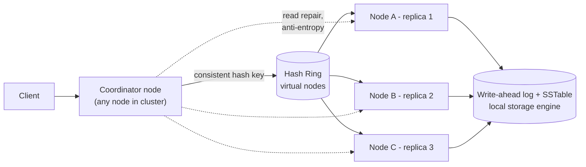

# Key-Value Store (DynamoDB/Redis-style) — High Level Design

🎯 Asked at: Amazon

## References
- Read first: [Design a Key-Value Store — Hello Interview Community](https://www.hellointerview.com/community/questions/key-value-store/cm8gcrkz800b7epmpcj06fkwk) and the [DynamoDB Deep Dive — Hello Interview](https://www.hellointerview.com/learn/system-design/deep-dives/dynamodb)
- Watch: [System Design Interview: Designing a Distributed Key-Value Store (Dynamo Style) (YouTube)](https://www.youtube.com/watch?v=j8iDY_RudJw)
- Background paper concepts: [Redis Deep Dive — Hello Interview](https://www.hellointerview.com/learn/system-design/deep-dives/redis) (for the single-node data-structure side of key-value stores)

## Practice prompt
Whiteboard a cloud-scale key-value store (`put`, `get`, `delete`) supporting values up to 1MB (rare
cases to 2GB), needing "read your own writes" consistency but otherwise optimized for availability,
durability, and horizontal scale. Decide: how do you partition keys across nodes without a hot spot
when you add/remove nodes? How many replicas, and what's your read/write quorum? What happens during
a network partition — do you favor consistency or availability for this workload?

## 1. Requirements

**Functional**
- `PUT(key, value)`, `GET(key)`, `DELETE(key)`; optionally TTL and conditional writes.
- Read-your-own-writes consistency for a single client/session.

**Non-functional**
- Horizontally scalable to many TBs / millions of keys per node cluster.
- High availability — tolerate node failures without downtime (favor AP over CP per CAP, tunable).
- Durability — writes survive a node crash; low tail latency for both reads and writes.

## 2. API

```
PUT    /v1/keys/{key}   body: { value, ttl? }        -> 200 { version }
GET    /v1/keys/{key}                                  -> 200 { value, version }
DELETE /v1/keys/{key}                                  -> 200
```

## 3. High-level design



- **Partitioning**: consistent hashing places each key on a point on a ring; the key is owned by the
  next N nodes clockwise (N = replication factor). Virtual nodes (many tokens per physical node) keep
  the load balanced when nodes join/leave.
- **Replication**: each key is stored on N nodes (typically 3). Any node can act as coordinator for a
  request, forwarding to the correct replica set.
- **Storage engine per node**: an LSM-tree (write-ahead log + memtable + periodically flushed SSTables)
  gives fast sequential writes and is the standard choice for write-heavy key-value stores (Cassandra,
  RocksDB, DynamoDB's internals).

## 4. Deep dives

- **Consistent hashing**: naive `hash(key) % N` reshuffles nearly every key when a node is added or
  removed. Consistent hashing maps both nodes and keys onto a ring (via a hash function); adding/removing
  a node only remaps the keys between it and its neighbor, not the whole keyspace. Virtual nodes (each
  physical node owns many ring positions) further smooth load distribution and speed up rebalancing after
  a node join/leave since the affected range is spread across many other nodes rather than one neighbor.
- **Read/write quorum trade-off**: with N replicas, define W (write quorum) and R (read quorum). If
  `W + R > N`, every read overlaps with the most recent write's replica set, giving strong(er)
  consistency (Dynamo-style "sloppy quorum"). Common choices: `N=3, W=2, R=2` (balanced), `W=1` (fast
  writes, weaker durability guarantee until replication catches up), `R=N` (strongest reads, slowest).
  This is the single dial that lets you trade latency/availability against consistency per workload.
- **Conflict resolution**: concurrent writes to the same key across replicas (e.g. during a partition)
  can diverge. Options: last-write-wins (simple, can silently drop a write), vector clocks (Dynamo's
  original approach — track causality, surface true conflicts to the application), or CRDTs for specific
  data types. Interview answer: last-write-wins with a well-defined clock (or hybrid logical clock) is
  usually acceptable unless the interviewer pushes on correctness.
- **Read-your-own-writes**: route a client's reads to the replica it last wrote to (sticky session), or
  require the client to pass back the version/timestamp it wrote and have the coordinator wait until a
  replica has caught up to at least that version before answering.
- **Hinted handoff + anti-entropy**: if a replica is down at write time, another node holds a "hint" and
  replays it once the replica recovers; background Merkle-tree comparisons between replicas (anti-entropy)
  catch and repair any data that still diverged.

## 5. Trade-offs

| Configuration | Consistency | Availability | Write latency | Read latency |
|---|---|---|---|---|
| W=1, R=1 (N=3) | Weak (eventual) | Highest | Lowest | Lowest |
| W=2, R=2 (N=3) | Strong-ish (`W+R>N`) | Good | Medium | Medium |
| W=N, R=1 | Strong on write | Lower (write needs all replicas up) | Highest | Lowest |
| W=1, R=N | Strong on read | Lower (read needs all replicas up) | Lowest | Highest |

| Conflict resolution | Simplicity | Correctness |
|---|---|---|
| Last-write-wins | Simple | Can silently drop concurrent writes |
| Vector clocks | Complex | Surfaces true conflicts, no silent loss |
| CRDTs | Medium (type-specific) | Automatic merge for supported types (counters, sets) |

## 6. How to narrate this in the interview

**Time budget (45 min)**
- 5 min: requirements & clarifying questions (value size, consistency needs, CAP preference).
- 5 min: scale estimation (key count, node count, replication factor).
- 10 min: API + data model (keep it simple — this API surface is small).
- 10 min: high-level design (ring, replication, storage engine).
- 15 min: deep dives — spend the most time on the quorum trade-off (`W+R>N`) and conflict resolution,
  since that's where most of the interesting judgment calls live for this design.

**Clarifying questions to ask early**
- "Do we need strong read-your-own-writes consistency, or is plain eventual consistency acceptable?"
- "What's the expected value size distribution — small (<1KB) values change some engine/network
  trade-offs versus large (MB-GB) blobs."
- "Should I favor availability or consistency during a network partition — i.e. AP or CP for this
  workload?"

**Whiteboard reveal order**
1. Draw the hash ring and partitioning first — it's the foundational structure everything else attaches to.
2. Add replication (N replicas per key) next.
3. Layer in the quorum read/write mechanics and conflict resolution last, once the ring and replicas are
   established — this is where the deepest discussion naturally happens.

**Scale/failure follow-up**
*"What if an entire availability zone goes down, taking out one full replica set for a range of keys?"*
Model answer: place replicas across availability zones (not just across physical nodes) when assigning
ring positions, so a single AZ failure only ever removes one of N replicas for any given key, never all of
them. In-flight requests to the downed AZ fail over to the remaining replicas; if the write/read quorum
can still be met with the surviving replicas (e.g. `W=2` met by the 2 remaining of `N=3`), the system
keeps serving without operator intervention. Once the AZ recovers, hinted handoff and anti-entropy
Merkle-tree comparisons bring the recovered replicas back in sync.

**Common mistake**
Candidates often pick `W=1, R=1` for "fast reads and writes" without acknowledging this gives essentially
no consistency guarantee and can silently return stale data indefinitely. Avoid this by explicitly stating
the quorum trade-off (`W+R>N` for consistency) and picking a configuration that matches the stated
requirement, rather than defaulting to the fastest option without justification.
