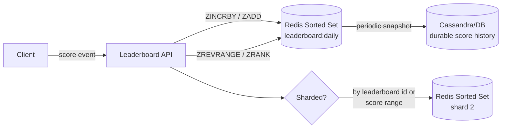

# Leaderboard / Distributed Counters — High Level Design

🎯 Asked at: Netflix

## References
- Read first: [Design an Online Game Leaderboard — Hello Interview Community](https://www.hellointerview.com/community/questions/cm4t0qbr9004988ilmum8jm06) and [Design YouTube's Top K Videos Feature — Hello Interview](https://www.hellointerview.com/learn/system-design/problem-breakdowns/top-k) (same top-K-at-scale core problem)
- Watch: [Designing Real-Time Leaderboards: Redis Sorted Sets and Architecture Patterns (YouTube)](https://www.youtube.com/watch?v=9yEPu8oSrhI)

## Practice prompt
Whiteboard a real-time leaderboard: users see their global rank, the K scores around them, and a
top-N list, updated continuously as millions of score events land per second. Decide: why is
`ORDER BY score DESC LIMIT N` on a SQL table the wrong approach at this scale? What data structure gives
O(log n) rank lookups and O(log n) updates? How do you shard it once one leaderboard key won't fit or
serve fast enough on a single node?

## 1. Requirements

**Functional**
- View current score and global rank in near real-time.
- View K scores immediately above/below the current user (their "neighborhood").
- View top-N leaderboard (e.g. daily/seasonal), refreshed continuously.

**Non-functional**
- Millions of score updates/day, bursty around events; rank queries must stay fast (sub-100ms) even as
  write volume grows.
- Reads vastly outnumber writes for any popular leaderboard (many viewers per score-changing event) —
  optimize for cheap reads, even at the cost of moving work to the write path.

## 2. API

```
POST /v1/leaderboards/{id}/scores
  body: { userId, delta }              -> 200 { newScore, newRank }

GET /v1/leaderboards/{id}/top?n=50     -> [{ userId, score, rank }, ...]
GET /v1/leaderboards/{id}/rank/{userId}?window=5
  -> { rank, neighbors: [{ userId, score, rank }, ...] }  // K above/below
```

## 3. High-level design



- **Why Redis Sorted Sets, not SQL `ORDER BY`**: SQL sorts on read — every `ORDER BY score DESC LIMIT N`
  re-sorts (or at best re-scans an index) at query time, and under millions of writes/sec that becomes a
  bottleneck since rank changes constantly invalidate any cached ordering. A sorted set (skip-list +
  hash map internally) sorts on write: `ZADD`/`ZINCRBY` keeps the structure ordered incrementally in
  O(log n), so reads (`ZRANGE`, `ZRANK`) are O(log n) or O(log n + count) with no sort step at all. This
  is the core trade-off: push the cost to the far less frequent write path.
- **Core Redis commands**: `ZADD key score member` (set absolute score), `ZINCRBY key delta member`
  (increment — the common case for "add points"), `ZREVRANGE key 0 N-1 WITHSCORES` (top-N),
  `ZRANK`/`ZREVRANK key member` (a user's rank), `ZRANGE key rank-K rank+K` (neighborhood around a rank).
  Five commands cover nearly the whole API surface above.
- **Durability**: Redis is in-memory; a durable store (Cassandra, or Redis persistence/AOF + replicas)
  backs it up so a Redis restart doesn't lose scores — Redis is the serving layer for reads/ranks, not
  necessarily the system of record.

## 4. Deep dives

- **Sorted-set ranking vs. naive SQL `ORDER BY`, quantified**: with a SQL table, computing "my rank"
  means `COUNT(*) WHERE score > mine` — an O(n) scan (or O(log n) with a well-maintained index, but the
  index itself becomes a write bottleneck at high update rates since every score change requires a B-tree
  rebalance). A sorted set gives O(log n) rank lookups intrinsically as part of its skip-list structure,
  and the whole structure lives in memory, avoiding disk I/O entirely on the hot path.
- **Scaling past one Redis instance**: a single sorted set for, say, 100M players fits in ~6GB of memory
  and Redis remains at ~27 comparisons per O(log n) op — this actually goes a long way on one instance.
  Once you need more throughput than one instance can serve, shard by hashing `userId` across N Redis
  instances, each maintaining its own partial sorted set; computing an exact *global* top-N or exact
  global rank then requires merging results across shards (fetch top-N from each shard, merge — correct
  for top-N; exact global rank requires summing cardinalities across shards up to the target score, which
  is more involved and often approximated).
- **Real-time updates to viewers**: pair the sorted-set backend with the "real-time updates" pattern
  (WebSocket/SSE push, see week 6 concept) so viewers watching a live leaderboard see rank changes
  without polling — polling `GET /top` from millions of viewers directly against Redis at high frequency
  would itself become the bottleneck.
- **Time-windowed leaderboards (daily/seasonal)**: use one sorted-set key per window (`leaderboard:2026-
  07-28`) with a TTL, rather than trying to expire individual members out of one long-lived set — this
  makes "reset for a new day" an O(1) operation (just start writing to a new key) instead of an O(n)
  purge.

## 5. Trade-offs

| Approach | Rank lookup | Top-N | Update cost | Scales past 1 node |
|---|---|---|---|---|
| SQL table + `ORDER BY` | O(n) scan or index rebuild pressure | Needs full sort/index scan | Cheap write, expensive index maintenance | Hard — sharding breaks global ordering further |
| Redis Sorted Set (single instance) | O(log n) | O(log n + N) | O(log n) | No — bounded by one instance's memory/CPU |
| Sharded Redis Sorted Sets | O(log n) per shard + merge | Merge across shards | O(log n) per shard | Yes, with approximate global exactness |

This design is best understood hands-on with a real Redis instance rather than by reading code —
`ZADD`/`ZINCRBY` for writes and `ZRANGE`/`ZREVRANGE`/`ZRANK` for reads. If you have Redis installed
locally (`redis-server` + `redis-cli`), run the commands yourself against a scratch sorted set before
your interview; that hands-on rep is worth more here than reading this repo's Go code.

## 6. How to narrate this in the interview

**Time budget (45 min)**
- 5 min: requirements & clarifying questions.
- 5 min: scale estimation (player count, score-update rate, read:write ratio).
- 10 min: API + data model (score/rank/neighborhood endpoints).
- 10 min: high-level design (sorted set, durability backing, sharding hook).
- 15 min: deep dives — this design's whole value is in explaining *why* a sorted set beats SQL `ORDER
  BY`, so give that the most airtime, then cover sharding and time-windowed leaderboards.

**Clarifying questions to ask early**
- "Do we need an exact global rank at scale, or is an approximate rank acceptable once we shard across
  multiple Redis instances?"
- "Is this a single global leaderboard, or many concurrent leaderboards (e.g. per-game, per-day) sharing
  the same infrastructure?"
- "Do viewers need real-time push updates to the leaderboard, or is polling/refresh-on-view acceptable?"

**Whiteboard reveal order**
1. Draw the naive SQL `ORDER BY` approach first and explicitly call out why it breaks down at scale —
   this sets up the motivation for the sorted-set answer.
2. Draw the Redis sorted set and its core commands (`ZADD`/`ZINCRBY`/`ZRANGE`/`ZRANK`) next.
3. Layer in durability (async snapshot to a durable store) and sharding last, once the single-node
   design is solid.

**Scale/failure follow-up**
*"What if a single leaderboard grows past what one Redis instance can hold (e.g. 500M players)?"*
Model answer: shard the sorted set by hashing `userId` (or by a natural partition like region) across N
Redis instances, each holding a partial ordered set. Top-N queries fetch the top-N from every shard and
merge client-side (correct, since the true top-N must appear in some shard's local top-N). Exact global
rank is harder — it requires summing "how many players below this score" across every shard, which is
either computed on demand (slower, exact) or approximated with a periodically-refreshed global sketch if
sub-100ms exact rank isn't achievable across shards.

**Common mistake**
Candidates often jump straight to "use Redis" without articulating *why* — i.e. without contrasting it
against a SQL `ORDER BY` and explaining the O(log n) sorted-insert vs. O(n) (or index-churn-heavy) sort-on-
read distinction. Avoid this by walking through the naive approach's failure mode explicitly before
introducing the sorted set as the fix.
