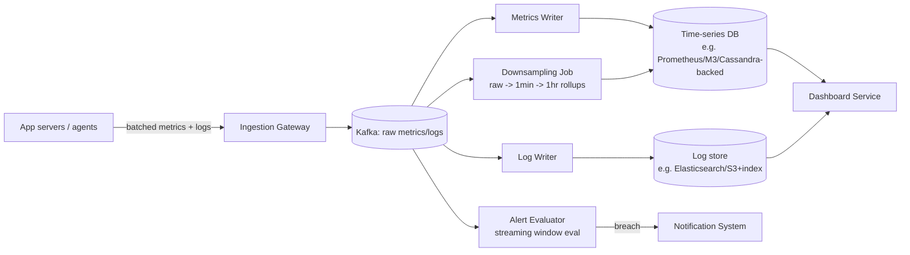

# Logging & Monitoring System — High Level Design

🎯 Asked at: Microsoft

## References
- Read first: [Design a Metrics Monitoring Platform like Datadog — Hello Interview](https://www.hellointerview.com/learn/system-design/problem-breakdowns/metrics-monitoring)
- Watch: [Building a Real Time Metrics Database at Datadog (YouTube)](https://www.youtube.com/watch?v=uQrRbvLyJ4M)
- Related: [Design a Client Device Log Collection and Viewing System — Hello Interview Community](https://www.hellointerview.com/community/questions/log-ingestion-system/cmp3gf5f203st08adwrv5jev4) (the log-aggregation half of this design)

## Practice prompt
Whiteboard a platform that ingests logs and metrics from hundreds of thousands of servers (each server
emitting ~100 metric points every 10s — ~5M metrics/sec at peak, ~1GB/sec raw), stores them queryable
by time range and labels, renders dashboards, and fires alerts on threshold breaches. Decide: what
happens to your storage engine if a label (like a raw user ID) becomes part of the metric key — the
"cardinality explosion" problem? How do you keep years of history without keeping every raw data point
forever? How does an alert get evaluated without re-scanning all history on every tick?

## 1. Requirements

**Functional**
- Ingest structured logs and numeric metrics (CPU, latency, custom app counters) from all services.
- Query logs/metrics by time range, service, and labels; render time-series dashboards.
- Define threshold-based alert rules that notify on-call when breached.

**Non-functional**
- High write throughput: millions of data points/sec at peak (~1GB/sec raw ingestion).
- Query latency: dashboards should render in seconds even over weeks of history.
- Storage cost must stay bounded — cannot retain raw-resolution data forever.

## 2. API

```
POST /v1/metrics       body: [{ name, value, timestamp, labels: {...} }, ...]   -> 202 Accepted
POST /v1/logs          body: [{ service, level, message, timestamp, traceId }, ...] -> 202 Accepted

GET /v1/metrics/query?name=&labels=&from=&to=&step=  -> [{ timestamp, value }, ...]
GET /v1/logs/search?query=&service=&from=&to=         -> [{ timestamp, message, ... }, ...]

POST /v1/alerts   body: { metricQuery, threshold, comparison, forDuration } -> { alertId }
```

## 3. High-level design



- **Ingestion**: agents batch and push metrics/logs to a gateway, which writes to Kafka for durability
  and backpressure absorption — decoupling bursty producer load from the storage writers.
- **Storage split**: metrics go to a time-series-optimized store (columnar, time-partitioned); logs go
  to a full-text-searchable store — the access patterns (range-scan-by-time-and-label vs. full-text
  search) are different enough to want different engines.
- **Downsampling**: a background job continuously rolls raw (e.g. 10s resolution) data up into coarser
  resolutions (1min, 1hr) so long-range dashboard queries read far fewer points, and old raw data can be
  deleted/archived once rolled up.
- **Alerting**: rather than polling the TSDB on a timer for every rule (expensive at scale), alert
  evaluation runs as a streaming consumer over the same Kafka topic, maintaining a sliding window per
  rule in memory and firing the moment a threshold is breached for the configured duration.

## 4. Deep dives

- **Cardinality explosion**: a metric's identity in most TSDBs is `name + all label key-value pairs`. If
  a label captures something with unbounded distinct values (raw user ID, request ID, IP address), each
  distinct combination becomes a new time series — this can turn a handful of metric names into billions
  of series, blowing up index memory and destroying query performance. Mitigation: enforce a label
  cardinality budget/allowlist at the ingestion gateway, reject or quarantine unbounded labels, and push
  high-cardinality data (e.g. per-request traces) into the log/trace store instead of the metrics store,
  which is built for exactly that kind of data.
- **Downsampling / retention strategy**: keep raw-resolution data only briefly (e.g. 24-48h, for
  debugging an active incident), 1-minute rollups for weeks, 1-hour rollups for years — each tier is
  progressively smaller, keeping total storage bounded regardless of retention window length. This is
  the only thing that keeps storage cost from growing unboundedly at 1GB/sec ingestion.
- **High write volume ingestion path**: writes are append-only and roughly sequential by time, which
  favors an LSM-tree-backed or purpose-built time-series storage engine over a general-purpose relational
  DB; batching writes client-side (agents) and server-side (writers) amortizes per-write overhead at this
  volume.
- **Alert evaluation without full re-scans**: streaming alert evaluators keep only a small sliding window
  of recent state in memory per rule (e.g. "average over last 5 minutes"), updated incrementally as new
  points arrive from Kafka, rather than issuing a fresh query against the TSDB on every evaluation tick —
  this keeps evaluation cost independent of total stored history.

## 5. Trade-offs

| Design choice | Pro | Con |
|---|---|---|
| Separate TSDB (metrics) + search store (logs) | Each optimized for its access pattern | Two systems to run/operate |
| Kafka as ingestion buffer | Absorbs bursts, decouples writers from producers | Added latency + infra vs. direct writes |
| Tiered downsampling (raw -> 1min -> 1hr) | Bounded storage cost, fast long-range queries | Loses fine-grained resolution for old data |
| Streaming alert evaluation | Low latency, scales independently of stored history size | More complex than "just query on a timer" |
| Label cardinality limits | Protects TSDB from cardinality explosion | Requires upfront schema/label discipline from service owners |

## 6. How to narrate this in the interview

**Time budget (45 min)**
- 5 min: requirements & clarifying questions.
- 5 min: scale estimation (metrics/sec, retention window, dashboard query volume).
- 10 min: API + data model (metric/log schema, label shape).
- 10 min: high-level design (ingestion, storage split, downsampling, alerting).
- 15 min: deep dives — cardinality explosion is the single most interview-differentiating topic here, so
  lead with it; downsampling/retention and streaming alert evaluation follow.

**Clarifying questions to ask early**
- "Should I design logs and metrics as one unified pipeline, or can I treat them as two systems sharing
  only the ingestion gateway?"
- "What retention/compliance requirements apply — is unbounded raw-resolution retention ever needed, or
  is tiered downsampling always acceptable?"
- "Do alerts need to fire within seconds of a breach, or is a delay of a minute or two acceptable?"

**Whiteboard reveal order**
1. Draw the ingestion path first (agents → gateway → Kafka) — it establishes that this is a
   write-heavy, buffered pipeline before anything else.
2. Draw the storage split (TSDB for metrics, search store for logs) next.
3. Layer in downsampling and streaming alert evaluation last, since both are refinements on top of the
   already-established storage tier.

**Scale/failure follow-up**
*"What if Kafka (the ingestion buffer) falls behind or goes down during a traffic spike?"*
Model answer: agents buffer locally (bounded, with backpressure/drop-oldest policy once the local buffer
fills) and retry with backoff against the ingestion gateway, so a brief Kafka outage doesn't immediately
lose data — it just delays it. If Kafka is down long enough that agent-side buffers fill, the system
degrades gracefully by dropping the least-important data first (e.g. debug-level logs before metrics, or
downsampled-anyway old data before recent data) rather than falling over entirely; this trade-off should
be called out explicitly since monitoring systems are expected to degrade, not cascade-fail, when they're
needed most (during an incident).

**Common mistake**
Candidates often design a solid ingestion/storage pipeline but never mention cardinality explosion,
missing the single most common real-world failure mode for metrics systems. Avoid this by proactively
raising what happens if a label like `userId` or `requestId` gets attached to a metric, and naming the
mitigation (cardinality budgets, routing high-cardinality data to logs/traces instead).
