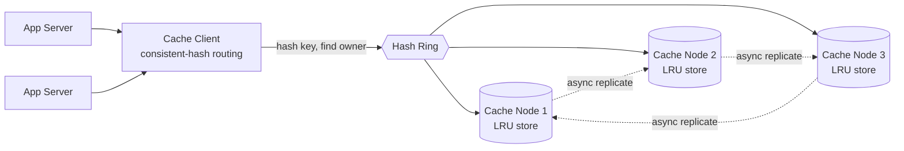

# Distributed Cache — High Level Design

🎯 Asked at: Uber (also a very common Amazon/Meta system-design question, framed as "design a cache
like Redis/Memcached" — one of the highest-yield HLD questions industry-wide)

## References
- Read first: [Design a Distributed Cache Like Redis — Hello Interview](https://www.hellointerview.com/learn/system-design/problem-breakdowns/distributed-cache)
- Community breakdown: [Design a Distributed Cache System — Hello Interview](https://www.hellointerview.com/community/questions/distributed-cache-system/cm6d9gnep03c46hpqrwc062ir)
- Watch: [System Design Interview - Design a Distributed LRU Cache (Full mock interview with Sr. MAANG SWE) (YouTube)](https://www.youtube.com/watch?v=lZ5QuFLCVn0)
- Cross-reference: [Consistent Hashing — this repo](../consistent-hashing/README.md) (the partitioning
  scheme used below) and this repo's [`lld/problems/lru-cache`](../../../lld/problems/lru-cache/README.md)
  (the single-node eviction core this design scales out)

## Practice prompt
Before reading further: whiteboard a cache that must serve `get`/`put` for billions of keys with
sub-millisecond latency, more data than fits on one machine, and survive individual node failures.
Decide: how do you split keys across nodes so adding/removing a node doesn't reshuffle everything?
What eviction policy runs on each node? What happens when a client reads right after a write lands on
a different replica? What do you do about one key everyone hits at once?

## 1. Requirements

**Functional**
- `Get(key) -> value` / `Put(key, value)` with low latency, backed by an LRU eviction policy per node
  when a node's capacity is exceeded.
- Data is partitioned across many cache nodes — no single node holds the whole keyspace.
- The cluster tolerates individual node failure without losing all data for the keys that node owned
  (via replication) and without a client-visible outage.

**Non-functional**
- Sub-millisecond to low-single-digit-millisecond latency for both reads and writes.
- Scale: billions of keys, terabytes of data — far more than one machine's RAM.
- Adding/removing a node should reshuffle only a small fraction of keys, not the whole keyspace.
- Reasonable consistency: this is a cache, so slightly stale reads are an acceptable trade for speed
  (see the consistency deep dive below) — this is not a system that needs linearizability.

## 2. API

```
client.Get(key string) (value string, ok bool)
client.Put(key string, value string, ttl time.Duration)
client.Delete(key string)
```
Exposed to application servers as a thin client library that resolves `key -> owning node` (via the
consistent-hash ring) and then speaks a simple wire protocol to that node.

## 3. High-level design



- **Partitioning via consistent hashing**: each key is routed to an owning node by walking the hash
  ring clockwise from `hash(key)`, exactly as described in
  [`consistent-hashing`](../consistent-hashing/README.md). This is what lets the cluster add/remove
  nodes while remapping only ~1/N of keys, instead of the ~(N-1)/N churn a naive `hash(key) % N` would
  cause every time the node count changes.
- **Per-node eviction core**: every cache node runs an independent, single-node LRU cache — this
  repo's `go/lru.go` (package `lrudistributedcache`) is exactly that core: a `map[string]*node` plus a
  sentinel-headed doubly linked list giving O(1) `Get`/`Put`/evict, guarded by one `sync.Mutex` per
  node. The distributed design is many independent copies of this structure, one per shard, with
  consistent hashing deciding which copy owns which key.
- **Replication**: each key's owning node asynchronously replicates to N-1 successor nodes on the ring,
  so losing one node doesn't lose the data for the keys it owned — a replica can serve reads (and,
  after a leader-failure/promotion step, writes) until the failed node recovers or is replaced.

## 4. Deep dives

- **Eviction policy choice — why LRU?** LRU approximates "keep what's likely to be reused" cheaply
  (O(1) per access) and matches typical request locality (recently-read items are often read again
  soon). LFU would track *frequency* instead of *recency* and suits workloads with a stable hot set
  that shouldn't be evicted by a burst of one-off reads, at the cost of extra bookkeeping (frequency
  counters, decay). FIFO is cheapest but ignores access patterns entirely — rarely the right default.
  This repo's `lru.go` core implements LRU because it's the standard interview-safe answer and is
  exactly the same HashMap+DLL structure as [`lld/problems/lru-cache`](../../../lld/problems/lru-cache/README.md).
- **Consistency model — eventual, not strong**: writes replicate asynchronously, so a read immediately
  after a write can hit a replica that hasn't caught up yet and return stale data. This is the right
  trade for a cache (the source of truth is the backing database; a stale cache read just means an
  extra trip to the DB, not corrupted state) — call this out explicitly rather than defaulting to
  "strong consistency," which would add cross-replica coordination latency on every write for no
  benefit a cache actually needs. A **read-through** pattern (cache miss -> read DB -> populate cache)
  is the standard way to keep the cache eventually correct.
- **Partitioning via consistent hashing (why not modulo)**: `hash(key) % N` remaps ~(N-1)/N of all keys
  whenever N changes — unacceptable when nodes autoscale or fail. Consistent hashing with virtual nodes
  (100-200 per physical node) keeps remap churn to ~1/N and smooths load distribution across a small
  node count; see [`consistent-hashing`](../consistent-hashing/README.md) for the full ring mechanics
  and empirical remap-fraction tests.
- **Hot-key mitigation**: consistent hashing balances *keyspace*, not *traffic* — one viral key (a
  celebrity's profile, a trending product) can still overwhelm the single node that owns it. Mitigate
  with: (a) client-side or edge-layer caching of the single hottest keys so most reads never reach the
  cache tier at all, (b) replicating especially hot keys to multiple nodes and having clients pick one
  at random ("key splitting"), or (c) request coalescing so concurrent misses for the same key trigger
  one backend fetch instead of a thundering herd.
- **Failure handling**: a node failure is detected via heartbeat/health-check; the ring routes future
  requests for that node's keys to its replica successor(s) until the node is replaced and rejoins the
  ring (at which point it resumes ownership and re-syncs from a replica).

## 5. Trade-offs

| Decision | Choice made | Alternative | Why |
|---|---|---|---|
| Eviction policy | LRU | LFU / FIFO | O(1), matches typical recency-biased access patterns; LFU adds bookkeeping for workloads where frequency matters more than recency |
| Partitioning | Consistent hashing + virtual nodes | Modulo hashing (`hash(key) % N`) | ~1/N remap on scaling events vs. ~(N-1)/N churn |
| Consistency | Eventual (async replication) | Strong/synchronous replication | Lower write latency; acceptable staleness since the DB remains the source of truth |
| Hot-key handling | Key splitting / edge caching for top keys | Uniform routing only | Prevents one popular key from bottlenecking a single node |

## 6. How to narrate this in the interview

**Time budget (45 min)**
- 5 min: requirements & clarifying questions.
- 5 min: scale estimation (key count, data size per node, node count).
- 10 min: API + data model (thin client interface, per-node LRU structure).
- 10 min: high-level design (ring, replication, per-node eviction).
- 15 min: deep dives — hot-key handling and the eventual-consistency trade-off are usually where
  interviewers push hardest, so weight the time there over restating eviction-policy basics.

**Clarifying questions to ask early**
- "Is this cache read-through (backed by a DB of record) or the system of record itself — that changes
  how much I need to worry about durability."
- "Do we need strong read-after-write consistency for any part of this, or is eventual consistency
  acceptable everywhere since it's a cache?"
- "Should I assume a roughly uniform key access pattern, or should I design explicitly for hot keys from
  the start?"

**Whiteboard reveal order**
1. Draw the client, hash ring, and cache nodes first — establish partitioning before anything else.
2. Add the per-node LRU eviction structure next, showing it's a normal single-node cache replicated many
   times, not something exotic per node.
3. Layer in replication and hot-key mitigation last, once the base partitioned design is solid.

**Scale/failure follow-up**
*"What if a single key becomes so hot it overwhelms the one node that owns it, even with virtual
nodes?"*
Model answer: consistent hashing balances the keyspace evenly but says nothing about traffic per key, so
one viral key can still saturate its owning node's CPU/network regardless of how well-distributed the
rest of the keyspace is. Mitigate by detecting hot keys (e.g. a sampling counter at the client or an
edge layer) and either replicating that specific key to several nodes with clients randomly picking one
("key splitting"), or caching it one layer closer to the client (local in-process cache with a short TTL)
so most reads for that key never reach the distributed cache tier at all.

**Common mistake**
Candidates often present consistent hashing as if it solves *all* load-balancing problems, without
distinguishing "even keyspace distribution" from "even traffic distribution." Avoid this by explicitly
naming the hot-key problem as a separate concern from partitioning, since interviewers frequently probe
exactly this gap.

## Run it

```bash
cd interview-prep
go test ./hld/designs/lru-distributed-cache/go/... -v
```

This exercises the single-node LRU eviction core (`New`, `Get`, `Put`, `Len`) that each shard of the
distributed design above runs internally — see `go/lru.go` and `go/lru_test.go`.
