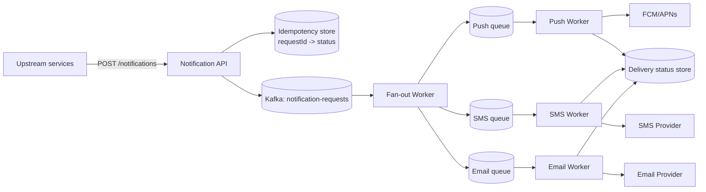

# Notification System — High Level Design

🎯 Asked at: Swiggy (also common at Uber, DoorDash, any multi-channel product)

## References
- Read first: [Design a Notification System — Hello Interview](https://www.hellointerview.com/learn/system-design/problem-breakdowns/notification-system)
- Watch: [System Design Part 14 — Design a Notification System: SMS, Email and Push (YouTube)](https://www.youtube.com/watch?v=1E3oeYkJ1P8)
- Related: [Real-time Updates Pattern — Hello Interview](https://www.hellointerview.com/learn/system-design/patterns/realtime-updates) (for the push-delivery half of this design)

## Practice prompt
Whiteboard an internal notification platform that other services call to deliver a message to a user
via push/SMS/email, either immediately or scheduled. Sustained load is ~100 notifications/sec, but a
marketing campaign can burst to 5,000/sec. Decide: how do you fan out one logical notification to
multiple channels and multiple devices? How do you guarantee at-least-once delivery without spamming
the user with duplicates when a retry happens? How do you avoid one slow provider (e.g. SMS gateway
down) blocking email/push for the same batch?

## 1. Requirements

**Functional**
- Upstream services submit a notification (user ID, template, channel preference) via API or event.
- Deliver via push (APNs/FCM), SMS, and email; support per-user channel preferences and templates.
- Support immediate and scheduled (future-time) delivery.
- Deduplicate: a retried send must not double-notify the user.

**Non-functional**
- At-least-once delivery per channel; delivery should survive provider outages (retry/backoff).
- Handle 50-100x burst multipliers over sustained average (marketing blasts) without falling over.
- End-to-end latency: seconds for transactional (OTP), minutes acceptable for bulk/marketing.

## 2. API

```
POST /v1/notifications
  body: { userId, eventType, templateId, channels: [push, sms, email], sendAt?: timestamp }
  -> { notificationId, status: "queued" }

GET /v1/notifications/{id}  -> { status: sent|failed|pending, perChannelStatus: {...} }
```

## 3. High-level design



- **Ingest and fan-out**: the API validates and writes one event to a durable queue (Kafka), then a
  fan-out worker expands it into one message per requested channel, each on its own queue — so a stuck
  SMS provider never backs up push or email delivery.
- **Per-channel workers**: independently scalable pools, each with its own retry/backoff policy tuned
  to that provider's rate limits.
- **Scheduling**: `sendAt` notifications land in a delayed-queue (e.g. a time-bucketed Redis sorted set
  or Kafka topic with a delay-aware consumer) and are only fanned out once due.

## 4. Deep dives

- **Idempotency and dedup**: every inbound request carries (or is assigned) an idempotency key. The API
  stores `(idempotencyKey -> notificationId)` before enqueuing; a retried request with the same key
  returns the existing result instead of re-queuing. This prevents duplicate sends when an upstream
  service retries a timed-out call.
- **Handling burst traffic (the marketing-blast problem)**: a campaign to 1M users at 9am must not
  overwhelm per-channel workers or providers. Mitigate with: (1) queue-based buffering — the burst piles
  up in Kafka rather than hitting providers directly; (2) per-provider rate limiting/token bucket on each
  worker pool matched to the provider's contracted throughput; (3) priority queues so transactional
  notifications (OTP, password reset) aren't stuck behind a marketing batch.
- **Retry without duplicate delivery**: workers use exponential backoff with jitter against transient
  provider failures, and mark a message processed (dedup key) *before* re-queuing on failure only if the
  provider call is confirmed not to have succeeded — for SMS/email providers that support it, a client
  request ID passed to the provider itself gives idempotency even across worker crashes mid-send.
- **User preferences and quiet hours**: a preference service is consulted before fan-out (e.g. don't
  push at 2am local time) — this filters/delays specific channels for specific users at the fan-out step,
  not the API layer, to keep the API request path itself fast.

## 5. Trade-offs

| Design choice | Pro | Con |
|---|---|---|
| Single fan-out queue per channel | Isolation — one bad provider doesn't block others | More infra to operate (N queues, N worker pools) |
| Idempotency key stored before enqueue | Prevents duplicate sends on client retry | Extra write on every request (small latency cost) |
| Delayed-queue for scheduled sends | Simple mental model, reuses existing queue infra | Delayed-queue implementations (Redis ZSET polling vs Kafka delay topics) have different precision/scale trade-offs |
| Priority queues per channel | Transactional messages never starved by bulk campaigns | Added scheduling complexity in each worker pool |

## 6. How to narrate this in the interview

**Time budget (45 min)**
- 5 min: requirements & clarifying questions.
- 5 min: scale estimation (sustained rate, burst multiplier, channel mix).
- 10 min: API + data model (idempotency key shape, per-channel status).
- 10 min: high-level design (ingest, fan-out, per-channel queues/workers).
- 15 min: deep dives — burst handling and idempotency are the two topics most likely to get follow-up
  questions, so prioritize them over restating the fan-out diagram.

**Clarifying questions to ask early**
- "What's the expected burst-to-sustained ratio — the marketing-blast case shapes the whole queueing
  design differently than a purely transactional (OTP-only) workload would."
- "Do different channels need independent failure isolation, or is it acceptable for a slow SMS provider
  to also delay email/push?"
- "Are there hard latency SLAs per notification type (e.g. OTP must arrive in under 5 seconds) that
  should drive a priority queue design?"

**Whiteboard reveal order**
1. Draw the ingest API and durable queue first — establish that requests are durably captured before any
   delivery attempt.
2. Draw the fan-out worker splitting into per-channel queues next.
3. Layer in per-channel workers, retry/backoff, and priority queues last, since those are refinements on
   the already-established fan-out structure.

**Scale/failure follow-up**
*"What if the SMS provider goes down for an extended outage — what happens to queued SMS notifications?"*
Model answer: because each channel has its own queue and worker pool, an SMS outage only backs up the SMS
queue — push and email continue unaffected. SMS workers retry with exponential backoff and circuit-break
against the down provider once failures cross a threshold, avoiding wasted calls; queued messages simply
wait (bounded by a TTL/expiry policy for time-sensitive content like OTPs, which should fail fast and
surface an alternate delivery path rather than sit in queue indefinitely) until the provider recovers or a
secondary SMS provider is failed over to, if one is configured.

**Common mistake**
Candidates often design a single shared queue/worker pool for all channels, which means one slow or down
provider (commonly SMS) backs up delivery for every other channel too. Avoid this by explicitly
partitioning fan-out into independent per-channel queues from the start, not as a later optimization.
