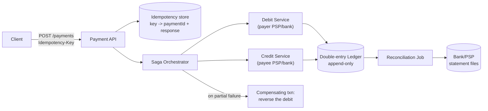

# Payment Gateway / UPI-like System — High Level Design

🎯 Asked at: PhonePe

## References
- Read first: [Design a Payment System Like Stripe — Hello Interview](https://www.hellointerview.com/learn/system-design/problem-breakdowns/payment-system) *(no dedicated hellointerview.com breakdown found for a UPI-specific gateway; this Stripe-style payment-processing breakdown covers the same idempotency/ledger/consistency patterns this design applies)*
- Watch: [Payment System Design Interview — Every Concept Explained: PSP, Idempotency, Saga, Ledger (YouTube)](https://www.youtube.com/watch?v=Zrd1wdkAZLY)
- Supplementary: [System Design: Distributed Transactions — Two-Phase Commit, Saga Pattern, and the Outbox Pattern](https://www.techinterview.org/post/3233465289/system-design-distributed-transactions/)

## Practice prompt
Whiteboard a UPI-style payment gateway: a payer initiates a transfer to a payee, money must move
between two banks (via the payer's PSP and payee's PSP), and the top constraint is "never double
charge, never lose money." Decide: what makes a retried payment request safe? How do you keep the
debit and credit consistent when they touch two different bank systems that don't share a transaction?
How do you reconcile your internal ledger against what the banks actually did, hours later?

## 1. Requirements

**Functional**
- Initiate a payment (payer, payee, amount); support retries from flaky mobile networks safely.
- Debit payer's account and credit payee's account as a single logical, all-or-nothing operation.
- Provide transaction status; support reconciliation against bank/PSP statements.

**Non-functional**
- Correctness over latency: no double-debit, no lost credit, ever — this is the top design constraint.
- High availability during peak (festival sales, salary days).
- Auditability: every state transition must be reconstructable (regulatory requirement in real systems).

## 2. API

```
POST /v1/payments
  headers: { Idempotency-Key: <client-generated UUID> }
  body: { payerAccountId, payeeAccountId, amount, currency }
  -> { paymentId, status: "pending" | "success" | "failed" }

GET /v1/payments/{paymentId}  -> { status, ledgerEntries: [...] }
```

## 3. High-level design



- **Idempotency at the edge**: every request carries a client-generated idempotency key; the API
  atomically checks-and-stores it before doing any work, so a retried request returns the original
  result instead of re-running the payment.
- **Saga instead of a distributed 2PC**: debit and credit happen as two local transactions across two
  systems that cannot share an ACID transaction (different banks/PSPs). An orchestrator drives the
  sequence and issues a compensating transaction (reverse the debit) if the credit step fails.
- **Ledger**: every movement of money is an immutable, append-only double-entry ledger row (debit
  account X, credit account Y, same amount) — this is the source of truth for reconciliation, not just
  the payment status field.

## 4. Deep dives

- **Idempotency key design**: key = client-generated UUID scoped to (payer, intent), stored in a table
  with a unique constraint on the key, along with the resulting `paymentId` and final response body. On
  a repeat request with the same key: return the stored response directly without re-executing the
  transfer — critical because mobile clients routinely retry on timeout, and a timeout does NOT mean the
  original request failed (it may have succeeded server-side already). The key must be checked-and-set
  atomically (unique index + insert, not read-then-write) to close the race where two retries arrive
  concurrently.
- **Saga compensation flow**: model the payment as a state machine: `INITIATED -> DEBITED -> CREDITED
  -> COMPLETED`, with a parallel failure path `DEBITED -> CREDIT_FAILED -> COMPENSATING -> REVERSED`.
  The orchestrator persists the current state after every step (so a crash mid-flow can resume exactly
  where it left off) and only issues the compensating reversal if it can positively confirm the debit
  succeeded but the credit did not — an unknown/ambiguous outcome (e.g. bank timeout) must be resolved by
  querying the bank's status API before compensating, never by assuming failure.
- **Exactly-once effect despite at-least-once delivery**: the debit and credit service calls themselves
  must be idempotent (keyed by `paymentId` + step name) since the orchestrator may retry a step after a
  crash without knowing if the previous attempt's network call actually landed.
- **Reconciliation**: because bank/PSP systems are external and can process a debit/credit without our
  system observing the confirmation (network drop after the bank accepted it), a periodic reconciliation
  job diffs our ledger against the bank's end-of-day statement file and flags mismatches for manual/auto
  resolution — this is why the ledger, not just an in-memory status, is the durable source of truth.

## 5. Trade-offs

| Approach | Consistency guarantee | Latency | Complexity |
|---|---|---|---|
| Two-phase commit (2PC) across banks | Strong, but requires all parties to participate in the protocol | High (blocking, holds locks) | Not viable — external banks won't join your 2PC coordinator |
| Saga (orchestrated) + compensation | Eventual consistency, correct given idempotent compensations | Lower, non-blocking | Medium — needs a durable state machine + compensation logic |
| Saga (choreographed via events) | Same as above, no central orchestrator | Lower | Higher — harder to trace/debug a flow spread across event handlers |
| Fire-and-forget, reconcile later only | Weakest — real errors surface only in batch recon | Lowest | Lowest, but unacceptable for money movement alone (used only as a backstop) |

## 6. How to narrate this in the interview

**Time budget (45 min)**
- 5 min: requirements & clarifying questions.
- 5 min: scale estimation (payments/sec, peak multiplier during sales/salary days).
- 10 min: API + data model (idempotency key, ledger schema).
- 10 min: high-level design (idempotency store, saga orchestrator, ledger).
- 15 min: deep dives — spend the most time on the saga state machine and idempotency, since correctness
  under retries/partial failure is the entire point of this design.

**Clarifying questions to ask early**
- "Are we integrating with external bank/PSP systems we don't control (so no shared distributed
  transaction is possible), or is this a closed-loop wallet-to-wallet system?"
- "What's acceptable latency for a payment to resolve — must it be synchronous end-to-end, or can it
  settle asynchronously with a polling/webhook status update?"
- "Is regulatory audit trail (immutable ledger, reconstructable history) an explicit requirement, or can
  I treat it as a nice-to-have?"

**Whiteboard reveal order**
1. Draw the idempotency check at the API edge first — this immediately signals you understand retries are
   the central risk in this design.
2. Draw the saga orchestrator and the debit/credit steps next, including the compensating-transaction path.
3. Layer in the ledger and reconciliation job last, once the happy-path and failure-path flows are both
   on the board.

**Scale/failure follow-up**
*"What if the orchestrator crashes right after the debit succeeds but before it calls the credit
service?"*
Model answer: because the orchestrator persists its state machine's current step after every transition
(`INITIATED → DEBITED → ...`), a replacement orchestrator instance (or the same one after restart) reads
the persisted state, sees the payment is stuck at `DEBITED`, and resumes exactly from there — calling the
credit service next, not restarting from `INITIATED` (which would risk a duplicate debit). If the credit
step's outcome from before the crash is ambiguous (e.g. the call was in flight), the resumed orchestrator
must query the credit service's status by `paymentId` first rather than blindly retrying, since the
original call may have already succeeded.

**Common mistake**
Candidates often design idempotency at the API layer but forget that the internal debit/credit service
calls the orchestrator makes also need to be idempotent and retry-safe — an orchestrator crash-and-resume
can call the same step twice. Avoid this by explicitly keying every internal step call (not just the
client-facing request) by `paymentId + step name` so a resumed orchestrator's retry is itself safe.
