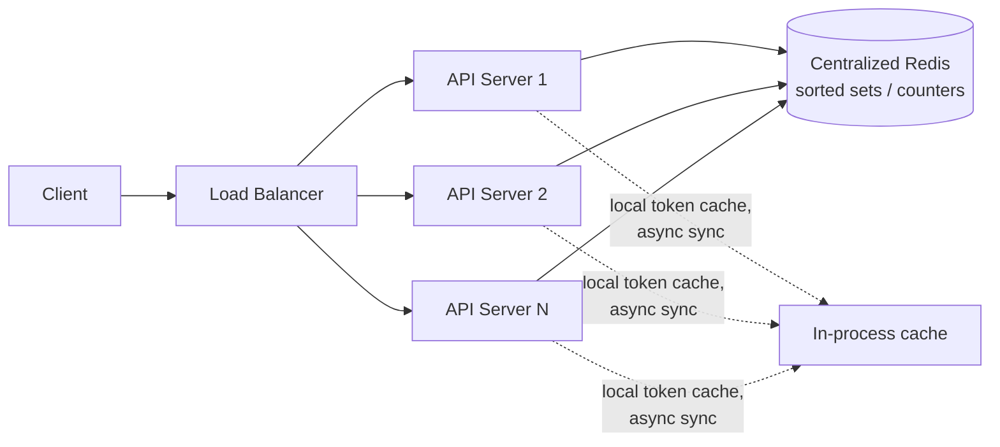

# Rate Limiter — High Level Design

🎯 Asked at: Razorpay (also common at Stripe/PayPal-style payments companies, and any high-traffic API platform)

## References
- Read first: [Design a Distributed Rate Limiter — Hello Interview](https://www.hellointerview.com/learn/system-design/problem-breakdowns/distributed-rate-limiter)
- Watch: [Design a Distributed Rate Limiter w/ an Ex-Meta Staff Engineer (YouTube)](https://www.youtube.com/watch?v=MIJFyUPG4Z4)
- Related LLD version (single-process algorithms in code): [Rate Limiter Low Level Design — Hello Interview](https://www.hellointerview.com/learn/low-level-design/problem-breakdowns/rate-limiter) and this repo's [`lld/problems/rate-limiter`](../../../lld/problems/rate-limiter/README.md)

## Practice prompt
Before reading further: whiteboard a rate limiter that must work correctly across many API servers (not
just one process) — 1M req/s, 100M DAU, limits configurable per user/API key. Decide: where does the
counter state live? How do you avoid a hot key under a single popular user? What happens when the
limiter node this request happened to land on has partial/stale state?

## 1. Requirements

**Functional**
- Rate-limit requests per client (user ID, API key, or IP) against configurable rules (e.g. 100 req/min).
- Reject over-limit requests with HTTP 429 + headers (`X-RateLimit-Remaining`, `X-RateLimit-Reset`).
- Support multiple algorithms/limits per route (burst allowance vs sustained rate).

**Non-functional**
- Must work correctly when requests for the same client land on different API servers (distributed).
- Low added latency (single-digit ms) — the limiter sits on the hot path of every request.
- Scale: ~1M requests/sec, ~100M daily active users.

## 2. API

```
Library/middleware interface (called by every API server before handling a request):
  allow(key string, ruleset RuleSet) -> (allowed bool, remaining int, resetAt time.Time)
```
This is invoked in-process by each API server; it is not a client-facing HTTP API by itself.

## 3. High-level design



- **Centralized counter store (Redis)**: every API server checks/increments a shared counter for
  `key` before proceeding. Redis is used because `INCR` + `EXPIRE`, or a Lua script for atomicity,
  gives us a fast, atomic read-modify-write shared across all servers.
- **Algorithm choice**: sliding-window counter (approximation of sliding log, O(1) memory) is the
  standard answer — it smooths the boundary burst problem of fixed windows without the memory cost of
  storing every request timestamp (sliding log). Token bucket is the answer when bursty traffic should
  be allowed up to a cap.
- **Atomicity across servers**: use a single Redis Lua script (`EVAL`) so check-and-increment is
  atomic, avoiding races where two servers both read "9/10" and both allow the 10th and 11th request.

## 4. Deep dives

- **Why not per-server in-memory counters?** They'd allow N× the intended limit (N = server count),
  since a client's requests are load-balanced across servers and each server would count independently.
- **Why Redis over a DB?** Sub-millisecond latency and native atomic counter primitives; a relational
  DB would add too much latency on the hot path at 1M req/s.
- **Hot key problem**: a single very-high-traffic client (or an API key shared by a large customer) can
  turn one Redis key into a bottleneck. Mitigate with local pre-aggregation (each API server buffers a
  small window of increments and flushes in batches) or key sharding.
- **Failure mode**: if Redis is unreachable, fail open (allow requests) or fail closed (reject) depending
  on whether availability or protection matters more for that route — call this out explicitly in an
  interview, it's a common follow-up.

## 5. Trade-offs (algorithm comparison)

| Algorithm | Burst handling | Memory | Boundary accuracy |
|---|---|---|---|
| Fixed window counter | Allows 2x burst at window edges | O(1) | Poor |
| Sliding window log | Perfect | O(requests) | Perfect |
| Sliding window counter | Good approximation | O(1) | Good |
| Token bucket | Allows configurable burst | O(1) | Good, burst-friendly |

This repo's Go demo (below) implements **token bucket** and **sliding window counter** so you can compare
their behavior directly.

## 6. How to narrate this in the interview

**Time budget (45 min)**
- 5 min: requirements & clarifying questions.
- 5 min: scale estimation (req/sec, number of distinct rate-limited keys).
- 10 min: API + data model (rule config shape, per-key counter representation).
- 10 min: high-level design (centralized Redis store, atomic check-and-increment).
- 15 min: deep dives — algorithm comparison and the hot-key problem are what interviewers usually push
  on, so give those the bulk of the remaining time over restating the architecture diagram.

**Clarifying questions to ask early**
- "Do limits need to be enforced exactly (no over-admission ever), or is a small amount of slop under
  race conditions acceptable in exchange for lower latency?"
- "Are limits per-user, per-API-key, per-IP, or a combination that needs to be evaluated together?"
- "Should the limiter fail open or fail closed if the centralized store (Redis) is unreachable — this
  materially changes the failure-mode design."

**Whiteboard reveal order**
1. Draw the naive per-server in-memory counter first and explain why it fails (N× the intended limit
   across N servers) — this motivates the centralized store.
2. Draw the centralized Redis store and the atomic check-and-increment (Lua script) next.
3. Layer in the algorithm choice (sliding window vs token bucket) and hot-key mitigation last.

**Scale/failure follow-up**
*"What if Redis becomes a bottleneck at 1M req/sec, or goes down entirely?"*
Model answer: shard the Redis layer by rate-limit key (e.g. consistent hashing over `userId`/`apiKey`) so
no single Redis instance has to handle the full request volume — each instance only serves the keys it
owns. For the down-Redis case, explicitly decide and state fail-open vs fail-closed: fail-open keeps the
product available at the cost of temporarily under-enforcing limits (acceptable for most consumer APIs),
while fail-closed protects backend capacity at the cost of rejecting legitimate traffic (necessary for
routes protecting a fragile downstream). A local in-process fallback limiter (looser, approximate) is a
common middle ground that keeps some protection active during a Redis outage without fully failing open.

**Common mistake**
Candidates often propose per-server in-memory counters as the whole design without realizing this allows
N× the intended limit once traffic is load-balanced across N servers. Avoid this by explicitly walking
through why a shared, centralized (or at least coordinated) counter store is required for a distributed
rate limiter to actually enforce its stated limit.

## Run it

```bash
cd interview-prep
go test ./hld/designs/rate-limiter/go/... -v
```
