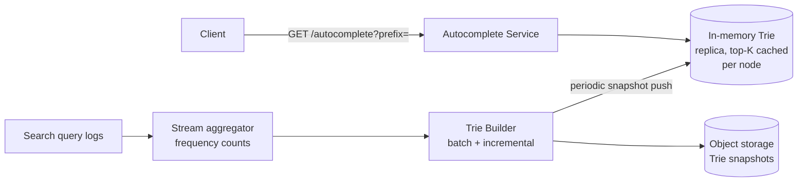

# Search Autocomplete / Typeahead — High Level Design

🎯 Asked at: Google (also common at Amazon, Uber — any product with a search box)

## References
- Read first: [Design Typeahead Search — Hello Interview Community](https://www.hellointerview.com/community/questions/typeahead-search-system/cm7l2wazy00t7105qdvnemtwy)
- Watch: [Design Search Autocomplete System — System Design Interview (YouTube)](https://www.youtube.com/watch?v=TZ_LSourdUc)
- Background: [System Design in a Hurry — Introduction](https://www.hellointerview.com/learn/system-design/in-a-hurry/introduction) (no dedicated hellointerview.com premium problem-breakdown page for this topic at time of writing; the community link above and video cover the same design)

## Practice prompt
Whiteboard a typeahead service for a search box with 500M DAU: suggestions must render within
100-300ms of each keystroke, ranked by historical popularity, and the underlying query-frequency
data updates continuously from live traffic. Decide: what data structure serves a prefix lookup in
O(prefix length)? How do you avoid recomputing top-K on every keystroke? How do you fold in new
popular queries without rebuilding the whole index?

## 1. Requirements

**Functional**
- As a user types a prefix, return the top-K most likely completions, ranked by search frequency.
- Support insertion of new queries/frequency updates from an offline or near-real-time pipeline.
- Suggestions should feel instant per keystroke.

**Non-functional**
- p99 latency for a suggestion request: <100ms (interview UX is unforgiving here).
- Scale: hundreds of millions of unique queries, tens of thousands of suggestion requests/sec at peak
  (every keystroke of every active user).
- Freshness: trending queries (breaking news, etc.) should surface within minutes, not the next daily
  batch job.

## 2. API

```
GET /v1/autocomplete?prefix={text}&limit={k}
  -> [{ "suggestion": string, "score": number }, ...]   // top-k, sorted desc by score

POST /v1/queries/log   (internal, called by the search service after a query completes)
  body: { "query": string }
  -> 202 Accepted    // async increments frequency counters
```

## 3. High-level design



- **Read path**: every API server holds a full copy of the Trie in memory (it's small enough — see
  deep dive) so a prefix lookup never leaves the process. No network hop on the hot path.
- **Write path**: query logs stream through an aggregator (e.g. Kafka + a windowed counter job) that
  increments per-query frequency counts. A Trie Builder periodically (every few minutes) rebuilds or
  incrementally patches the Trie and pushes new snapshots to all API servers.
- **Ranking**: each Trie node precomputes and caches its own top-K completions (this repo's Go demo
  does exactly this), so a query is a single tree walk down to the prefix's node, then return the
  cached list — no scanning of all words under that subtree at request time.

## 4. Deep dives

- **Precompute top-K per node vs. compute at query time**: computing top-K live would mean, for a
  short prefix like "a", scanning potentially millions of words under that subtree per request. Instead
  each node maintains its own bounded (size-K) sorted list, updated incrementally on insert — O(K log K)
  per insert instead of O(matches) per read. This is the single most important trade-off in this design:
  push cost to the write path, since reads vastly outnumber writes.
- **Memory footprint & sharding**: a full Trie of, say, 50M unique queries with cached top-5 lists per
  node is typically a few GB — feasible to replicate in full on every API server. If the corpus grows
  past what fits in memory, shard the Trie by first 1-2 characters across a cluster, with a stateless
  routing layer forwarding `prefix` requests to the shard owning that prefix range.
- **Freshness vs. rebuild cost**: rebuilding the whole Trie from scratch on every update is wasteful.
  Two common strategies: (1) incremental updates — apply frequency deltas directly to affected nodes'
  top-K caches without touching the rest of the tree; (2) periodic full rebuild from a batch job (e.g.
  hourly) plus a separate small "trending" overlay Trie built from the last few minutes of traffic that
  is merged with the main Trie's results at query time, so breaking-news queries surface fast without
  needing sub-minute rebuilds of the whole structure.
- **Personalization/locale**: production systems (Google, Amazon) blend a global Trie with per-user
  history and geographic/language signals. Out of scope for the base design but worth mentioning as a
  follow-up if the interviewer pushes on ranking quality.

## 5. Trade-offs

| Approach | Read latency | Write cost | Freshness | Memory |
|---|---|---|---|---|
| Compute top-K at query time (scan subtree) | Poor (O(matches)) | None | Instant | Low |
| Precomputed top-K per node, full rebuild | Excellent (O(prefix len)) | High (full rebuild) | Batch (hours) | Higher (cache per node) |
| Precomputed top-K + incremental updates | Excellent | Low (delta only) | Minutes | Higher |
| Precomputed + trending overlay Trie | Excellent | Low + small overlay rebuild | Seconds-minutes | Slightly higher |

This repo's Go demo implements the **precomputed top-K per Trie node** approach with incremental
frequency updates on `Insert`.

## 6. How to narrate this in the interview

**Time budget (45 min)**
- 5 min: requirements & clarifying questions.
- 5 min: scale estimation (unique queries, requests/sec, memory footprint of the Trie).
- 10 min: API + data model.
- 10 min: high-level design (in-memory Trie replicas, write pipeline, Trie builder).
- 15 min: deep dives — the precompute-top-K-per-node insight is the crux of this design, so make sure it
  gets explained clearly before moving to sharding/freshness follow-ups.

**Clarifying questions to ask early**
- "How fresh do trending queries need to be — minutes (needs a fast incremental/overlay path) or is a
  periodic batch rebuild (hourly/daily) acceptable?"
- "Should suggestions be personalized per user, or is a single global ranking acceptable for the base
  design?"
- "What's the expected corpus size — does the full Trie comfortably fit in memory on one server, or
  should I design for sharding from the start?"

**Whiteboard reveal order**
1. Draw the read path first (client → API → in-memory Trie, single process, no network hop) — this
   establishes the latency-critical hot path before anything else.
2. Draw the write/ingestion path next (query logs → stream aggregator → Trie builder).
3. Layer in the precomputed top-K-per-node detail and the trending overlay Trie last, once the basic
   read/write split is established.

**Scale/failure follow-up**
*"What if the corpus grows past what fits in memory on a single server?"*
Model answer: shard the Trie by the first one or two characters of the prefix across a cluster of
servers, with a thin stateless routing layer forwarding each `prefix` request to the shard owning that
prefix range (e.g. all "a*" queries go to shard 0). Because a prefix query only ever needs data from
exactly one shard (the query's own prefix determines its shard deterministically), this doesn't require
any cross-shard merge at read time, unlike, say, a sharded leaderboard's top-N — this makes the sharded
Trie design simpler than most other sharding stories in this problem set, which is worth calling out
explicitly.

**Common mistake**
Candidates often describe "use a Trie" without explaining how top-K is served fast at every node — i.e.
they leave it implicit that a query means scanning the whole subtree under a prefix, which is far too
slow for a popular short prefix. Avoid this by explicitly stating that each node caches its own
precomputed top-K list, updated incrementally on write, so a read is a single tree walk with no subtree
scan.

## Run it

```bash
cd interview-prep
go test ./hld/designs/search-autocomplete/go/... -v
```
