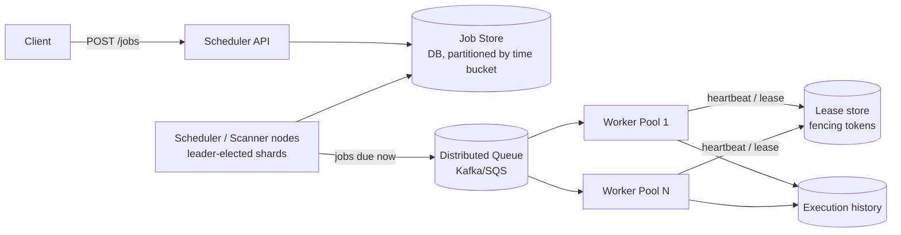

# Distributed Task Scheduler — High Level Design

🎯 Asked at: Spotify

> Note: this is the **distributed-systems** version of a task scheduler — leader election / partitioning
> for scale, at-least-once execution across a fleet of workers. It is distinct from this repo's
> [`lld/problems/task-scheduler`](../../../lld/problems/task-scheduler/README.md), which is the
> single-process, in-memory LLD version of the same idea.

## References
- Read first: [Design a Distributed Job Scheduler Like Airflow — Hello Interview](https://www.hellointerview.com/learn/system-design/problem-breakdowns/job-scheduler)
- Watch: [Distributed Job Scheduler Design Deep Dive with Google SWE (YouTube)](https://www.youtube.com/watch?v=WTxG5880EH8)

## Practice prompt
Whiteboard a scheduler that lets users submit one-time and cron-recurring jobs, executed across a fleet
of worker nodes, at 10,000+ jobs/sec throughput, with retry on failure and history retained for a year.
Decide: which component decides *when* a job is due, and how does it not become a single point of
failure? How do you guarantee a job runs even if the worker that claimed it crashes mid-execution? How
do you stop two workers from double-executing the same due job?

## 1. Requirements

**Functional**
- Submit one-time or recurring (cron) jobs; cancel a submitted job.
- Execute jobs across many worker nodes; report status (queued/running/completed/failed) and history.
- Retry failed jobs per a configurable policy (max attempts, backoff).

**Non-functional**
- High throughput: 10,000+ jobs/sec scheduled/fired.
- At-least-once execution guarantee — a job must not silently vanish; duplicate execution is acceptable
  only if jobs are designed idempotently (call this out to the interviewer).
- Fire within seconds of the scheduled time; horizontally scalable to thousands of workers; job history
  retained ~1 year.

## 2. API

```
POST /v1/jobs
  body: { cronExpr? , runAt?, payload, retryPolicy }
  -> { jobId, status: "scheduled" }

DELETE /v1/jobs/{jobId}          -> 200
GET    /v1/jobs/{jobId}/history  -> [{ attempt, startedAt, status, error? }, ...]
```

## 3. High-level design



- **Job store**: durable, partitioned by scheduled-time bucket (e.g. per-minute shards) so scanning
  "what's due now" only touches the current bucket, not the whole table.
- **Scanner/scheduler tier**: multiple scanner nodes, each owning a shard of time buckets (partitioned
  by consistent hashing over bucket ID), poll their shard for due jobs and push them onto a distributed
  queue. Leader election (or partition ownership via a coordination service like ZooKeeper/etcd) ensures
  each bucket has exactly one active scanner at a time, avoiding duplicate enqueues.
- **Worker pool**: pulls from the queue, claims a job with a time-bound lease, executes it, and reports
  completion. If a worker crashes mid-execution, the lease expires and another worker re-claims the job
  (at-least-once, not exactly-once).

## 4. Deep dives

- **Avoiding duplicate firing across scanner replicas**: if two scanner nodes both believe they own the
  same time bucket (e.g. during a rebalance), they could both enqueue the same due job. Fix: partition
  ownership is itself coordinated through a strongly consistent store (etcd/ZooKeeper) using leases with
  fencing tokens — a scanner must hold a valid, non-expired lease for a bucket before it's allowed to
  enqueue jobs from it, and an old scanner whose lease expired is fenced off even if it hasn't noticed yet.
- **At-least-once execution guarantee**: workers claim a job with a visibility timeout/lease (like SQS).
  If the worker doesn't ack completion before the lease expires, the job becomes visible to other workers
  again. This guarantees the job *will* run, but can run more than once if the first worker was still
  alive but slow — so job handlers must be idempotent (keyed by jobId + attempt, or by a business-level
  idempotency key) for this guarantee to be safe in practice.
- **Leader election for the scanner tier**: rather than one global leader (bottleneck + SPOF), shard time
  buckets across many scanner nodes, each independently leader-elected per shard. This scales scanning
  throughput horizontally and confines a scanner failure's blast radius to just its shard, which fails
  over quickly.
- **Retry with backoff, and the "poison job" problem**: failed jobs are retried with exponential backoff
  up to a max-attempts cap; jobs that exceed the cap move to a dead-letter store for manual inspection
  instead of retrying forever and consuming worker capacity.

## 5. Trade-offs

| Approach | Duplicate-fire risk | Scan cost | Complexity |
|---|---|---|---|
| Single global scanner | None (one writer) | Bottleneck at scale | Low, but SPOF |
| Sharded scanners, no coordination | High during rebalance | Scales well | Low, but unsafe |
| Sharded scanners + leased ownership (fencing tokens) | Low (fenced) | Scales well | Higher — needs a coordination service |

| Execution guarantee | User-facing correctness | Implementation cost |
|---|---|---|
| At-most-once | Simple, but a crashed worker silently drops the job | Low |
| At-least-once + idempotent handlers | Job always eventually runs; safe under duplicates | Medium (idempotency burden on job authors) |
| Exactly-once | Ideal, but effectively unachievable end-to-end without idempotency anyway | High, usually not worth it |

## 6. How to narrate this in the interview

**Time budget (45 min)**
- 5 min: requirements & clarifying questions.
- 5 min: scale estimation (jobs/sec, worker fleet size, history retention volume).
- 10 min: API + data model (job schema, cron/one-time distinction).
- 10 min: high-level design (job store, scanner tier, queue, workers).
- 15 min: deep dives — duplicate-fire prevention and at-least-once execution guarantees are the two
  topics interviewers dig into most, so weight time there over the basic architecture walkthrough.

**Clarifying questions to ask early**
- "Is at-least-once execution (with the burden of idempotent job handlers) acceptable, or does the
  interviewer want me to reason about exactly-once (and its practical limits)?"
- "What's the acceptable delay between a job's scheduled time and actual execution — seconds, or is a
  looser SLA (minutes) acceptable?"
- "Do jobs need strict ordering relative to each other, or is each job independent?"

**Whiteboard reveal order**
1. Draw the job store and a single naive scanner first (functionally correct, single point of failure) —
   establish the basic due-job-detection mechanism before scaling it out.
2. Draw the queue and worker pool next, including the lease/heartbeat mechanism.
3. Layer in sharded scanners with leader election/fencing tokens last, once the single-scanner version
   and its bottleneck/SPOF problem are clearly on the board.

**Scale/failure follow-up**
*"What if a worker claims a job, starts executing, and then the whole availability zone it's in goes
down mid-execution?"*
Model answer: because the job was claimed with a time-bound lease (not a permanent claim), the lease
simply expires when the worker stops heartbeating, and the job becomes visible again for another worker
(in a healthy AZ) to claim and execute. This is exactly the at-least-once guarantee already built into the
design — the job handler must be idempotent (e.g. keyed by `jobId + attempt` or a business-level
idempotency key) so re-execution after the AZ failure doesn't cause a duplicate side effect, which is why
idempotency is called out as a requirement on job authors up front rather than treated as a rare edge
case.

**Common mistake**
Candidates often design a single global scanner/scheduler node "for simplicity" without flagging it as a
bottleneck and single point of failure at the stated throughput (10,000+ jobs/sec). Avoid this by
proactively sharding the scanner tier by time bucket and using leader election/fencing per shard, rather
than waiting for the interviewer to point out the single-scanner design doesn't scale.
