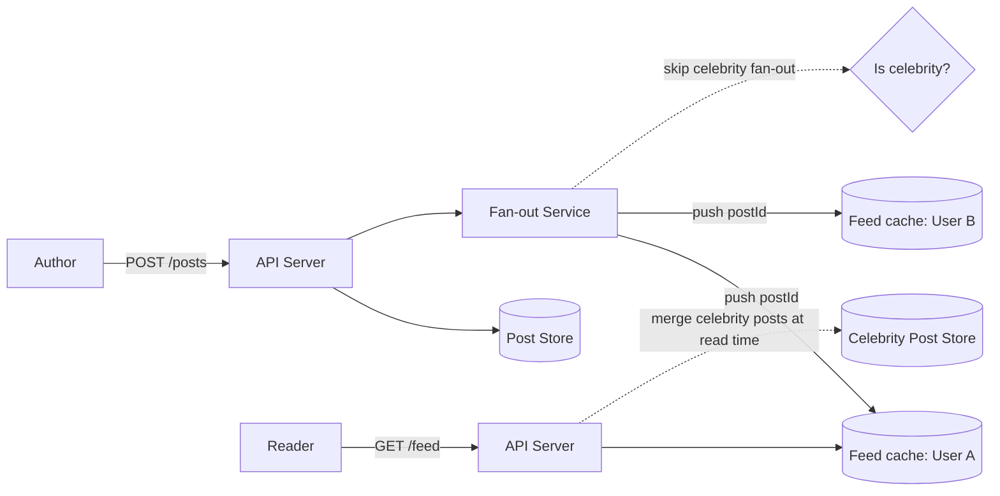

# Twitter / Instagram Feed — High Level Design

🎯 Asked at: Meesho

## References
- Read first: [Design Facebook's News Feed — Hello Interview](https://www.hellointerview.com/learn/system-design/problem-breakdowns/fb-news-feed)
  (same core problem as a Twitter-style feed: fan-out, ranking, celebrity/hot-user handling)
- Watch: [Design FB News Feed — System Design Interview w/ an Ex-Meta Senior Manager (YouTube)](https://www.youtube.com/watch?v=Qj4-GruzyDU)

## Practice prompt
Before reading further: whiteboard a feed for a user who follows 500 people, one of whom is a celebrity
with 50M followers. Decide whether you precompute each user's feed on every new post (fan-out-on-write)
or compute it on demand at read time (fan-out-on-read), and what breaks at the extremes of that choice.

## 1. Requirements

**Functional**
- Users can post text (+ optional media) and follow other users.
- Users can view a reverse-chronological (or ranked) feed of posts from people they follow.
- Feed supports pagination (infinite scroll).

**Non-functional**
- Feed read latency should be low (<200ms) — it's the most frequently hit endpoint in the product.
- Read-heavy: feed reads vastly outnumber posts written.
- Must handle extreme follower-count skew: most users follow/are followed by hundreds, a small number
  of celebrity accounts have tens of millions of followers.
- Eventual consistency is acceptable — a follower seeing a new post a few seconds late is fine.

## 2. API design

```
POST /posts
  body: { text, mediaUrls? } -> { postId, createdAt }

GET /feed?cursor={cursor}&limit=20
  -> { posts: [{ postId, authorId, text, createdAt }], nextCursor }

POST /follow/{userId}
DELETE /follow/{userId}
```

## 3. High-level design



- **Fan-out-on-write (push)**: on post creation, the fan-out service pushes the new `postId` into a
  precomputed feed list (cache, e.g. Redis sorted set keyed by follower) for every follower. Reads are
  then a cheap cache lookup — this is the default for the common case (normal users with normal follower
  counts).
- **Fan-out-on-read (pull)**: for celebrity accounts, fan-out-on-write to millions of followers is
  prohibitively expensive per post. Instead, celebrity posts are *not* pushed; at read time, the feed
  service merges the user's precomputed feed with a pull of recent posts from the small number of
  celebrities they follow.
- **Hybrid model** is the standard answer: push for everyone, except skip push for accounts above a
  follower-count threshold, and merge those in in real time on read.

## 4. Deep dives

- **Fan-out-on-write vs fan-out-on-read trade-off**: push makes reads cheap but writes expensive (and
  wasteful if a followed user's posts are never read before the next one arrives); pull makes writes
  cheap but reads expensive (fan-in across every followed account on every feed load). The right answer
  is almost always hybrid, keyed off follower count.
- **The celebrity/hot-user problem**: a single celebrity posting means potentially tens of millions of
  fan-out writes fired at once — a "thundering herd" on the fan-out workers and feed caches. Mitigations:
  exclude celebrities from push fan-out entirely (merge at read time instead), rate-limit/queue fan-out
  jobs so they trickle rather than spike, and shard the fan-out workers so one celebrity's fan-out doesn't
  starve everyone else's.
- **Feed ranking vs strict chronology**: once ranking (engagement-based ordering, not just recency) enters
  the picture, feed generation becomes a light real-time scoring pass over a candidate set rather than a
  pure merge — this is usually flagged as a stretch goal/optional deep dive unless the interviewer pushes
  on it explicitly.
- **Feed cache storage**: a bounded-size sorted set per user (e.g. last ~1000 post IDs) keeps memory
  bounded; older feed entries are dropped since users rarely scroll back that far, and the post store is
  the fallback source of truth if a full re-derivation is ever needed.

## 5. Trade-offs

| Approach | Write cost | Read cost | Best for |
|---|---|---|---|
| Fan-out-on-write (push) | O(followers) per post | O(1) cache read | Normal users (bounded followers) |
| Fan-out-on-read (pull) | O(1) per post | O(followed accounts) merge | Celebrity/high-follower accounts |
| Hybrid (push + pull merge) | Bounded by threshold | Small merge on top of cache read | Real-world systems at scale |

## 6. How to narrate this in the interview

**Time budget (45 min)**
- 5 min: requirements & clarifying questions.
- 5 min: scale estimation (posts/sec, average follower count, celebrity follower count).
- 10 min: API + data model.
- 10 min: high-level design (fan-out-on-write, feed cache).
- 15 min: deep dives — the celebrity/hot-user problem is the single most important topic in this design,
  so make sure it gets real time even if it means trimming the ranking discussion.

**Clarifying questions to ask early**
- "What's a realistic upper bound on follower count I should design for — this determines whether I need
  the celebrity hybrid path at all."
- "Is strict reverse-chronological order acceptable, or does the feed need engagement-based ranking (which
  changes generation from a merge into a scoring pass)?"
- "How stale can a feed be after a new post — seconds, or is a slightly longer delay (tens of seconds)
  acceptable given eventual consistency is already assumed?"

**Whiteboard reveal order**
1. Draw the simple fan-out-on-write path first (post → fan-out service → per-follower feed cache) for a
   normal user — get the basic mechanism across before introducing any complication.
2. Draw the read path (feed cache lookup) next.
3. Layer in the celebrity exception (skip push, merge at read time) last — this is the natural
   deep-dive pivot point and shouldn't be introduced before the base case is clear.

**Scale/failure follow-up**
*"What if the fan-out service falls behind during a burst of posts from many active users at once (not
just one celebrity)?"*
Model answer: fan-out jobs are queued (not executed synchronously on post creation), so a burst simply
grows the queue depth rather than blocking post creation or dropping fan-out work — the fan-out workers
drain the queue as capacity allows, and feed staleness temporarily increases but no data is lost. Scale
the fan-out worker pool horizontally and shard it (e.g. by follower-ID range) so no single celebrity's
fan-out job starves the queue for everyone else's more mundane fan-out jobs, keeping tail latency for
normal users bounded even while a large fan-out job is in flight elsewhere in the queue.

**Common mistake**
Candidates often present pure fan-out-on-write as the whole answer without being prompted about celebrity
accounts, then get stuck when the interviewer asks "what about someone with 50M followers?" Avoid this by
proactively raising the celebrity/hot-user case as part of the initial design, not waiting for the
interviewer to surface it.
