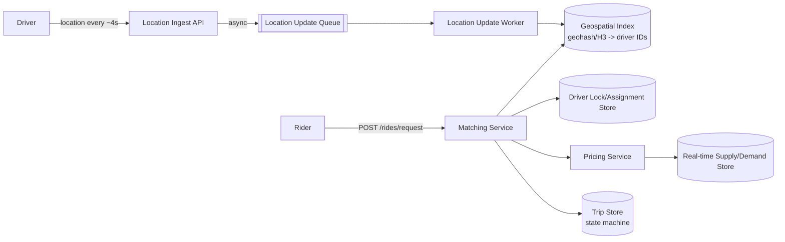

# Uber / Ride-Sharing — High Level Design

🎯 Asked at: Zomato

## References
- Read first: [Design a Ride-Sharing Service Like Uber — Hello Interview](https://www.hellointerview.com/learn/system-design/problem-breakdowns/uber)
- Watch: [System Design Interview: Design Uber w/ an Ex-Meta Staff Engineer (YouTube)](https://www.youtube.com/watch?v=lsKU38RKQSo)

## Practice prompt
Before reading further: whiteboard the "find nearby drivers and match a rider" flow at Uber's scale —
millions of drivers constantly reporting location updates (a write-heavy stream), riders expecting a
match within a few seconds, and prices that need to rise automatically when demand spikes in an area.
Decide how you'd index driver locations so a "K nearest available drivers" query is fast even though
every driver's position is changing every few seconds, and how matching avoids double-booking a driver
two riders both just requested.

## 1. Requirements

**Functional**
- Riders can request a ride from their current location to a destination and get matched with a nearby
  available driver.
- Drivers continuously report their location and toggle availability (online/offline, en route, in-trip).
- Support the full trip lifecycle: requested → matched → driver en route → in-trip → completed/cancelled.
- Compute a price for a trip, including surge pricing during high demand relative to driver supply.

**Non-functional**
- Match latency should be low (a few seconds) — this is the core user-facing promise of the product.
- Extremely write-heavy: millions of drivers pushing location updates every ~4 seconds.
- Geographic locality: matching only ever needs to consider drivers within a few km of the rider —
  the system should never need to scan all drivers globally for a single match.
- Strong-enough consistency on driver assignment to avoid double-booking the same driver to two trips.

## 2. API design

```
POST /drivers/{driverId}/location
  body: { lat, lng, timestamp, status: online|offline|enRoute|inTrip }
  -> 202 Accepted   (high-frequency, fire-and-forget style write)

POST /rides/request
  body: { riderId, pickup: {lat,lng}, destination: {lat,lng} }
  -> { rideId, status: matching }

GET /rides/{rideId}
  -> { rideId, status, driverId?, eta?, fare?, surgeMultiplier? }

POST /rides/{rideId}/accept   (driver accepts a proposed match)
POST /rides/{rideId}/cancel
POST /rides/{rideId}/complete
```

## 3. High-level design



- **Location ingestion**: driver location updates hit a lightweight ingest API and are pushed onto a
  queue rather than written synchronously to the geo-index — this is the highest-volume write path in
  the system (see deep dive on handling it at scale).
- **Geospatial index**: a background worker consumes the queue and updates a geo-index (geohash, quadtree,
  or H3 cells — see deep dive) mapping location buckets to the set of currently-online driver IDs in
  that bucket, so "find nearby drivers" is a fast index lookup rather than a scan.
- **Matching**: on a ride request, the matching service queries the geo-index for nearby available
  drivers, proposes the match, and atomically claims the driver (via the driver lock/assignment store) so
  a second concurrent request can't also match the same driver.
- **Pricing**: the pricing service computes a base fare plus a surge multiplier derived from the current
  supply (available nearby drivers) vs demand (open ride requests) in that area.

## 4. Deep dives

- **Geospatial indexing for matching (geohash vs quadtree vs H3)**: this repo's week-07 concept notes
  (`../../week-07-location-scheduling/README.md`) cover the general trade-offs — geohash is simplest to
  bolt onto an existing indexed store (query by string-prefix range) but has uneven cell shapes near
  boundaries; quadtrees adapt resolution to point density and suit an in-memory service; **H3 is the
  standard answer specifically for ride-sharing**, because its hexagonal cells have uniform adjacency
  (all 6 neighbors equidistant), which makes "expand the search radius by one ring of cells" a
  well-defined, consistent operation — exactly the access pattern matching needs ("find drivers within
  ring 1, if none found expand to ring 2, ..."). In an interview, naming H3 explicitly and explaining why
  its hexagon-adjacency property fits ride-matching better than a geohash's uneven grid is the strongest
  answer.
- **Surge pricing computation**: divide the map into cells (the same H3/geohash cells used for matching),
  and continuously compute a supply/demand ratio per cell — e.g. `(open ride requests) / (available
  drivers)` over a short rolling window. A multiplier function maps that ratio to a price multiplier
  (1.0x at balance, rising as demand outstrips supply). This must be computed near-real-time from the
  same live location/request streams, not from a batch job, or surge pricing lags actual demand by too
  much to be useful for balancing supply. A key trade-off: too-frequent multiplier changes confuse riders
  (price changing mid-request), so multipliers are typically locked in briefly (e.g. quoted at request
  time and honored for that ride) rather than recalculated continuously.
- **Handling driver location updates at scale (write-heavy stream)**: with millions of drivers reporting
  every few seconds, synchronous writes straight to a geo-index/DB would be a huge bottleneck and mostly
  wasted work (most updates move a driver only slightly within the same or an adjacent cell). Standard
  approach: ingest via a message queue (e.g. Kafka) partitioned by geographic region, with stream-
  processing workers consuming and applying batched/coalesced updates to the geo-index — this absorbs
  bursts, lets the geo-index update rate be decoupled from the raw ingest rate, and allows dropping/
  coalescing stale updates (only the most recent position per driver in a short window actually matters).
- **Avoiding double-booking a driver**: two concurrent ride requests near the same driver could both try
  to match them. Use an atomic claim (e.g. a conditional write / distributed lock keyed on driverId with
  a short TTL) at the moment a match is proposed — the first request to successfully claim the driver
  wins; the loser's matching service immediately retries against the next-nearest candidate.

## 5. Trade-offs

| Geo-index | Cell shape | Adjacency uniformity | Fit for ride-matching |
|---|---|---|---|
| Geohash | Rectangular, distorts near poles | Uneven (prefix-boundary issues) | OK for a simple/first-pass answer |
| Quadtree | Adaptive to density | Uneven (variable-size cells) | Good for in-memory, less standard for ring-expansion queries |
| H3 (hexagonal) | Uniform hexagons | Uniform (all 6 neighbors equidistant) | Best fit — Uber's own choice, ring-expansion is natural |

| Location update path | Latency to index freshness | Write amplification | Resilience to bursts |
|---|---|---|---|
| Synchronous write to geo-index | Freshest | Very high (every update hits index) | Poor — index becomes bottleneck |
| Queue + async batched worker | Slightly delayed (sub-second to few sec) | Reduced via coalescing | Good — queue absorbs bursts |

## 6. How to narrate this in the interview

**Time budget (45 min)**
- 5 min: requirements & clarifying questions.
- 5 min: scale estimation (drivers online, updates/sec, ride requests/sec).
- 10 min: API + data model (trip state machine, driver/location schema).
- 10 min: high-level design (location ingest, geo-index, matching, pricing).
- 15 min: deep dives — this design lives or dies on the geospatial-indexing and write-scale deep dives,
  so give them the most time; surge pricing and double-booking can be covered more briskly if time is
  short.

**Clarifying questions to ask early**
- "Should I design the driver-location ingestion pipeline in depth, or can I treat 'nearby available
  drivers' as a given and focus on matching and pricing?"
- "Is exact double-booking prevention (no driver ever gets two simultaneous match proposals) a hard
  requirement, or is an occasional retry due to a race acceptable?"
- "How dynamic should surge pricing be — locked in at request time, or should it be allowed to change
  while a rider is still deciding?"

**Whiteboard reveal order**
1. Draw the location ingestion path first (driver → ingest API → queue → worker → geo-index) — this
   establishes the write-heavy nature of the problem up front, which frames everything else.
2. Draw the matching flow next (rider request → geo-index lookup → candidate drivers → atomic claim) —
   this is the functional core of the product.
3. Layer in pricing (supply/demand store → surge multiplier) last, since it depends on the same
   cell-based data the matching flow already established.

**Scale/failure follow-up**
*"What if the geo-index for a single hot region (e.g. downtown during a big event) becomes a hotspot?"*
Model answer: shard the geo-index by top-level geographic cell (e.g. by H3 resolution-0 or resolution-1
cell, or by city), so a busy downtown region's cell hierarchy lives on dedicated shard(s) rather than
competing with the rest of the city's traffic on one shared index. Within a hot shard, further split by
finer-grained cells and route matching queries to the specific sub-cell shard needed, rather than a
single node owning "all of downtown." Add read replicas of the geo-index for the matching service's read
path (queries) while writes from the location-update workers go to the primary, since matching reads
vastly outnumber the coalesced writes for any single driver in a short window.

**Common mistake**
Candidates often default to a plain SQL "nearest drivers" query (e.g. Haversine distance computed
row-by-row, or a naive `ORDER BY distance LIMIT K`) without acknowledging it doesn't scale to millions of
moving drivers updating every few seconds. Avoid this by explicitly introducing a proper geospatial index
(H3/geohash/quadtree) as the mechanism that turns "nearest K drivers" into an indexed lookup instead of a
full scan — and by not writing every raw location update synchronously to that index.
