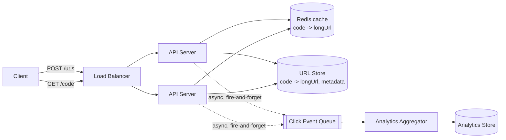

# URL Shortener — High Level Design

🎯 Asked at: Flipkart

## References
- Read first: [Design a URL Shortener Like Bitly — Hello Interview](https://www.hellointerview.com/learn/system-design/problem-breakdowns/bitly)
- Watch: [Beginner System Design Interview: Design Bitly w/ an Ex-Meta Staff Engineer (YouTube)](https://www.youtube.com/watch?v=iUU4O1sWtJA)

## Practice prompt
Before reading further: whiteboard a URL shortener for 100M new URLs/day and a 1000:1 read:write ratio.
Decide how a short code is generated (and what happens on a collision), whether redirects are 301 or 302
and why that choice matters for your analytics, and how you'd serve reads at very low latency at scale.

## 1. Requirements

**Functional**
- Given a long URL, return a short URL (`https://sho.rt/{code}`).
- Given a short code, redirect to the original long URL.
- Support optional custom aliases and optional expiry.
- Track click analytics (count, timestamp, referrer, rough geo) per short URL.

**Non-functional**
- Read-heavy: ~1000 reads (redirects) per write (creation) — optimize for read latency.
- Redirect latency should be near-instant (<100ms) — this is on the user's critical path.
- Scale: ~100M new URLs/day, tens of billions of URLs stored over years, ~10K redirects/sec average
  with spiky peaks.
- Short codes must be effectively unique and not easily guessable/enumerable if privacy matters.

## 2. API design

```
POST /urls
  body: { longUrl: string, customAlias?: string, expiresAt?: timestamp }
  -> { shortUrl: string, code: string }

GET /{code}
  -> 301/302 redirect to longUrl (see deep dive on which)

GET /urls/{code}/stats
  -> { code, longUrl, totalClicks, createdAt, lastClicked, clicksByDay: [...] }
```

## 3. High-level design



- **Write path**: API server generates a code (see deep dive), writes `{code -> longUrl}` to the URL
  store, primes the cache, returns the short URL.
- **Read path**: API server checks cache first (hot codes served from Redis), falls back to the URL
  store on miss, then issues the redirect. Given the 1000:1 read skew, cache hit rate should be very high.
- **Analytics**: click events are **not** written synchronously on the redirect path — they're pushed to
  a queue and aggregated asynchronously so redirect latency isn't coupled to analytics writes.

## 4. Deep dives

- **Hashing scheme — base62 encoding of a counter vs random ID + collision check**
  - *Base62 encode a counter*: maintain a distributed counter (e.g. a range of IDs handed out per API
    server, or a Snowflake-style ID), base62-encode it (`[0-9a-zA-Z]`, 62 chars) to get a 6-8 char code.
    Guaranteed unique, no collision checks needed, but codes are sequential/guessable and leak creation
    order/volume unless you shuffle the ID space (e.g. XOR with a fixed key, or use a non-sequential
    counter like a Zookeeper-style ID block per node).
  - *Random ID + collision check*: generate a random 6-8 char base62 string, check the DB/cache for
    existing use, retry on collision. Simpler mentally, avoids leaking sequence info, but needs a
    uniqueness check on every write (cheap if you check a Bloom filter or cache first) and collision
    probability rises as the keyspace fills (birthday paradox) — 6 base62 chars gives ~56 billion
    combinations, comfortably enough at this scale if collisions are retried.
  - Most interviews accept either; the follow-up is always "how do you know it's actually unique" —
    answer: a unique constraint in the DB as the source of truth, with cache/Bloom filter as a fast
    pre-check to avoid hitting the DB on every attempt.

- **301 vs 302 redirect**
  - **301 (permanent)**: browsers and CDNs cache the redirect, so subsequent clicks from the same client
    never hit your servers again — great for load, terrible for analytics (you undercount clicks) and
    makes the mapping hard to change later.
  - **302 (temporary)**: every click hits your server, giving accurate click analytics and letting you
    change/expire the mapping freely, at the cost of more traffic to your redirect service.
  - Standard answer: **302**, because click analytics is a functional requirement here and the extra
    server load is exactly what the cache layer is designed to absorb.

- **Click analytics without slowing down redirects**: fire an async event (message queue or even just an
  in-memory buffered batch flushed periodically) from the redirect handler rather than writing to a
  database synchronously. A separate aggregator consumes the stream and rolls up counts per code per
  time bucket — this decouples the hot read path from the analytics write path entirely.

- **Cache invalidation on custom alias collisions / expiry**: when a URL expires or is deleted, the
  cache entry must be invalidated too (not just the DB row), otherwise stale redirects keep serving from
  cache — use a short TTL on cache entries as a safety net even if explicit invalidation is also wired up.

## 5. Trade-offs

| Approach | Uniqueness guarantee | Code predictability | Extra work per write |
|---|---|---|---|
| Base62(counter) | Guaranteed | Sequential/guessable unless obfuscated | None (no collision check) |
| Random + collision check | Probabilistic, retried | Not guessable | 1 lookup (cache/Bloom filter first) |

| Redirect type | Analytics accuracy | Server load | Mapping mutability |
|---|---|---|---|
| 301 | Undercounts (browser/CDN caches it) | Low after first hit | Hard to change |
| 302 | Accurate | Every click hits server | Easy to change/expire |

## 6. How to narrate this in the interview

**Time budget (45 min)**
- 5 min: requirements & clarifying questions.
- 5 min: scale estimation (new URLs/day, read:write ratio, storage over years).
- 10 min: API design.
- 10 min: high-level design (write path, read path, cache).
- 15 min: deep dives — this design's classic "gotchas" (collision handling, 301 vs 302) are exactly what
  interviewers probe, so budget the most time there.

**Clarifying questions to ask early**
- "Do we need accurate click analytics, or is a simple redirect the only functional requirement — this
  directly decides 301 vs 302."
- "Should short codes be non-guessable (security/privacy consideration), or is sequential/predictable
  fine?"
- "Do we need custom aliases and expiring links, or just the base shorten-and-redirect flow?"

**Whiteboard reveal order**
1. Draw the write path first (client → API → code generation → URL store) — establish how a code gets
   created before discussing how it's served.
2. Draw the read/redirect path next, including the cache layer.
3. Layer in the async analytics pipeline last, since it's decoupled from the critical redirect path and
   naturally comes up once the core flow is settled.

**Scale/failure follow-up**
*"What if the cache layer goes down entirely during peak traffic?"*
Model answer: reads fall back to the URL store (the source of truth) on every request, so redirects still
function correctly — just at higher latency and higher load on the database, since the 1000:1 read skew
that the cache was absorbing now hits the DB directly. To avoid a full outage under this fallback load,
the URL store should be read-replica-scaled independently of the cache, and the API layer should apply
backpressure/rate limiting rather than let an unbounded flood of direct DB reads take the store down too;
the cache is restored and re-primed (lazily, on subsequent reads) once it recovers.

**Common mistake**
Candidates often pick 301 redirects "because it's faster" without recognizing it silently breaks the
click-analytics requirement (browsers/CDNs cache 301s and never hit the server again). Avoid this by
explicitly connecting the redirect-type choice back to the stated functional requirements rather than
defaulting to whichever redirect code sounds more "correct" in isolation.

## Optional: Go demo

A tiny `go/` package with base62 encode/decode (and tests) can be added here to make the hashing scheme
concrete, e.g. `Encode(uint64) string` / `Decode(string) uint64`. Not included by default — this design
is a README-only entry in the roadmap.
