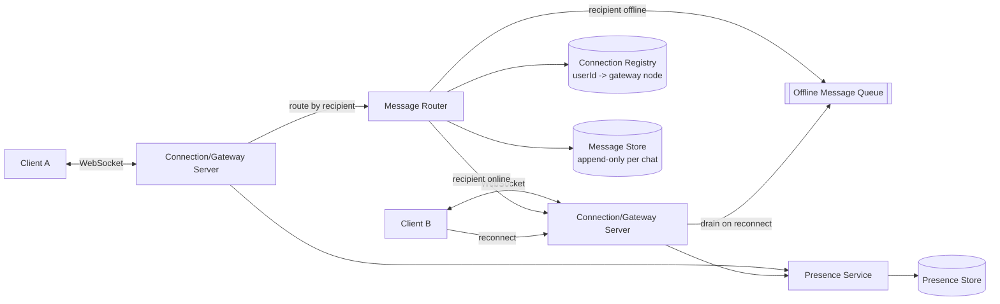

# WhatsApp / Messaging System — High Level Design

🎯 Asked at: Microsoft

## References
- Read first: [Design a Messaging App Like WhatsApp — Hello Interview](https://www.hellointerview.com/learn/system-design/problem-breakdowns/whatsapp)
- Watch: [Design WhatsApp: System Design Interview w/ an Ex-Meta Senior Manager (YouTube)](https://www.youtube.com/watch?v=cr6p0n0N-VA)

## Practice prompt
Before reading further: whiteboard how a message sent by User A reaches User B in near real time when
both are online, and what happens when B is offline for hours or days. Decide how you'd track and surface
delivery state (sent/delivered/read) without slowing down the send path, and how a group chat with 100
members avoids becoming 100x the work of a 1:1 chat on every send.

## 1. Requirements

**Functional**
- Send and receive 1:1 messages in near real time.
- Support group messaging (up to ~100-256 participants per group).
- Track and surface delivery state per message: sent → delivered → read, per recipient.
- Show online/last-seen presence for a user (subject to their privacy settings).
- Messages sent while a recipient is offline must be delivered once they come back online (no message
  loss).

**Non-functional**
- Real-time delivery latency should be low (sub-second) when both parties are online.
- Scale: billions of messages/day, hundreds of millions of concurrently connected users.
- Messages must not be lost even if a client is offline for an extended period (bounded retention window,
  e.g. up to ~30 days, is acceptable).
- End-to-end encryption is assumed at the transport/content layer (clients encrypt/decrypt; the server
  relays ciphertext and never needs plaintext to route or store a message) — this shapes the design even
  though the crypto scheme itself is usually out of scope for the interview.

## 2. API design

Mostly WebSocket-based, since this is a real-time, bidirectional system — a thin REST layer handles
setup/auxiliary calls.

```
WS  /connect                          (persistent connection, authenticated on handshake)
  Client -> Server: { type: "send", toUserId | toGroupId, ciphertext, clientMsgId, timestamp }
  Server -> Client: { type: "message", fromUserId, ciphertext, msgId, timestamp }
  Server -> Client: { type: "ack", clientMsgId, msgId, status: "sent" }
  Server -> Client: { type: "receipt", msgId, status: "delivered"|"read", byUserId }
  Client -> Server: { type: "receipt", msgId, status: "delivered"|"read" }
  Server -> Client: { type: "presence", userId, status: "online"|"offline", lastSeen? }

REST (auxiliary, not on the real-time hot path):
POST /groups                body: { name, memberIds } -> { groupId }
POST /groups/{id}/members    body: { userId } -> 200
GET  /messages/history?chatId={id}&before={cursor} -> { messages: [...] }  (offline backfill / pagination)
```

## 3. High-level design



- **Connection/gateway servers**: every online client holds a persistent WebSocket to a gateway server;
  gateways are stateless about routing beyond "which connections do I hold," and register each connected
  userId in a shared connection registry so any gateway can find where to route a message.
- **Message routing**: on send, the router looks up the recipient's connection location; if online, the
  message is forwarded directly to the owning gateway and pushed down that socket; if offline, it's
  durably written to an offline queue (or simply the message store, keyed by recipient) and delivered on
  reconnect.
- **Message store**: every message is durably persisted (append-only per chat) regardless of delivery
  path — this is the source of truth for history/backfill and what offline delivery reads from, not just
  a queue that could be lost.
- **Presence service**: tracks online/offline + last-seen per user, updated on connect/disconnect, and
  pushed to relevant contacts (e.g. people with an open chat with that user) rather than broadcast
  globally.

## 4. Deep dives

- **Real-time delivery — WebSocket fan-out and offline message queuing**: for 1:1 chats, fan-out is
  trivial (one recipient). For group chats, a send fans out to every online member's gateway connection
  plus an offline-queue entry for every offline member — this is naturally bounded by group size (~100s),
  unlike a social-feed fan-out to millions of followers, so a straightforward per-member fan-out on send
  is acceptable here (no need for a fan-out-on-read hybrid the way a celebrity feed would). The connection
  registry (userId → gateway node, e.g. backed by Redis) is what makes routing possible across a fleet of
  gateway servers instead of requiring all users to connect to one node; a gateway restart/deploy simply
  drops its connections and clients reconnect (ideally to a different node) and re-register.
- **Delivery receipt state machine (sent → delivered → read)**: `sent` is set the moment the server
  durably accepts the message (before any delivery attempt); `delivered` is set when the recipient's
  client acknowledges receipt over the socket (or on reconnect-drain for offline messages); `read` is set
  when the recipient's client reports the message was displayed/opened, often batched (e.g. one read
  receipt per chat-open covering all newly-seen messages, not one round-trip per message) to avoid a
  receipt storm. In groups, delivery/read state is naturally per-recipient — the sender's UI aggregates
  those into a summary (e.g. "delivered" once all members have delivered, "read" showing per-member if the
  UI exposes that), and this fan-in of receipts is itself a small write-amplification concern worth
  naming: a 100-person group generates up to 100 delivered + 100 read receipts per message, which is why
  receipts are typically written/aggregated asynchronously rather than synchronously updating the
  original message record on every single receipt.
- **Message ordering and idempotency in group chats**: a client can retry a send (e.g. after a flaky
  connection) without knowing if the original attempt succeeded — the client attaches a `clientMsgId`
  (client-generated UUID) so the server can dedupe retries idempotently (if a message with that
  `clientMsgId` from that sender already exists, return the existing `msgId` rather than creating a
  duplicate). For ordering, assign a monotonically increasing sequence number per chat (not a wall-clock
  timestamp, which can skew across servers) so all clients converge on the same message order even if
  messages arrive at different gateways at slightly different times — the message store's per-chat
  sequence counter is the source of truth clients reconcile against on sync/reconnect.

## 5. Trade-offs

| Delivery path | Latency | Durability | Complexity |
|---|---|---|---|
| Direct push (recipient online) | Sub-second | Backed by message store write | Low — normal path |
| Offline queue + drain on reconnect | Delayed until reconnect | Durable (message store) | Medium — needs reconnect-drain logic |

| Receipt handling | Sender UX accuracy | Write load | Notes |
|---|---|---|---|
| Synchronous per-message receipt write | Immediate | High in large groups | Simple but doesn't scale to big groups |
| Batched/async receipt aggregation | Near-immediate (small delay) | Much lower | Standard approach at scale |

## 6. How to narrate this in the interview

**Time budget (45 min)**
- 5 min: requirements & clarifying questions.
- 5 min: scale estimation (concurrent connections, messages/sec, group size bound).
- 10 min: API + data model (WebSocket protocol shape, message/receipt schema).
- 15 min: high-level design (gateway servers, connection registry, routing, message store, presence).
- 10 min: deep dives — prioritize delivery-receipt state and ordering/idempotency, since those are the
  parts most likely to trip candidates up; offline queuing can be covered more briefly if it's already
  implied by the high-level design.

**Clarifying questions to ask early**
- "Do we need to design end-to-end encryption itself, or can I assume clients handle encrypt/decrypt and
  the server only ever relays ciphertext?"
- "What's the maximum group size we need to support — this changes whether per-member fan-out on send is
  acceptable or whether we need a fan-out-on-read-style optimization like a feed system would."
- "How long do we need to retain undelivered messages for an offline user — hours, days, or weeks? This
  bounds the offline queue's storage/retention design."

**Whiteboard reveal order**
1. Draw the two clients, their gateway connections, and the connection registry first — this establishes
   the core real-time routing mechanism before anything else.
2. Draw the message store and the send/route/durable-write path next, showing that persistence happens
   regardless of whether the recipient is online — this heads off the common mistake of treating the
   queue as the only copy of the message.
3. Layer in delivery/read receipts and presence last, since both build on the connection registry and
   message store already on the board.

**Scale/failure follow-up**
*"What if a gateway server crashes while holding thousands of active connections?"*
Model answer: all connected clients on that gateway are dropped, but no messages are lost, because every
message was durably written to the message store before (or as part of) being pushed to a socket — the
gateway is purely a routing/transport layer, not a source of truth. Clients detect the dropped connection
and reconnect (via a load balancer, likely landing on a different gateway node), re-register in the
connection registry, and request a sync from their last-known sequence number per chat to catch up on
anything they missed while disconnected. Because delivery state and message ordering are tracked
server-side (per-chat sequence numbers, receipt records) rather than assumed from socket state, the
reconnect-and-resync flow is a normal path the system already needs for the offline case — a gateway
crash is just a forced, larger-scale version of the same thing.

**Common mistake**
Candidates often design the WebSocket fan-out and then forget to separately guarantee durability — i.e.
they treat "pushed to the recipient's socket" as equivalent to "message saved," which loses messages on a
server crash or if the recipient is offline. Avoid this by explicitly writing the message to durable
storage as part of (or before) the send acknowledgment, independent of whether real-time delivery
succeeds.
