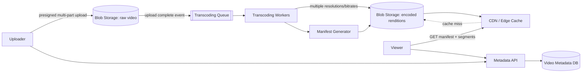

# YouTube / Netflix — High Level Design

🎯 Asked at: Netflix

## References
- Read first: [Design a Video Streaming Platform Like YouTube — Hello Interview](https://www.hellointerview.com/learn/system-design/problem-breakdowns/youtube)
- Watch: [System Design Interview: Design YouTube w/ an Ex-Meta Staff Engineer (YouTube)](https://www.youtube.com/watch?v=IUrQ5_g3XKs)

## Practice prompt
Before reading further: whiteboard how a multi-gigabyte video file gets from a user's upload button to
being watchable, in adaptive quality, by millions of viewers around the world. Decide where transcoding
happens, why you need multiple resolutions at all, and how playback stays smooth on a bad connection.

## 1. Requirements

**Functional**
- Users can upload videos; videos are processed and become watchable shortly after.
- Users can watch (stream) videos at a quality appropriate to their bandwidth/device.
- Users can see view counts and basic metadata (title, description, thumbnail).

**Non-functional**
- Upload must support large files (multi-GB) reliably, resumable on failure.
- Playback must start fast (low startup latency) and adapt smoothly to changing network conditions.
- Massively read-heavy and globally distributed — viewers are everywhere, uploaders are relatively few.
- Storage at petabyte scale; durability of the original upload is critical.

## 2. API design

```
POST /uploads/init
  -> { uploadId, presignedUrls: [...] }   # client uploads directly to blob storage

POST /uploads/{uploadId}/complete
  -> { videoId, status: "processing" }

GET /videos/{videoId}
  -> { videoId, title, status, manifestUrl, thumbnailUrl, viewCount }

GET /videos/{videoId}/manifest.m3u8   # adaptive streaming manifest (HLS/DASH)
```

## 3. High-level design



- **Upload path**: client uploads directly to blob storage (e.g. S3) via presigned URLs with multi-part,
  resumable chunked transfer — this bypasses the application servers entirely so they're never a
  bottleneck or single point of failure for large uploads.
- **Processing path**: an upload-complete event triggers transcoding workers that produce multiple
  resolution/bitrate renditions and a streaming manifest, all written back to blob storage.
- **Playback path**: viewers fetch the manifest and video segments through a CDN, which caches renditions
  at edge locations close to viewers — the origin blob store is only hit on a cache miss.

## 4. Deep dives

- **Video upload pipeline**: presigned URLs let the client (browser/app) upload directly to blob storage,
  in chunks, so an interrupted upload can resume from the last successful chunk rather than restarting.
  The application server's only job is issuing the presigned URL and recording the upload's existence —
  it never sees the video bytes.
- **Transcoding into multiple resolutions**: raw upload is encoded into a ladder of resolutions/bitrates
  (e.g. 240p/480p/720p/1080p/4K) so playback can adapt to viewer bandwidth. This is CPU-intensive and
  done asynchronously by a pool of transcoding workers (often GPU-accelerated), fanned out per-resolution
  so they can run in parallel; the video isn't watchable until at least the first rendition finishes,
  which is why upload-to-watchable has a processing delay.
- **CDN-based adaptive streaming**: the player (HLS/DASH) periodically measures effective bandwidth and
  switches to a higher/lower bitrate rendition between segment boundaries — this is what makes a stream
  survive a subway tunnel without buffering forever. The CDN's job is purely to get segments to the
  viewer with minimal latency; the *adaptation logic* itself lives in the client player.
- **Hot video / cache strategy**: a small number of videos account for a disproportionate share of views
  (similar shape to the celebrity problem in feeds). Popular video metadata and manifests are cached with
  a distributed LRU-based cache partitioned by `videoId` so the metadata DB isn't hammered by repeated
  lookups of the same trending video; the CDN handles the actual byte-serving hot path.

## 5. Trade-offs

| Decision | Option A | Option B | Notes |
|---|---|---|---|
| Upload path | Through app servers | Direct-to-blob via presigned URL | B avoids app-server bottleneck for large files |
| Transcoding timing | Eager (all resolutions before "ready") | Progressive (lowest res first, others follow) | B reduces time-to-watchable |
| Streaming protocol | Progressive download | Adaptive (HLS/DASH), chunked | B handles variable bandwidth gracefully |
| Serving | Origin-only | CDN-fronted | CDN essential at global read-heavy scale |

## 6. How to narrate this in the interview

**Time budget (45 min)**
- 5 min: requirements & clarifying questions.
- 5 min: scale estimation (uploads/day, concurrent viewers, storage growth rate).
- 10 min: API design.
- 10 min: high-level design (upload path, transcoding path, playback path).
- 15 min: deep dives — transcoding and adaptive streaming are where interviewers usually go deepest, so
  weight time there over the CDN/caching discussion.

**Clarifying questions to ask early**
- "Should I design the upload/transcoding pipeline in depth, the playback/CDN side, or both — most
  interviews narrow to one to go deep."
- "Do we need live streaming support, or is this strictly video-on-demand (pre-recorded, fully processed
  before first watch)?"
- "What's an acceptable upload-to-watchable delay — does the first (lowest) resolution need to be ready
  in seconds, or is a longer processing window fine?"

**Whiteboard reveal order**
1. Draw the upload path first (client → presigned URL → blob storage directly, bypassing app servers) —
   this establishes the key insight that large files never touch application servers.
2. Draw the transcoding pipeline next (event-triggered workers producing multiple renditions).
3. Layer in the CDN-fronted playback path and adaptive bitrate switching last, once upload and processing
   are established.

**Scale/failure follow-up**
*"What if a transcoding worker crashes partway through processing a video?"*
Model answer: transcoding jobs are consumed from a durable queue (triggered by the upload-complete event,
not held in worker memory), so a crashed worker simply leaves its job unacknowledged; the job becomes
visible again after a visibility timeout and another worker picks it up and restarts that rendition's
encode. Because each resolution/bitrate rendition is typically processed as an independent job, a crash
only wastes the partial work for the renditions that worker was actively encoding, not the whole video —
and the video isn't marked watchable until at least the lowest-resolution rendition's job completes
successfully, so partial failures never surface as a broken playback experience to viewers.

**Common mistake**
Candidates often gloss over the fact that transcoding is CPU/GPU-intensive and asynchronous, sometimes
implying playback can start immediately after upload. Avoid this by explicitly calling out the
upload-to-watchable processing delay and how progressive transcoding (lowest resolution first) minimizes
it, rather than leaving the impression that a raw upload is instantly streamable.
