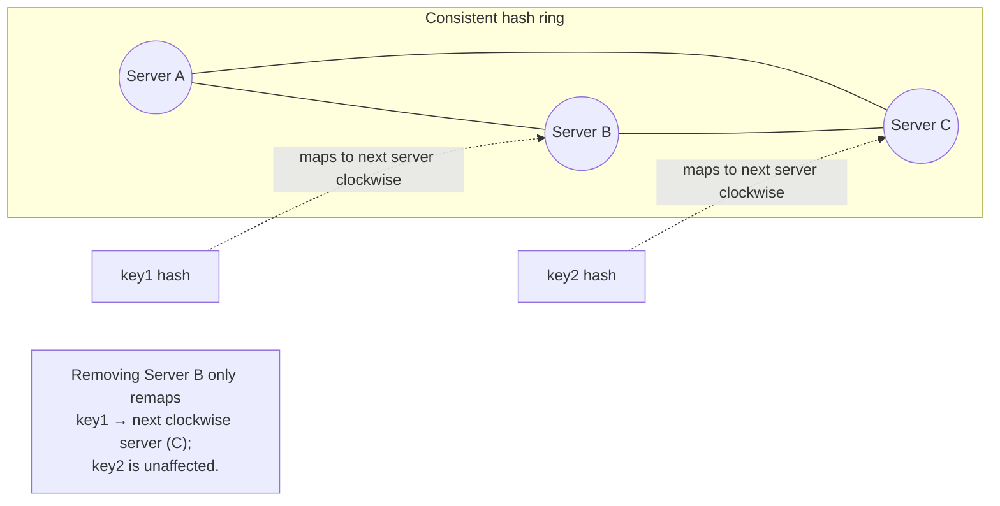
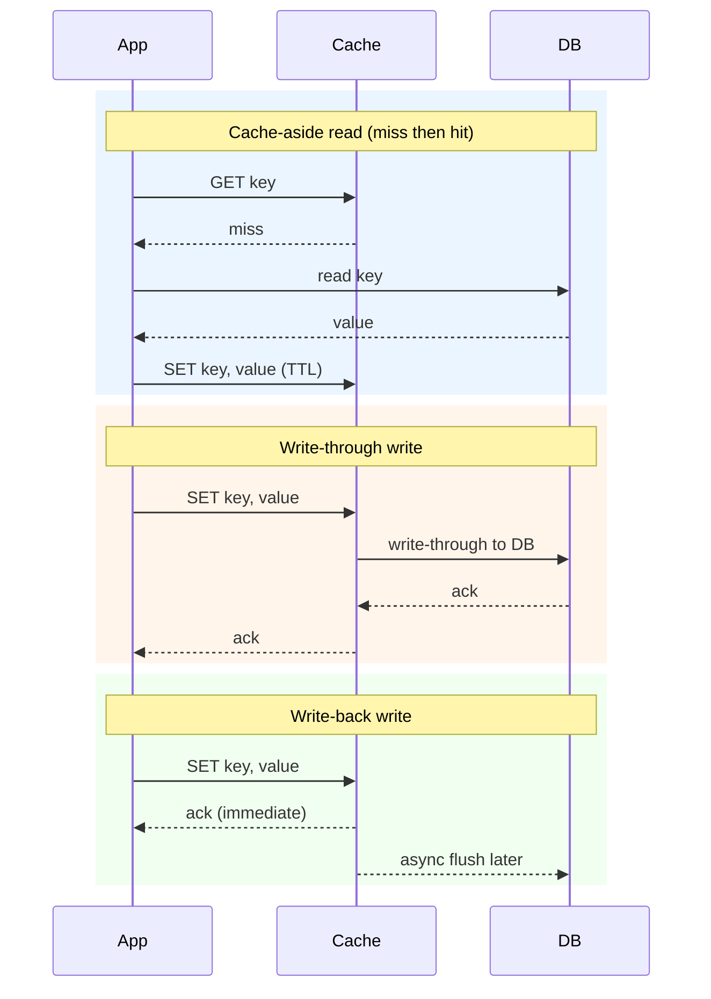

# Week 2 — Core Infrastructure Building Blocks

Part of the [8-week HLD learning path](../README.md).

## Concept: Networking concepts and load balancers (L4 vs L7, consistent hashing)

- **TCP vs UDP, in interview terms**: TCP gives ordered, reliable, connection-oriented delivery (the
  default for HTTP/most APIs); UDP is connectionless and unordered but lower-overhead (used where
  occasional loss is fine and latency matters more — video/voice streaming, some gaming). Mention this
  only when a design's transport choice is actually in question (e.g. live video week).
- **L4 (transport-layer) load balancing**: routes based on IP/port only, without looking at
  request content — fast, cheap, protocol-agnostic, but can't route on URL path, header, or cookie.
  Good fit as the outermost layer (e.g. AWS NLB) fronting a fleet of L7 load balancers or servers.
- **L7 (application-layer) load balancing**: terminates and inspects the actual HTTP request — can
  route `/api/*` to one service and `/static/*` to another, do content-based routing, sticky sessions
  via cookies, and TLS termination. Costs more per-request overhead than L4 but is what most services
  actually need for smart routing.
- **Load balancing algorithms**: round robin (simple, ignores server load), least-connections (routes to
  the server with fewest active connections, better under uneven request durations), weighted variants
  (accounts for heterogeneous server capacity). State which one and why when it matters to the deep
  dive — "round robin is fine since requests are uniform work" is a complete, sufficient answer.
- **Consistent hashing**: solves the problem of naive `hash(key) % N` remapping almost every key when N
  (server/shard count) changes — consistent hashing places both servers and keys on a hash ring, and a
  key maps to the next server clockwise from it; adding/removing one server only remaps the keys between
  it and its predecessor, not the whole keyspace. Virtual nodes (each physical server gets many points on
  the ring) smooth out uneven load distribution across a small number of physical servers.

## Concept: CDN, DNS, reverse proxies

- 🎯 Asked at Netflix
- **DNS**: translates a domain name to an IP address, hierarchically resolved (root → TLD → authoritative
  nameserver), and heavily cached at every layer (browser, OS, ISP resolver) per each record's TTL —
  which is exactly why DNS-based failover/traffic-shifting is slow (bounded by TTL) compared to a load
  balancer health check.
- **CDN (Content Delivery Network)**: a globally distributed network of edge caches that serve static
  (and increasingly, cacheable dynamic) content from a location physically close to the user, cutting
  both latency and origin load. Push CDN (you upload content ahead of time) vs. pull CDN (edge fetches
  and caches on first miss, like a cache-aside pattern at global scale) — pull is the common default for
  user-generated content since you can't pre-push everything.
- **Reverse proxy**: sits in front of one or more backend servers, terminating client connections and
  forwarding to backends — used for TLS termination, load balancing, request routing, caching, and
  hiding backend topology from clients (Nginx, Envoy are common examples). Contrast with a *forward*
  proxy, which sits in front of clients and hides them from the destination server.
- **Why Netflix asks this**: video delivery is the canonical CDN use case — video chunks are large,
  cacheable, and read by millions of geographically distributed users, so pushing that traffic to edge
  PoPs instead of a central origin is the difference between a viable and non-viable cost/latency
  profile. Expect a follow-up on cache invalidation for content that changes (thumbnails, metadata)
  versus immutable video chunks (which can be cached forever, keyed by content hash/version).
- **DNS + CDN + reverse proxy working together**: a request typically resolves DNS to the nearest CDN
  PoP, the CDN edge serves from cache or proxies to origin on a miss, and the origin itself usually sits
  behind its own reverse proxy/load balancer — worth sketching this full chain once in an interview to
  show you see the whole path, not just one hop.

## Concept: Caching strategies (write-through, write-back, cache-aside, TTL)

- **Cache-aside (lazy loading)**: application checks cache first; on a miss, reads from the DB and
  populates the cache. Simplest and most common pattern; only requested data ever gets cached, but the
  first request for any key always pays a cache-miss penalty and there's a window where cache and DB can
  disagree if the DB is updated by another path.
- **Write-through**: every write goes to the cache and the DB synchronously (as one logical operation)
  before returning success. Keeps cache and DB always consistent, at the cost of higher write latency
  (two writes on the critical path).
- **Write-back (write-behind)**: writes go to the cache immediately and are asynchronously flushed to the
  DB later. Lowest write latency and can batch/coalesce writes, but risks data loss if the cache node
  fails before the flush — only acceptable when that loss window is tolerable.
- **TTL (time-to-live)**: every cached entry expires after a fixed duration regardless of writes,
  bounding staleness without needing explicit invalidation logic. Often combined with cache-aside as the
  default safety net even when explicit invalidation also exists.
- **Choosing one**: cache-aside + TTL is the default unless you have a specific reason to pay for
  stronger consistency (write-through) or lower write latency (write-back) — name the read:write ratio
  and staleness tolerance you identified in week 1's estimation step to justify the choice.

## Concept: Redis deep dive — data structures, eviction policies, pub/sub

- 🎯 Asked at Spotify
- **Data structures beyond plain key-value**: strings, hashes (object-like field maps, good for partial
  updates without reading the whole object), lists (queues, recent-items), sets/sorted sets (sorted sets
  power leaderboards and rate limiters — score-ordered membership with O(log N) operations), and
  bitmaps/HyperLogLog for cheap approximate counting at scale. Picking the right structure for the access
  pattern is usually the actual interview signal, not just "we'll use Redis."
- **Eviction policies**: when Redis hits its memory limit, it evicts by policy — `allkeys-lru` (evict
  least-recently-used across all keys, the common cache default), `volatile-lru` (LRU only among keys
  with a TTL set, protecting keys meant to be permanent), `allkeys-random`, `noeviction` (reject writes
  instead of evicting — appropriate when Redis holds non-cache, must-not-lose data). Naming the specific
  policy and why is a strong signal in a Redis-heavy deep dive.
- **Pub/sub**: Redis pub/sub lets producers publish to a channel and all currently-subscribed consumers
  receive the message — fire-and-forget, no persistence or replay for disconnected subscribers (unlike
  Kafka). Good fit for fanning out real-time events to connection-holding servers (see week 6's
  WebSocket/SSE routing problem) where losing a message during a brief disconnect is acceptable.
- **Redis as more than a cache**: Spotify-style interviews often push past "Redis is a cache" into using
  it as the primary store for ephemeral or approximate data — session state, rate-limiter counters
  (sorted sets/strings with TTL), a "currently playing" registry — because its data structures and
  latency profile fit those access patterns better than a general-purpose DB.
- **Persistence and availability caveats worth knowing**: RDB snapshots and AOF logs give Redis optional
  durability, but most cache deployments run it as best-effort in-memory state; for anything where losing
  Redis's data would be a real incident, either enable persistence deliberately or treat Redis purely as
  a cache in front of a durable source of truth.

## How to bring this up in the interview

- **When to mention it**: as soon as your high-level diagram has more than one server, before you've
  even been asked — say "I'll put a load balancer in front of these" as you draw it, rather than waiting
  for a prompt. Bring up caching specifically once you've established a read-heavy access pattern in your
  estimation step (week 1) — that's the natural trigger, not a random aside.
- **A good opening line**: when introducing caching, "Given the read:write ratio we estimated, I'd add a
  cache in front of the DB — let me pick a strategy based on how much staleness we can tolerate and
  whether write latency matters here." This ties the infra choice back to the numbers instead of
  sounding like a reflexive "always add Redis."
- **A question to ask the interviewer**: "Is stale data for a few seconds acceptable for this read path,
  or does it need to reflect writes immediately?" — the answer directly picks cache-aside+TTL vs.
  write-through, and asking it shows you know the trade-off exists rather than defaulting silently.
- **Common follow-up 1**: *"What happens on a cache stampede — a hot key expires and thousands of
  requests hit the DB at once?"* Answer: mention request coalescing (single in-flight DB read per key,
  others wait on it), jittered TTLs so keys don't expire in lockstep, or a short "logical lock" in the
  cache during refresh.
- **Common follow-up 2**: *"How do you keep the cache from serving stale data after a write?"* Answer:
  either invalidate/delete the cache key on write (cache-aside's usual pairing) rather than trying to
  update it in place, or move to write-through if staleness is truly unacceptable — and name which one
  you're choosing and why for this specific field.

## Designs this week

- [Consistent Hashing](../designs/consistent-hashing/README.md) (✅ runnable Go demo in this repo) *(cross-cutting concept,
  builds the ring data structure this week's load-balancing section covers)*
- [Rate Limiter](../designs/rate-limiter/README.md) (✅ runnable Go demo in this repo) — 🎯 Asked at Razorpay *(uses Redis
  data structures from this week's Redis deep dive; full design covered in week 4)*

## Practice prompt
Design the caching layer for a Spotify-style "currently playing" + recently-played-tracks feature: reads
massively outnumber writes, staleness of a second or two is fine, and you also want a real-time "friend
started listening to X" fan-out. Whiteboard which Redis data structure backs recently-played (hint: a
capped list or sorted set), which caching strategy backs the currently-playing lookup (cache-aside with
TTL, or something stronger), which eviction policy you'd set, and how pub/sub fits the friend-activity
fan-out versus a durable queue.
