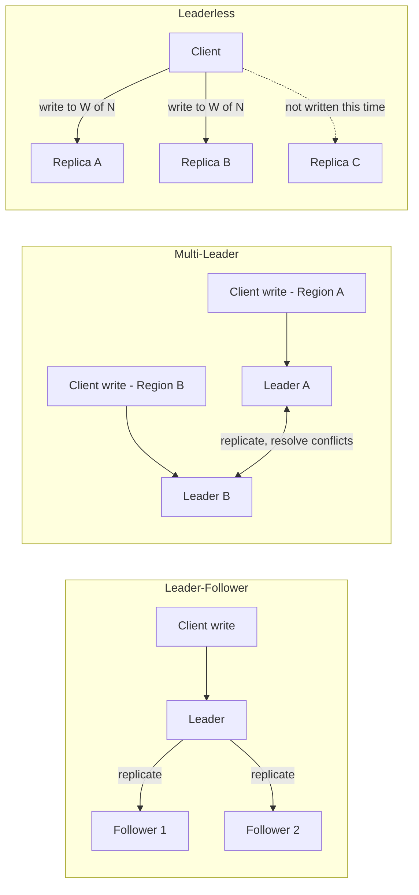
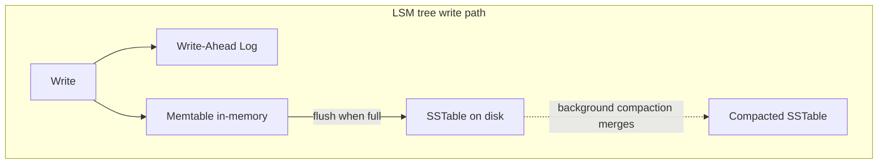
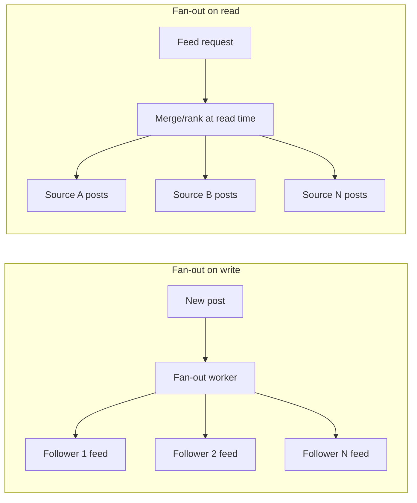

# Week 3 — Database & Messaging Systems

Part of the [8-week HLD learning path](../README.md).

## Concept: Sharding strategies (range, hash, directory-based)

- 🎯 Asked at Microsoft
- **Why shard at all**: once a single node can't hold the data volume or serve the write throughput
  (informed by week 1's estimation step), you split ("shard"/"partition") data across multiple nodes,
  each holding a subset. Sharding trades single-node simplicity (easy joins, easy transactions) for
  horizontal scalability.
- **Range-based sharding**: partition by a key range (e.g. user IDs 1-1M on shard 1, 1M-2M on shard 2).
  Simple, and range queries within a shard are cheap, but prone to hotspots when access/insert patterns
  cluster (e.g. sequential IDs mean all new writes hit the last shard).
- **Hash-based sharding**: partition by `hash(key) % N` (or, better, consistent hashing from week 2 to
  avoid a full remap when N changes). Spreads load evenly and avoids hotspots from sequential keys, but
  loses range-query locality — "give me all users created this week" now fans out to every shard.
- **Directory-based sharding**: a separate lookup service/table maps each key (or key range) to its
  shard explicitly, rather than deriving it algorithmically. Most flexible (arbitrary rebalancing,
  per-tenant shard placement) but adds an extra lookup hop and makes the directory itself a critical,
  must-scale component.
- **Choosing a shard key**: this is usually the actual interview question, not "which strategy" in the
  abstract — a good shard key matches the dominant access pattern (so most queries hit one shard, not a
  fan-out across all of them) and avoids hotspotting (no single key/small key-set gets disproportionate
  traffic). State the shard key explicitly and justify it against the access pattern from your data
  model step.
- **Resharding pain**: whichever strategy you pick, growing shard count later is expensive — range and
  hash sharding both require moving data; this is precisely the problem consistent hashing (week 2)
  minimizes for hash-based schemes.

```mermaid
flowchart TB
    Q[Query: user_id = 4821] --> R{Shard strategy}
    R -->|Range: id 0-5000 -> Shard A| SA[(Shard A)]
    R -->|Hash: hash(id) mod 3 -> Shard B| SB[(Shard B)]
    R -->|Directory: lookup(id) -> Shard C| Dir[[Directory Service]] --> SC[(Shard C)]
```

## Concept: Replication (leader-follower, multi-leader, leaderless)

- **Leader-follower (primary-replica)**: all writes go to one leader, which replicates to one or more
  followers; reads can be served from followers to scale read throughput. Simple to reason about
  consistency-wise (one writer = no write conflicts), but the leader is a single point of failure for
  writes until a follower is promoted, and follower reads can be stale (replication lag) unless you
  route "read-your-own-write" traffic back to the leader.
- **Synchronous vs. asynchronous replication**: synchronous waits for follower ack before confirming the
  write (stronger durability, higher write latency, and availability suffers if a follower is slow/down);
  asynchronous confirms immediately and replicates in the background (lower latency, but a leader crash
  before replication completes can lose the most recent writes). Semi-synchronous (wait for at least one
  follower) is a common middle ground.
- **Multi-leader**: multiple nodes (often one per region) each accept writes and replicate to each other.
  Enables low-latency local writes in multiple geographies, but creates write conflicts that need
  resolution (last-write-wins, application-level merge, CRDTs) when the same record is written in two
  places concurrently.
- **Leaderless (e.g. Dynamo-style)**: any replica can accept a write; the client (or a coordinator)
  writes to W replicas and reads from R replicas, using quorum math (`W + R > N`) to guarantee overlap
  between write and read sets. Highly available and partition-tolerant, but requires conflict resolution
  for concurrent writes (version vectors, last-write-wins) and read-repair/anti-entropy to converge
  stale replicas.
- **Connecting back to CAP (week 1)**: leader-follower with synchronous replication leans CP (rejects
  writes rather than risk inconsistency during a partition); leaderless with low W/R leans AP (stays
  available, tolerates temporary divergence). Naming this connection explicitly is a strong signal.



## Concept: Database indexing internals (B-Tree, LSM tree)

- **B-Tree indexes**: the classic balanced-tree index used by most SQL databases (Postgres, MySQL) —
  data is stored in sorted, disk-page-sized nodes, giving `O(log N)` lookups and efficient range scans.
  Reads are fast (few page reads to find any key); writes require in-place page updates, which are
  more expensive random I/O, especially under high write throughput.
- **LSM trees (Log-Structured Merge trees)**: used by write-optimized stores (Cassandra, RocksDB,
  LevelDB, and under the hood of many "NoSQL" engines). Writes go to an in-memory structure (memtable),
  usually backed by a write-ahead log for durability; when the memtable fills, it's flushed to disk as an
  immutable sorted file (SSTable). Reads may need to check the memtable plus multiple SSTables (mitigated
  with bloom filters to skip files that definitely don't contain the key), and a background **compaction**
  process periodically merges SSTables to bound read amplification and reclaim space from deleted/
  overwritten keys.
- **The core trade-off**: B-Trees optimize for read latency and in-place update simplicity at the cost of
  write amplification (random disk I/O per write); LSM trees optimize for write throughput (sequential
  disk I/O, writes are cheap appends) at the cost of read amplification (a read may touch several files)
  and background compaction overhead. State this trade-off explicitly when justifying a storage engine
  choice for a write-heavy design (e.g. week 3's message queue material, or a metrics/logging system).
- **Where this shows up in interviews**: "why does Cassandra handle write-heavy workloads better than
  Postgres" is really this B-Tree vs. LSM-tree trade-off — a strong answer names the write path
  difference (in-place update vs. sequential append + later compaction), not just "Cassandra is NoSQL so
  it scales better."



## Concept: Message queues & event-driven architecture (Kafka, SQS)

- 🎯 Asked at Uber
- **Why decouple with a queue**: a producer publishes an event/message without needing the consumer to be
  available right now — this absorbs traffic spikes (the queue buffers), lets producer and consumer scale
  independently, and lets one event fan out to multiple independent consumers without the producer
  knowing about any of them.
- **Kafka (log-based)**: an append-only, partitioned log retained for a configurable window; consumers
  track their own read offset and can replay from any point, and multiple independent consumer groups can
  each read the full stream at their own pace. Ordering is guaranteed only within a partition, so the
  partition key choice (e.g. `user_id`) determines what ordering guarantee you actually get. Good fit for
  event streaming, event sourcing, and fan-out to multiple consumer types (analytics, notifications,
  search indexing off the same event).
- **SQS (queue-based)**: messages are consumed and removed (or become invisible during a visibility
  timeout) — a more classic work-queue model, best for task distribution where each message should be
  processed exactly by one worker, not broadcast to many. Simpler operationally than running Kafka, at
  the cost of no replay and no natural multi-consumer-group fan-out.
- **Choosing between them**: "does more than one consumer need the same event independently, and might we
  need to replay history" points to Kafka; "is this a straightforward task queue for one class of
  worker" points to SQS/simple queue. Uber-style interviews (ride events, driver-location events feeding
  matching + pricing + analytics simultaneously) are the canonical multi-consumer Kafka case.
- **Delivery guarantees**: at-least-once (default for both, possible duplicate delivery — pairs with
  week 8's idempotency material), at-most-once (fire-and-forget, can lose messages), and effectively
  exactly-once (at-least-once delivery + idempotent consumers, since true exactly-once delivery isn't
  achievable over a network — see week 8).

## Concept: Async processing and fan-out patterns

- **Async processing**: move non-critical-path work off the synchronous request/response cycle — e.g.
  accept a write, enqueue side effects (send email, update search index, recompute aggregates), and
  return to the client immediately. Improves perceived latency and isolates slow downstream work from
  the request path (ties back to week 5's resilience patterns).
- **Fan-out-on-write**: when an event happens (e.g. a post), immediately push/precompute it into every
  relevant consumer's view (e.g. every follower's feed). Read path becomes very cheap (just read the
  precomputed view), but write path becomes expensive and gets worse with fan-out size — a user with
  10M followers means 10M writes per post ("celebrity problem").
- **Fan-out-on-read**: instead of precomputing, assemble the view at read time by querying/merging from
  source data (e.g. pull recent posts from everyone a user follows, merge and rank on demand). Write path
  stays cheap (just write the post once), but read path becomes more expensive and read latency grows
  with the number of sources merged.
- **Hybrid approach**: most large-scale feed systems (this is a preview of week 5) fan out on write for
  normal users and fan out on read for high-follower-count accounts, avoiding both the celebrity write
  storm and universally slow reads. Naming this hybrid explicitly, with the threshold that triggers the
  switch, is a strong deep-dive answer.



## How to bring this up in the interview

- **When to mention it**: sharding and replication come up the moment your estimation step (week 1)
  shows write throughput or storage exceeding a single node's capacity — say so explicitly ("at this
  write volume, a single primary won't keep up, so let's shard") rather than waiting to be pushed.
  Message queues come up whenever you spot a slow or optional side effect on the critical write path.
- **A good opening line**: "This write needs to trigger three things — persist it, index it for search,
  and notify followers. Only the persist has to be synchronous; I'd put the other two on a queue so the
  user's request doesn't wait on them." This shows you default to decoupling non-critical work rather
  than bolting a queue on reflexively everywhere.
- **A question to ask the interviewer**: "Do multiple independent services need to react to this same
  event, or is this a single task getting handed off to one worker?" — directly decides Kafka-style
  pub/sub vs. a simple task queue, and shows you know they're different tools for different fan-out
  shapes.
- **Common follow-up 1**: *"Your shard key is `user_id` — what breaks if one user is far more active than
  everyone else (a hot shard)?"* Answer: name the specific mitigation — sub-sharding the hot key, adding
  a random suffix to spread writes then merging on read, or moving that one entity to dedicated capacity
  — and acknowledge no shard key is hotspot-proof for a sufficiently skewed distribution.
- **Common follow-up 2**: *"A consumer crashes after processing a Kafka message but before committing its
  offset — what happens?"* Answer: the message gets redelivered on restart (at-least-once), so the
  consumer's processing must be idempotent (tie back to week 8) — this is precisely why "exactly-once" is
  really "at-least-once + idempotent handling" in practice.

## Designs this week

- [Key-Value Store](../designs/key-value-store/README.md) (best explored hands-on — see design doc) — 🎯 Asked at Amazon — the design
  that most directly exercises this week's sharding, replication, and LSM-tree material end to end.

## Practice prompt
Design the storage and delivery layer for a ride-event pipeline like Uber's: a driver's location update,
a trip-start event, and a trip-completion event each need to reach a matching service, a pricing service,
and an analytics pipeline independently, at very high write volume. Whiteboard your shard key for storing
trip data, your replication strategy and its consistency trade-off, whether you'd reach for Kafka or a
simple queue for the event distribution (and why), and where in the pipeline fan-out-on-write vs.
fan-out-on-read logic would apply.
