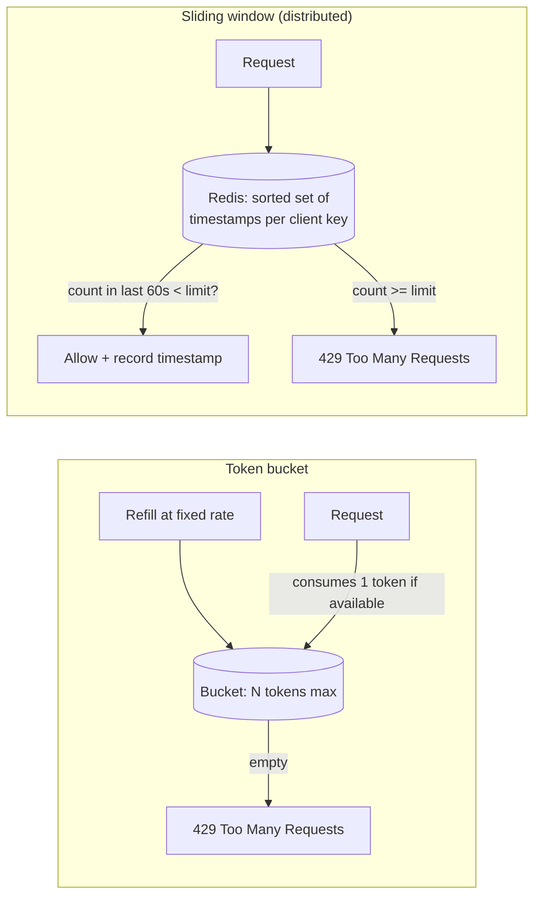
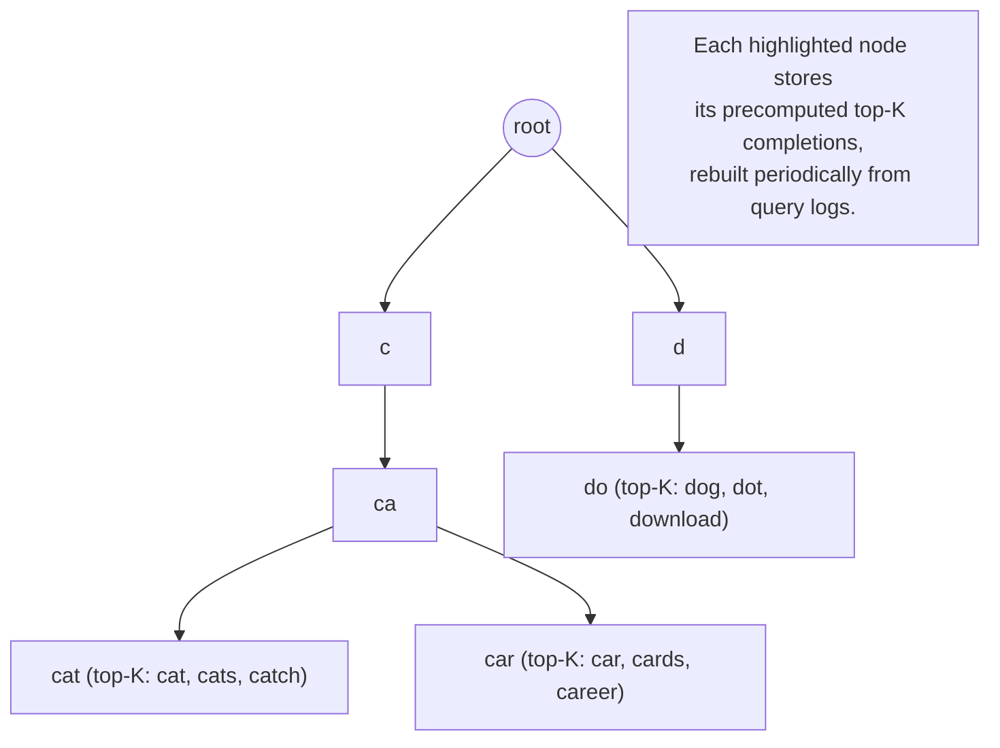

# Week 4 — High-Traffic & Search Systems

Part of the [8-week HLD learning path](../README.md).

## Concept: Rate limiting at scale (Token Bucket, Sliding Window at distributed level)

- **Why rate limit**: protect a service (or a downstream dependency) from being overwhelmed by a client
  — abusive, buggy, or simply too popular — and to enforce fair usage/tiered quotas (free vs. paid API
  tiers). It's both a reliability tool (week 5's resilience theme) and a product/business tool (quota
  enforcement).
- **Token bucket**: a bucket holds up to `capacity` tokens, refilled at a fixed `rate`; each request
  consumes one token, and requests are rejected (or queued) when the bucket is empty. Naturally allows
  short bursts up to the bucket capacity while enforcing a long-run average rate — usually the preferred
  algorithm because bursty-but-bounded traffic is realistic client behavior.
- **Sliding window**: counts requests in a moving time window (e.g. "last 60 seconds") rather than fixed
  buckets, avoiding the fixed-window algorithm's edge-case flaw where a client can burst 2x the limit by
  timing requests around a window boundary (e.g. all at the end of one window and all at the start of
  the next). A sliding-window-counter approximation (weighting the previous window's count) gets most of
  the accuracy of a true sliding log at a fraction of the memory.
- **Making it distributed**: a single in-memory counter only works for one server; at scale, counters
  must live in a shared, fast store (Redis is the standard choice, using `INCR` + `EXPIRE` or a sorted
  set for sliding-window-log) so all servers behind a load balancer enforce the same limit against the
  same client. This introduces a new bottleneck (the shared counter store) and a race-condition concern
  (two servers both read-then-write the same counter) that needs an atomic operation (Redis `INCR`, or a
  Lua script for multi-step logic) to resolve correctly.
- **Where to enforce it**: at the edge (API gateway/reverse proxy) is cheapest — rejects abusive traffic
  before it reaches application servers — but coarse; per-user/per-endpoint limits usually need
  application-level enforcement with access to business context (user tier, endpoint cost).

## Concept: Design: URL Shortener (hashing, redirection, analytics)

- 🎯 Asked at Flipkart
- **Short code generation**: either hash the long URL (e.g. base62-encode a truncated MD5/SHA hash) and
  handle collisions with a retry/salt, or use a counter/ID-generation service (e.g. a distributed
  sequence, or Snowflake-style ID) and base62-encode that — the counter approach guarantees uniqueness
  by construction and avoids collision handling entirely, which is usually the cleaner interview answer.
- **301 vs 302 redirect trade-off**: 301 (permanent) lets browsers cache the redirect, meaning
  subsequent visits skip your server entirely — great for load, bad because you lose analytics visibility
  on cached hits and can't easily change the target later. 302 (temporary) always round-trips through
  your server, giving accurate click analytics at the cost of extra load — the standard answer is 302
  specifically *because* analytics is a stated requirement.
- **Analytics as an async side effect**: recording a click shouldn't block the redirect response (ties
  directly to this week's async-processing material from week 3) — fire an event onto a queue and let a
  separate aggregator update click counts, keeping redirect latency on the critical path minimal.
- **Full write-up**: [URL Shortener design](../designs/url-shortener/README.md) covers requirements, API,
  data model, high-level diagram, and deep dives in full.

## Concept: Design: Rate Limiter (Token Bucket, Sliding Window — distributed)

- 🎯 Asked at Razorpay
- **This is the productionized version of the concept above**: same algorithms, but now as a standalone
  service/library other services call into — worth distinguishing "rate limiting as a design pattern
  inside a larger system" (previous section) from "a rate limiter as the entire interview question"
  (this one), since the latter expects much deeper treatment of the shared-state and multi-node
  correctness problem.
- **Where the limiter lives**: as a library embedded in each service (lowest latency, but state isn't
  shared unless backed by Redis) vs. a standalone service/sidecar all traffic passes through (centralizes
  logic and state, adds a network hop and a new single point of failure to guard against).
- **Multi-dimension limits**: real systems rate-limit on multiple keys simultaneously (per-user, per-IP,
  per-API-key, global) — the data model needs a limit config per dimension, and a request may need to
  check several limiters and take the most restrictive result.
- **Full write-up**: [Rate Limiter design](../designs/rate-limiter/README.md) (✅ runnable Go demo in this repo) — has a runnable
  Go implementation, useful for seeing the atomic-counter logic concretely rather than just on a
  whiteboard.

## Concept: Design: Search Autocomplete (Trie at scale, typeahead service)

- **Trie (prefix tree) basics**: each node represents one character; a path from root to node represents
  a prefix, and marking terminal nodes (with a frequency/popularity score) lets you retrieve "all
  completions of this prefix" by walking the subtree rooted at the prefix's node — naturally suited to
  typeahead since users type prefixes incrementally.
- **Scaling the trie beyond memory**: a full trie over a huge corpus (all search queries ever) won't fit
  on one machine and rebuilding it live per keystroke is wasteful — the standard approach precomputes,
  per trie node (or per prefix up to some length), the top-K most popular completions, so a query is an
  O(1)-ish lookup rather than a live subtree walk; the trie is rebuilt periodically (e.g. hourly/daily)
  from aggregated query logs rather than updated on every single query.
- **Sharding the trie**: shard by prefix range (e.g. a-h on shard 1, i-p on shard 2) since the access
  pattern is purely prefix-keyed — a clean, natural fit for range-based sharding from week 3, in contrast
  to the hotspot risk range sharding usually carries (short common prefixes like "a" will still be hot,
  worth calling out).
- **Latency requirement drives the whole design**: typeahead has to respond within the time between
  keystrokes (well under 100ms) or it feels broken — this single non-functional requirement is why the
  design precomputes top-K results and caches aggressively rather than computing anything live per
  request.
- **Full write-up**: [Search Autocomplete design](../designs/search-autocomplete/README.md) (✅ runnable Go demo in this repo) —
  includes a runnable Go trie implementation.

## How to bring this up in the interview

- **When to mention it**: rate limiting comes up naturally the moment you discuss protecting an API from
  abuse or enforcing tiered quotas — bring it up proactively when sketching the API gateway/edge layer,
  don't wait to be asked "how would you prevent abuse?" Autocomplete/trie material is narrower — bring it
  up specifically when a design has a "search-as-you-type" requirement, not for general search.
  Redirection-service trade-offs (301 vs 302) are worth stating unprompted the moment you draw the
  redirect endpoint, since it's a classic "shows you understand the implications" detail.
- **A good opening line**: "Since this endpoint is public and could get hammered by a bad client, I'd put
  a rate limiter in front of it — let me pick between token bucket and sliding window based on whether
  bursts should be allowed." This frames rate limiting as a deliberate choice tied to a real risk, not a
  buzzword drop.
- **A question to ask the interviewer**: "Should the rate limit be per-user, per-IP, or global — and do
  we need it enforced consistently across many servers, or is best-effort per-server enough?" — this
  single question decides whether you need the distributed/Redis-backed version at all, and shows you
  know the local-vs-shared-state distinction matters.
- **Common follow-up 1**: *"Two requests hit two different servers at the exact same instant and both
  read the counter as 1-under-limit — how do you avoid both being allowed when only one should be?"*
  Answer: use an atomic increment-and-check on the shared store (Redis `INCR` returns the new value
  atomically, or a Lua script for multi-step check-then-act logic) rather than a read-then-write from the
  application, which is inherently racy.
- **Common follow-up 2** (autocomplete): *"How do you keep the top-K suggestions fresh without recomputing
  the whole trie on every query?"* Answer: rebuild off of aggregated query-log counts on a fixed cadence
  (e.g. hourly) into a new trie version, then atomically swap the "current" trie pointer — reads never
  block on rebuilds, and staleness is bounded by the rebuild interval, which is an acceptable trade-off
  for a ranking signal like popularity.

## Designs this week

- [URL Shortener](../designs/url-shortener/README.md) — 🎯 Asked at Flipkart
- [Rate Limiter](../designs/rate-limiter/README.md) (✅ runnable Go demo in this repo) — 🎯 Asked at Razorpay
- [Search Autocomplete](../designs/search-autocomplete/README.md) (✅ runnable Go demo in this repo)

## Practice prompt
Design a public API gateway that fronts three internal services and must (a) rate-limit each API key to
a configurable requests-per-minute quota with burst tolerance, and (b) serve a `/search/suggest?q=`
typeahead endpoint backed by a precomputed trie over the last 30 days of query logs. Whiteboard the
rate-limiter algorithm and where its shared state lives across a fleet of gateway instances, then
whiteboard how the trie is built, sharded, and refreshed — and be ready to justify both against a
100ms p99 latency requirement.
