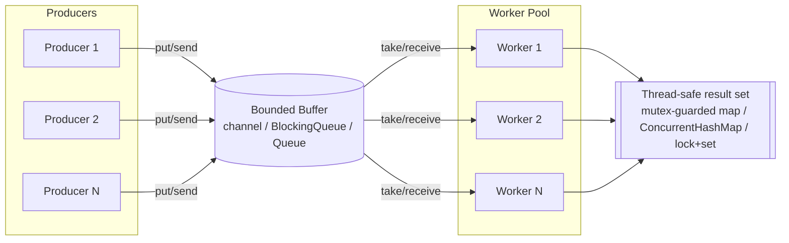
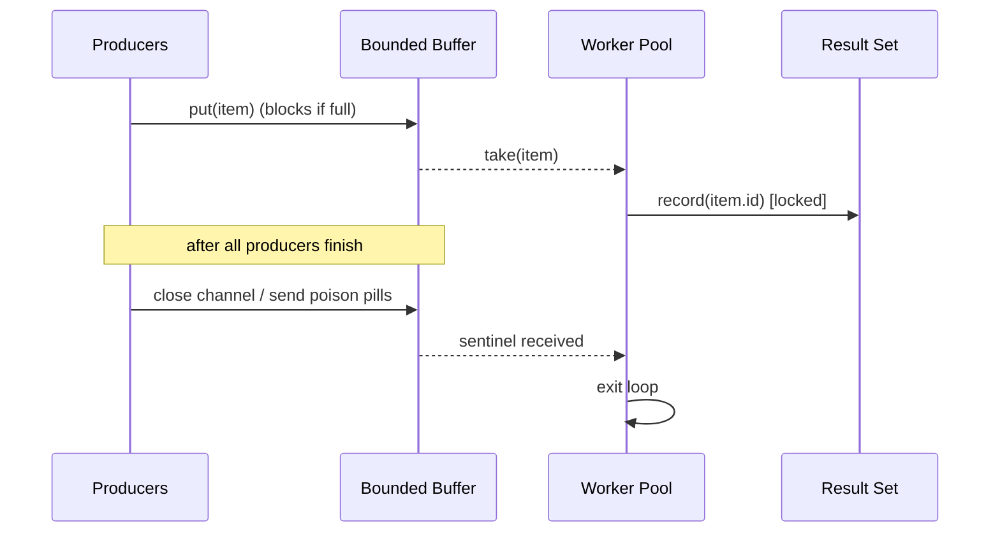

# Concurrency Primitives — Low Level Design

🎯 Asked at: Senior-level LLD interviews as a follow-up ("now make this thread-safe" / "now handle
this at scale with N workers") rather than a standalone problem — parking lot, elevator, and
rate-limiter designs all get a concurrency twist once you clear the base design.

## References
- Read first: [Introduction to Concurrency — Hello Interview](https://www.hellointerview.com/learn/low-level-design/concurrency/intro)
- Watch: [Java ExecutorService - Part 1 - Introduction (YouTube)](https://www.youtube.com/watch?v=6Oo-9Can3H8)

## Practice prompt
Before opening the code below: design a bounded work queue fed by multiple producers and drained by
a fixed pool of worker threads/goroutines, such that no submitted item is ever lost, duplicated, or
processed out of a safe concurrent context. Decide what happens when the buffer is full (block? drop?
reject?) and how workers know when to stop. Only then look at the reference implementations.

## Concepts, and where they show up in the code

- **Thread basics** — each producer and each worker runs on its own thread of execution: a goroutine
  in Go (`go func() {...}()`), a `Thread`/pooled task in Java, a `threading.Thread` in Python. The core
  interview skill is recognizing that any state touched by more than one of these needs protection.
- **Locks (mutex)** — Go's `SafeSet` (`go/concurrency.go`) guards its map with a `sync.Mutex` so
  concurrent `Add` calls from worker goroutines never race. Python's demo/tests guard a shared
  `dict`/`list` with `threading.Lock` for the same reason. This is the same pattern as the
  `sync.Mutex` guarding `Floor.findAndAssign` in the parking-lot problem — mutual exclusion around a
  read-modify-write on shared memory.
- **ReadWriteLock** — not needed by this pipeline (every access here is a write), but it's the natural
  upgrade once a design has many concurrent readers and rare writers (e.g. a cache of spot
  availability) — swap `sync.Mutex`/`synchronized` for `sync.RWMutex`/`ReentrantReadWriteLock` so
  readers don't serialize behind each other, only behind writers.
- **ThreadPool / ExecutorService** — the Java implementation (`java/src/BoundedPipeline.java`) uses
  `Executors.newFixedThreadPool(numWorkers)` as the consumer pool: a fixed number of worker threads
  pull from the shared queue instead of spawning one thread per item. Go achieves the same effect with
  a fixed number of long-lived goroutines ranging over a channel; Python with a fixed number of
  `threading.Thread`s looping on `queue.Queue.get()`.
- **Producer-Consumer** — the central pattern of all three implementations: producers push `Item`s
  into a **bounded buffer** (Go: buffered `chan Item`; Java: `ArrayBlockingQueue`; Python:
  `queue.Queue(maxsize=...)`), and workers pull and process them concurrently. The bound provides
  backpressure — a slow consumer pool naturally stalls fast producers instead of buffering unbounded
  memory.
- **Task Scheduling (concurrency angle)** — coordinating *when* work stops is the scheduling problem
  here: Go closes the channel once `sync.WaitGroup` confirms every producer is done, letting `range`
  drain the buffer and exit; Java/Python push one poison-pill sentinel per worker after producers
  finish, so each worker exits its loop cleanly after doing the same job. This is distinct from the
  functional "task scheduler" LLD problem elsewhere in this repo (recurring jobs, cron-like
  scheduling) — here "scheduling" means orchestrating thread lifecycles, not job semantics.

## Flow diagram





## Key trade-offs / talking points
- **Bounded vs unbounded buffer**: bounding the buffer (channel capacity, `ArrayBlockingQueue`
  capacity, `Queue(maxsize=...)`) gives backpressure for free — producers block instead of the process
  running out of memory under a slow consumer. Unbounded queues trade that safety for lower producer
  latency.
- **Shutdown signaling**: Go's closed-channel-plus-`range` idiom is idiomatic and only works because
  channels support broadcast-close; Java/Python queues don't support that, so a poison-pill sentinel
  (one per worker) is the portable equivalent.
- **Fixed worker pool vs thread-per-task**: a bounded pool (`ExecutorService`, N goroutines, N
  `Thread`s) caps resource usage under load — the same reasoning that makes a `ThreadPool` preferable
  to spawning a thread per incoming request in a real service.
- **Verifying correctness**: because ordering across producers/workers is inherently nondeterministic,
  the tests here don't assert order — they assert the *set* of consumed items has exactly the expected
  size with no duplicates, which is the property that actually matters for correctness.

## Run it

**Go** (from `interview-prep/`):
```bash
go test ./lld/concurrency/go/... -v -race
```

**Java** (from `interview-prep/lld/concurrency/java/`):
```bash
javac -d out src/*.java
java -cp out Main
java -cp out ConcurrencyTest
```

**Python** (from `interview-prep/lld/concurrency/python/`):
```bash
pytest test_concurrency.py -v
python3 concurrency.py   # runs the demo
```
