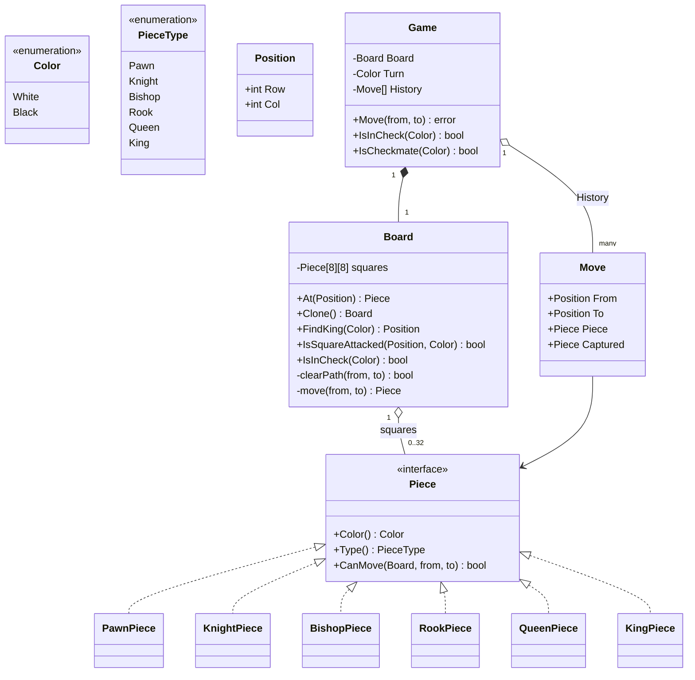

# Chess — Low Level Design

🎯 Asked at: Google

## References
- Read first: [Design an Online Chess Platform — Hello Interview](https://www.hellointerview.com/community/questions/online-chess-platform/cm4szywgj003ivszmblm3pmoa)
- Framework refresher: [Low Level Design Interview Delivery Framework — Hello Interview](https://www.hellointerview.com/learn/low-level-design/in-a-hurry/delivery)
- Watch: [Design Chess | Object Oriented Design Interview (YouTube)](https://www.youtube.com/watch?v=C4tyv9k0i9M)

## Practice prompt
Before opening the code below: design the class model for an 8x8 chess game exposing
`move(from, to) -> error` that (a) rejects moves that don't match the mover's piece-movement rules,
(b) rejects moving out of turn or capturing your own piece, and (c) rejects a move that would leave
the mover's own king in check — even if the piece's raw movement pattern is legal. Work out how you'd
avoid a combinatorial explosion of `if piece is Rook do X, if Bishop do Y` in one giant function, and
how you'd implement checkmate detection in terms of the primitives you already have (don't design a
separate "checkmate engine"). Only then look at the reference design.

## Requirements

**Functional**
1. `Move(from, to)` moves the piece at `from` to `to` if legal, alternating turns between White and
   Black starting with White.
2. Each piece type (Pawn, Knight, Bishop, Rook, Queen, King) enforces its own movement pattern,
   including path-clearance for sliding pieces (Bishop/Rook/Queen) and pawn's double-step-from-start,
   diagonal-capture-only, and forward-move-only-into-empty-square rules.
3. A move is rejected if it isn't the mover's turn, there's no piece at `from`, the target square holds
   the mover's own piece, or the move would leave the mover's own king in check.
4. `IsInCheck(color)` and `IsCheckmate(color)` report check/checkmate state for a given side.

**Non-functional**
- Extensible piece movement (Strategy/polymorphism) — adding a rule change to one piece must not touch
  the others.
- Move history is retained so a future `Undo`/PGN-export feature has a natural extension point.

*Out of scope (see talking points below): en passant, castling, pawn promotion, threefold repetition,
draw by stalemate/50-move-rule.*

## Class design



- `Piece` is a small interface (`Color`, `Type`, `CanMove`) implemented once per piece type, each
  embedding a shared `basePiece` for the common `Color()` accessor — this is what keeps
  `if/else`-on-type out of `Board`/`Game` entirely.
- `Board` owns the raw grid and pure board-geometry queries (`At`, `clearPath`, `IsSquareAttacked`,
  `IsInCheck`, `FindKing`); it has no notion of whose turn it is.
- `Game` owns turn alternation, move history, and the "does this move leave my own king in check"
  legality check, by cloning the board, trial-applying the move, and testing check on the clone.

## Design patterns used
- **Strategy (via polymorphism)** — `Piece.CanMove` is the strategy; `Board`/`Game` call it
  uniformly without ever switching on `PieceType`.
- **Factory Method** — `NewPiece(type, color)` centralizes piece construction so callers (board setup,
  future pawn-promotion) never need a type switch of their own.
- **Prototype-ish clone-and-simulate** — `Board.Clone()` deep-copies the fixed `[8][8]Piece` array by
  plain assignment, giving `Game.Move` and `IsCheckmate` a cheap, safe sandbox to trial a move in
  without mutating real game state.

## Key trade-offs / talking points
- **Why validate "leaves king in check" via clone-and-simulate rather than incremental pin-detection?**
  Simulating the move on a cloned board and re-running `IsInCheck` is O(64) per candidate move — much
  simpler to reason about and get correct than maintaining a pinned-piece table, at the cost of being
  slower for a full move-generator (acceptable at interview/example scope; a chess engine would
  precompute pins).
- **Why is `CanMove` unaware of check?** Separating "does this piece's geometry allow this move" (Piece)
  from "does this move leave my king exposed" (Game) keeps each piece's rule dead simple and testable
  in isolation, and keeps the expensive check-simulation in exactly one place.
- **`IsCheckmate` brute-forces every (piece, destination) pair** rather than generating a minimal legal
  move list — O(pieces × 64) per call. This is intentionally simple at interview scope; a real engine
  would cache/incrementally-update legal moves instead of recomputing from scratch every ply.
- **What's cut and why**: en passant, castling, and promotion are omitted so the piece-movement +
  check/checkmate core stays the interview's focus; each is a bounded, well-known extension (castling
  needs "has this King/Rook ever moved" tracking; en passant needs "was the last move a pawn double-step
  adjacent to me"; promotion needs a post-move piece-type-swap hook) worth naming even if not coded.

## Run it

**Go** (from `interview-prep/`):
```bash
go test ./lld/problems/chess/go/...
```

**Java** (from `interview-prep/lld/problems/chess/java/`):
```bash
javac -d out src/*.java
java -cp out Main
```

**Python** (from `interview-prep/lld/problems/chess/python/`):
```bash
pytest test_chess.py -v
python3 chess.py   # runs the demo
```
