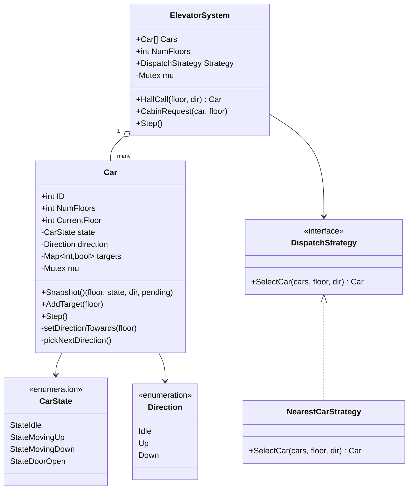

# Elevator System — Low Level Design

🎯 Asked at: Zomato

## References
- Read first: [Elevator Low Level Design — Hello Interview](https://www.hellointerview.com/learn/low-level-design/problem-breakdowns/elevator)
- Framework refresher: [Low Level Design Interview Delivery Framework — Hello Interview](https://www.hellointerview.com/learn/low-level-design/in-a-hurry/delivery)
- Watch: [Elevator System Design | LLD Interview (YouTube)](https://www.youtube.com/watch?v=x8CtiPRWq04)

## Practice prompt
Before opening the code below: design a fleet-of-elevators system with a `HallCall(floor, direction)`
API (a person outside the elevator, on some floor, wants to go up or down) and a `CabinRequest(car,
floor)` API (a person already inside a specific car presses a floor button). Decide how a car picks
its *next* target floor when it has several pending, and how the fleet picks *which car* answers a
hall call — a car should prefer to keep moving in the direction it's already going rather than
reverse every time a new call arrives (the standard SCAN/elevator-algorithm idea). Only then look at
the reference design.

## Requirements

**Functional**
1. `HallCall(floor, direction)` dispatches one car (chosen by the fleet's dispatch strategy) to `floor`.
2. `CabinRequest(car, floor)` adds `floor` as a target for a specific car, from inside that car.
3. Each car tracks its own current floor, direction (idle/up/down), motion state
   (idle/moving-up/moving-down/door-open), and set of pending target floors.
4. `Step()` advances simulated time: a car with its doors open closes them and re-evaluates direction;
   otherwise it moves one floor towards its next target and opens its doors on arrival.

**Non-functional**
- Thread-safe: hall calls and cabin requests can be issued concurrently (from outside/inside different
  cars) without corrupting a car's target set or the fleet's dispatch decision.
- Pluggable dispatch strategy (Strategy pattern) so the "which car answers this hall call" policy can
  be swapped/tested independently of car mechanics.

## Class design



- `Car` is self-contained: its own mutex guards `state`/`direction`/`targets` so hall-call dispatch
  (writing a target from outside) and a cabin request (writing a target from inside) can race safely.
- `pickNextDirection` implements a simplified **SCAN** (elevator algorithm): continue towards the
  nearest pending target; when idle with pending targets, pick the nearest one and derive direction
  from it. This avoids needless direction reversals when several targets are queued.
- `NearestCarStrategy.SelectCar` prefers, in order: an idle car nearest the call floor, then a car
  already moving *towards* the call floor in the requested direction (so it can be picked up en route
  without a detour), then simply the nearest car overall.
- `ElevatorSystem.mu` guards the select-then-assign sequence for `HallCall` so two concurrent hall
  calls can't both compute their "best car" against a stale snapshot and pile onto the same car.

## Design patterns used
- **Strategy** — `DispatchStrategy` lets the hall-call assignment policy (nearest-car here) vary
  independently of `Car`/`ElevatorSystem` mechanics; a fairness- or zoning-based strategy could be
  swapped in without touching car logic.
- **State** (implicit, via `CarState` enum) — a car's behavior in `Step()` branches on its state
  (door-open vs moving vs idle) the way a State-pattern object's behavior would vary by concrete state
  class; here it's done with a state enum + switch rather than one class per state, which is a common
  simplification at interview scope.

## Key trade-offs / talking points
- **Enum-based State vs one class per CarState**: a "real" State pattern would have
  `IdleState`/`MovingUpState`/`DoorOpenState` classes each implementing `Step()`. The enum+switch
  version used here is simpler to read for four states with light behavioral difference; call out in
  an interview that you know the trade-off (adding a fifth state with heavy per-state logic would push
  towards real State-pattern classes).
- **`NearestCarStrategy`'s cost function penalizes "incompatible" cars by adding `NumFloors`** rather
  than excluding them outright — this guarantees *some* car is always selected (no `nil` fleet-empty
  edge case to special-case at the call site) while still strongly preferring compatible cars.
- **Snapshot-then-decide dispatch**: `SelectCar` reads a `Snapshot()` of each car (copy, not a live
  reference) before comparing costs, so the comparison is over a consistent moment-in-time view even
  though cars are being stepped/targeted concurrently by other goroutines.
- **What's cut and why**: capacity/weight limits, express/zoned elevators, and destination-dispatch
  (grouping riders by destination before boarding, as in modern high-rises) are out of scope — the
  exercise focuses on the dispatch-strategy-vs-car-mechanics split, which is the core LLD signal.

## Run it

**Go** (from `interview-prep/`):
```bash
go test ./lld/problems/elevator-system/go/...
```

**Java** (from `interview-prep/lld/problems/elevator-system/java/`):
```bash
javac -d out src/*.java
java -cp out Main
```

**Python** (from `interview-prep/lld/problems/elevator-system/python/`):
```bash
pytest test_elevator_system.py -v
python3 elevator_system.py   # runs the demo
```
