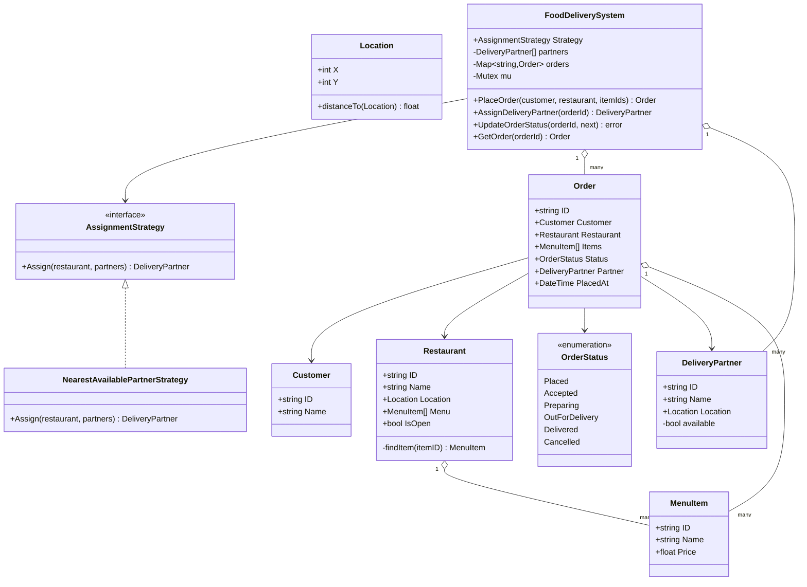

# Food Delivery — Low Level Design

🎯 Asked at: Swiggy

## References
- Read first: [Design DoorDash — Hello Interview](https://www.hellointerview.com/community/questions/food-delivery-platform/cm5omjbka00023b6q9bfevwjl)
- Framework refresher: [Low Level Design Interview Delivery Framework — Hello Interview](https://www.hellointerview.com/learn/low-level-design/in-a-hurry/delivery)
- Watch: [Design Food Delivery App like Swiggy/Zomato | LLD (YouTube)](https://www.youtube.com/watch?v=Zy2QQ6L0z3s)

## Practice prompt
Before opening the code below: design the class model for placing a food order —
`PlaceOrder(customer, restaurant, itemIds) -> Order` — assigning it the nearest available delivery
partner, and moving it through a status lifecycle (placed → accepted → preparing → out-for-delivery →
delivered, with cancellation only allowed early). Decide how you'd guarantee two concurrent assignment
calls never hand the same delivery partner to two different orders, and how you'd encode "which status
transitions are legal" so an invalid jump (e.g. placed → delivered) is rejected by construction rather
than by scattered `if` checks. Only then look at the reference design.

## Requirements

**Functional**
1. `PlaceOrder(customer, restaurant, itemIds)` creates an order if the restaurant is open and every
   requested item is on its menu; rejects otherwise.
2. `AssignDeliveryPartner(orderId)` atomically picks the nearest *available* delivery partner to the
   restaurant and marks that partner unavailable.
3. `UpdateOrderStatus(orderId, next)` enforces the order lifecycle state machine
   (`Placed → Accepted → Preparing → OutForDelivery → Delivered`, with `Cancelled` reachable from
   `Placed`/`Accepted` only); reaching `Delivered` or `Cancelled` frees the assigned partner.
4. `GetOrder(orderId)` retrieves current order state.

**Non-functional**
- Thread-safe: concurrent `PlaceOrder`/`AssignDeliveryPartner`/`UpdateOrderStatus` calls must not
  double-assign a partner or corrupt order state.
- Pluggable partner-assignment policy (Strategy pattern) so "nearest available" can be swapped for a
  different heuristic (e.g. load-balanced, rating-weighted) without touching order/status logic.

## Class design



- `FoodDeliverySystem` is the facade/orchestrator: it owns partners and orders behind one mutex and
  never lets a caller see or mutate `Order`/`DeliveryPartner` internals except through its methods.
- `validNextStatus` (a map of allowed forward transitions, not shown as a class) is the state-machine's
  single source of truth — `UpdateOrderStatus` looks up `validNextStatus[current][next]` instead of a
  chain of `if` statements, so adding/removing a legal transition is a one-line map edit.
- `AssignDeliveryPartner` and `UpdateOrderStatus` both hold `FoodDeliverySystem.mu` for their entire
  body, so "read state, decide, mutate state" is one atomic step — no other goroutine can observe or
  act on a half-updated order/partner pair.

## Design patterns used
- **Strategy** — `AssignmentStrategy` isolates the partner-selection heuristic (nearest-available here)
  from order/status orchestration, mirroring the same pattern used for elevator dispatch and payment
  processing elsewhere in this repo.
- **State machine via transition table** — `validNextStatus` encodes the order lifecycle declaratively;
  this is the same idea as a formal State pattern's transition table, implemented as data instead of
  one class per state (appropriate given each state has no behavior of its own beyond "what can I go
  to next").
- **Facade** — `FoodDeliverySystem` is the only entry point client code touches; `Restaurant.findItem`,
  partner availability flags, etc. stay private implementation detail.

## Key trade-offs / talking points
- **Partner assignment holds the system lock, not a per-order lock**: `AssignDeliveryPartner` locks the
  whole `FoodDeliverySystem` for its duration because the partner pool is shared across all orders — a
  per-order lock wouldn't prevent two orders from racing onto the same partner. The cost is that
  concurrent assignments for *different* restaurants serialize even though they're logically
  independent; a sharded-by-region lock would relax this at real scale.
- **Partner freed exactly at terminal transitions**: `UpdateOrderStatus` frees the partner only on
  `Delivered`/`Cancelled`, inside the same locked, validated transition — so "assign partner" and
  "free partner" can never both apply (or neither apply) to the same order due to a lost update.
- **Why a transition table instead of a full State pattern with per-state classes?** No state here has
  distinct *behavior* (e.g. `Preparing.onEnter()` doing something special) — only distinct *legal next
  states* — so a `map[Status]map[Status]bool` captures the entire rule set in one place without the
  ceremony of six near-empty classes.
- **`NearestAvailablePartnerStrategy` is O(n) per assignment**: fine at interview/example scale; a
  production system would index partners by geohash/quadtree so "nearest available" doesn't scan every
  partner in the fleet.

## Run it

**Go** (from `interview-prep/`):
```bash
go test ./lld/problems/food-delivery/go/...
```

**Java** (from `interview-prep/lld/problems/food-delivery/java/`):
```bash
javac -d out src/*.java
java -cp out Main
```

**Python** (from `interview-prep/lld/problems/food-delivery/python/`):
```bash
pytest test_food_delivery.py -v
python3 food_delivery.py   # runs the demo
```
