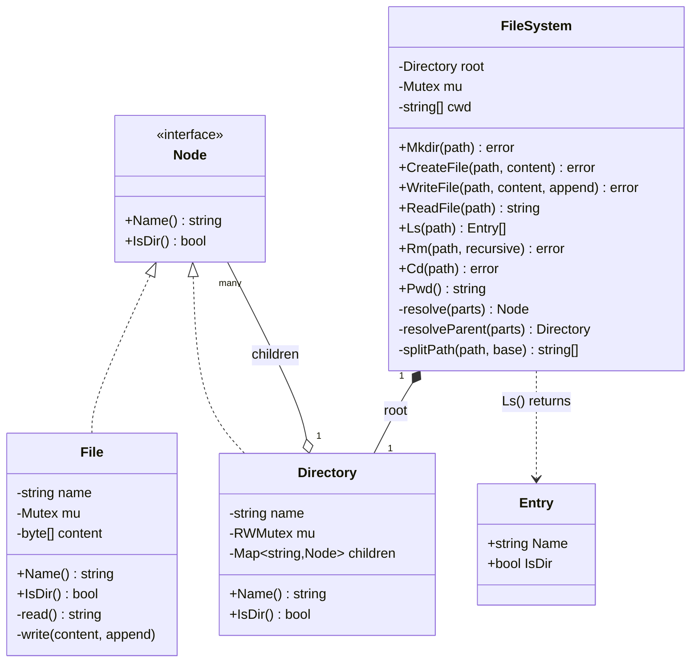

# In-Memory File System — Low Level Design

🎯 Asked at: Netflix

## References
- Read first: [File System Low Level Design — Hello Interview](https://www.hellointerview.com/learn/low-level-design/problem-breakdowns/file-system)
- Framework refresher: [Low Level Design Interview Delivery Framework — Hello Interview](https://www.hellointerview.com/learn/low-level-design/in-a-hurry/delivery)
- Watch: [Design In-Memory File System | LLD Interview (YouTube)](https://www.youtube.com/watch?v=DQqfNwbeXvE)

## Practice prompt
Before opening the code below: design an in-memory hierarchical file system exposing `mkdir`,
`createFile`, `writeFile`/`readFile`, `ls`, `rm`, `cd`/`pwd`, supporting both absolute (`/a/b/c`) and
relative paths (including `.`/`..`). Decide how a single class hierarchy can represent "a file" and "a
directory containing files and other directories" so that `ls` on a directory and reading a file share
as much machinery as possible without special-casing every operation on "is this a file or a
directory?" Then decide how you'd let two different files be written concurrently without one write
corrupting another, and how a `cd` from one caller doesn't affect another caller's view of "current
directory". Only then look at the reference design.

## Requirements

**Functional**
1. `Mkdir(path)` creates a directory; the parent must already exist.
2. `CreateFile(path, content)` creates a new file (optionally pre-seeded with content); the parent must
   already exist.
3. `WriteFile(path, content, append)` overwrites or appends to an existing file's content.
4. `ReadFile(path)` returns a file's full content.
5. `Ls(path)` lists the direct children of a directory, sorted by name.
6. `Rm(path, recursive)` removes a file, or a directory only if empty unless `recursive` is set.
7. `Cd(path)` / `Pwd()` change/report the current working directory; paths may be absolute (leading
   `/`) or relative to `cwd`, and resolve `.`/`..` segments.

**Non-functional**
- Thread-safe: concurrent operations on different files/directories must not corrupt the tree;
  concurrent writers to the *same* file must not interleave partial writes.
- Extensible node model (Composite pattern) so a future node type (e.g. symlink) could be added without
  changing every existing operation's type-switch.

## Class design



- `Node` is the Composite's common interface (`Name`, `IsDir`); `File` is a leaf, `Directory` is a
  composite holding a `name -> Node` map of children, so `Ls`/`resolve`/`Rm` can walk the tree without
  ever needing to know how deep they are.
- `FileSystem` is the facade: it owns `root` and `cwd`, and every public method funnels through
  `splitPath` (turns a path string into clean components, resolving `.`/`..`) then `resolve`/
  `resolveParent` (walk components down from `root`, type-asserting each hop is a `Directory` until the
  last one).
- Locking is per-node, not global: each `Directory` has its own `RWMutex` guarding its `children` map,
  and each `File` has its own `Mutex` guarding its `content` — so writes to unrelated parts of the tree
  never contend, and `Ls` (a read lock) doesn't block concurrent reads of the same directory.

## Design patterns used
- **Composite** — `Node`/`File`/`Directory` is a textbook Composite: `Directory` treats its children
  uniformly whether they're files or subdirectories, and the tree can be arbitrarily deep without any
  operation caring about depth.
- **Facade** — `FileSystem` hides path-parsing (`splitPath`), tree-walking (`resolve`/`resolveParent`),
  and `cwd` bookkeeping behind a flat set of POSIX-shaped methods (`Mkdir`, `Ls`, `Cd`, ...).

## Key trade-offs / talking points
- **Fine-grained (per-node) locking vs one global filesystem lock**: per-directory/per-file locks let
  unrelated writes proceed in parallel, at the cost of needing lock-ordering discipline to avoid
  deadlock (this implementation only ever locks a parent then a child, top-down, never the reverse — so
  no cycle can form). A single global mutex would be simpler to reason about but would serialize every
  operation across the entire tree, including unrelated subtrees.
- **`cwd` is per-`FileSystem` instance, not per-caller**: this example has one shared `cwd` (like a
  single shell session). A multi-session filesystem (e.g. simulating several concurrent shells) would
  need `cwd` to live in a per-session handle instead of the shared `FileSystem`, with path resolution
  taking that handle instead of reading shared state.
- **Path resolution always starts from `root` and re-walks every hop** rather than caching resolved
  `Directory` pointers — simpler and automatically consistent with concurrent mutation (a deleted
  intermediate directory is naturally caught as "not found" on the next resolve), at the cost of O(depth)
  work per operation instead of O(1) for a cached handle.
- **`content` is a `[]byte` guarded by a per-file mutex**, not a more elaborate block/extent structure —
  appropriate for an in-memory exercise; a real filesystem would chunk content into blocks for partial
  reads/writes at scale.

## Run it

**Go** (from `interview-prep/`):
```bash
go test ./lld/problems/in-memory-file-system/go/...
```

**Java** (from `interview-prep/lld/problems/in-memory-file-system/java/`):
```bash
javac -d out src/*.java
java -cp out Main
```

**Python** (from `interview-prep/lld/problems/in-memory-file-system/python/`):
```bash
pytest test_in_memory_file_system.py -v
python3 in_memory_file_system.py   # runs the demo
```
