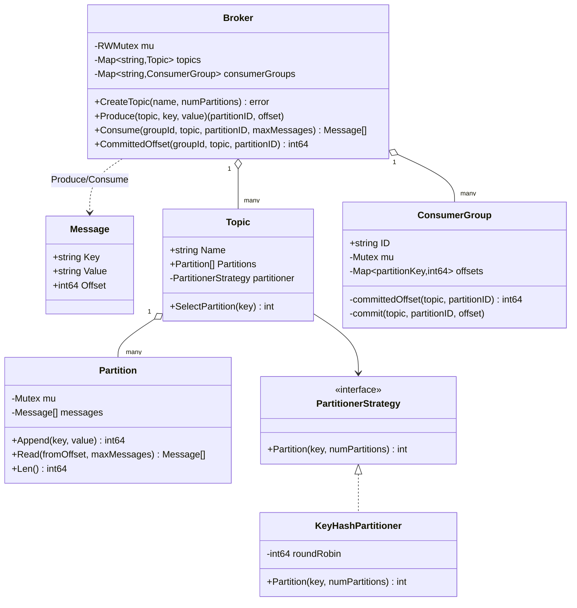

# Kafka — Low Level Design

🎯 Asked at: Uber

## References
- Read first: [Kafka Deep Dive for System Design Interviews — Hello Interview](https://www.hellointerview.com/learn/system-design/deep-dives/kafka)
- Framework refresher: [Low Level Design Interview Delivery Framework — Hello Interview](https://www.hellointerview.com/learn/low-level-design/in-a-hurry/delivery)
- Watch: [Apache Kafka Explained | System Design Interview (YouTube)](https://www.youtube.com/watch?v=uvb00oaa3k8)

## Practice prompt
Before opening the code below: design a single-process, in-memory pub/sub broker modeled on Kafka —
`CreateTopic(name, numPartitions)`, `Produce(topic, key, value) -> (partition, offset)`, and
`Consume(groupId, topic, partition, max) -> messages`. Decide how a message's *key* determines which
partition it lands on (and why that matters for ordering), how an offset is assigned so it's gapless
and monotonic per partition even under concurrent producers, and how two different consumer groups can
read the same topic independently — each tracking its own progress — without stepping on each other.
Only then look at the reference design.

## Requirements

**Functional**
1. `CreateTopic(name, numPartitions)` creates a topic with a fixed number of partitions.
2. `Produce(topic, key, value)` appends a message to a partition selected by the topic's partitioner and
   returns the `(partitionID, offset)` it was assigned.
3. Messages with the same key always land on the same partition (per-key ordering); keyless messages
   are spread round-robin across partitions.
4. `Consume(groupId, topic, partition, maxMessages)` returns up to `maxMessages` messages after the
   calling consumer group's last committed offset for that `(topic, partition)`, then auto-commits past
   the returned batch.
5. Each consumer group tracks its own committed offset per `(topic, partition)`, independent of every
   other group reading the same topic.

**Non-functional**
- Thread-safe: concurrent producers appending to the same partition must never be assigned a duplicate
  or out-of-order offset; concurrent consumers in different groups must never see each other's offsets.
- Pluggable partitioning strategy (Strategy pattern) so key-hash routing can be swapped for a different
  scheme without touching `Broker`/`Topic`.

## Class design



- `Broker` is the top-level orchestrator/facade: it owns `topics` and `consumerGroups` behind one
  `RWMutex`, and is the only thing client code (producers/consumers) talks to.
- `Partition` is an append-only log: `Append` assigns the next offset as `len(messages)` while holding
  its own lock, so it's gapless and monotonic by construction — no separate offset counter to keep in
  sync with the slice.
- `Topic` owns a fixed set of `Partition`s created at topic-creation time, plus a `PartitionerStrategy`
  it delegates key-to-partition routing to.
- `ConsumerGroup` maps `(topic, partitionID) -> committedOffset`; each group is created lazily
  (`getOrCreateConsumerGroup`) on first use and is completely independent of every other group.

## Design patterns used
- **Strategy** — `PartitionerStrategy` isolates "which partition does this key go to" from `Topic`;
  `KeyHashPartitioner` (hash(key) % numPartitions, round-robin for keyless messages) is one
  implementation among possible others (e.g. explicit-partition override, sticky-partition batching).
- **Facade** — `Broker` exposes `CreateTopic`/`Produce`/`Consume`/`CommittedOffset` and hides
  partition/offset bookkeeping entirely inside `Topic`/`Partition`/`ConsumerGroup`.
- **Repository-ish per-entity locking** — `Partition` and `ConsumerGroup` each guard their own state
  with their own mutex, rather than one broker-wide lock serializing every produce/consume call.

## Key trade-offs / talking points
- **Per-partition locking, not a broker-wide lock**: `Broker.mu` (an `RWMutex`) only protects the
  `topics`/`consumerGroups` maps themselves (structural changes); the actual append/read hot path locks
  only the target `Partition`, so producers writing to *different* partitions never contend — this
  mirrors real Kafka's partition-level parallelism.
- **Auto-commit-on-read, not explicit `CommitOffset`**: `Consume` commits past the returned batch
  immediately, which keeps the API small and each call deterministic, but means a consumer that crashes
  after `Consume` returns but before finishing processing the batch loses those messages (at-most-once
  effectively, for that crash window). A production system would expose explicit
  commit-after-processing for at-least-once redelivery semantics — call this out explicitly as the
  known simplification.
- **Key-hash partitioning trades load-balance for ordering**: routing by `hash(key) % numPartitions`
  guarantees all messages for one key are strictly ordered (they all land on one partition, appended
  in arrival order), but concentrates a hot key's traffic on a single partition — the same trade-off
  real Kafka producers make, and worth naming as a scaling limit.
- **No replication/leader-election**: this is a single-process broker with no durability story beyond
  the in-memory slice — the exercise's scope is the partitioning/offset/consumer-group *object model*,
  not distributed consensus; naming what real Kafka adds (replicas, ISR, controller election) is a good
  interview signal without needing to implement it.

## Run it

**Go** (from `interview-prep/`):
```bash
go test ./lld/problems/kafka-lld/go/...
```

**Java** (from `interview-prep/lld/problems/kafka-lld/java/`):
```bash
mkdir -p out && javac -d out src/*.java
java -cp out BrokerTest   # run tests
java -cp out Main         # run demo
```

**Python** (from `interview-prep/lld/problems/kafka-lld/python/`):
```bash
python3 -m pytest test_kafka_lld.py -v
python3 kafka_lld.py      # run demo
```
