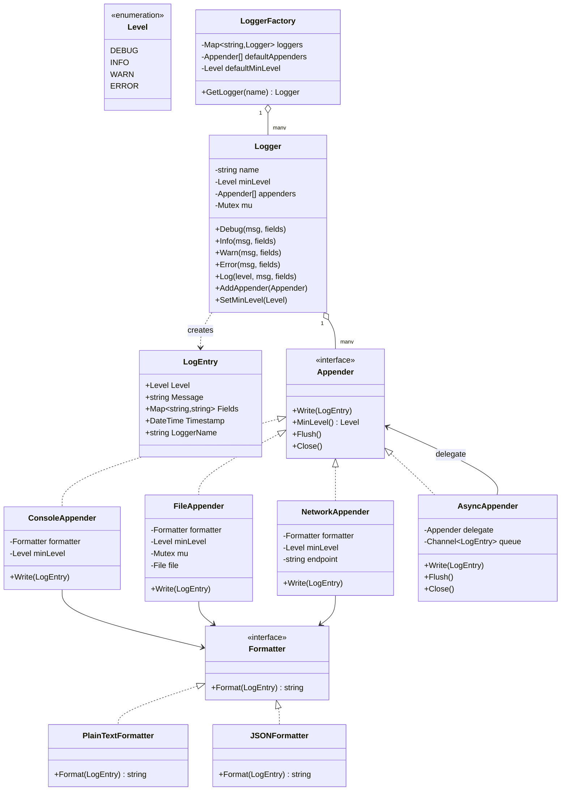

# Logging Framework — Low Level Design

🎯 Asked at: Microsoft

## References
- Read first: [Logging Service Low Level Design — Hello Interview](https://www.hellointerview.com/learn/low-level-design/problem-breakdowns/logging-service)
- Framework refresher: [Low Level Design Interview Delivery Framework — Hello Interview](https://www.hellointerview.com/learn/low-level-design/in-a-hurry/delivery)
- Watch: [Design a Logging Framework | LLD Interview (YouTube)](https://www.youtube.com/watch?v=xpDnVSmNFX0)

## Practice prompt
Before opening the design below: design a logging framework offering `logger.Info("msg", fields...)`,
`logger.Error(...)`, etc., where (a) each logger has a minimum level below which calls are cheap no-ops,
(b) a single log call can fan out to multiple destinations (console, file, network) with independent
formatting per destination, and (c) adding a brand-new destination type must not require touching
`Logger` itself. Decide where thread-safety belongs (per-appender? per-logger?) and how you'd let
logging be asynchronous (a slow network appender shouldn't block the caller's hot path) without losing
messages on shutdown. Only then look at the design below.

## Requirements

**Functional**
1. `Logger.Log(level, message, fields...)` (and convenience `Debug`/`Info`/`Warn`/`Error` methods)
   record a log entry if `level >= logger.minLevel`, otherwise the call is a no-op.
2. A `Logger` fans an accepted entry out to every attached `Appender` (console, file, network, ...);
   each appender formats and writes independently.
3. Each `Appender` has its own minimum level and `Formatter`, so e.g. console can show `INFO+` while a
   file appender captures `DEBUG+` from the same logger.
4. New appender types plug in by implementing the `Appender` interface — no changes to `Logger`.
5. An `AsyncAppender` wraps any appender to move the write off the caller's goroutine/thread, backed by
   a bounded queue; on `Close()`/`Flush()` it drains the queue before returning, so no buffered message
   is silently dropped on shutdown.

**Non-functional**
- Thread-safe: concurrent `Log` calls from multiple goroutines/threads must not interleave partial
  writes within a single appender, or corrupt the appender list.
- Low overhead for rejected entries: a `Log` call below `minLevel` must not format the message or touch
  any appender (short-circuit before any work).
- Extensible destination and formatting logic (Strategy) and extensible level-filtering/routing
  (Chain of Responsibility) without modifying `Logger`.

## Class design



- `Logger.Log` builds a `LogEntry` only after the `level >= minLevel` short-circuit passes, then hands
  the *same* `LogEntry` to every attached `Appender` — each appender independently re-checks its own
  `MinLevel()` and applies its own `Formatter` before writing, so one logger can drive differently
  filtered, differently formatted destinations from a single call site.
- `AsyncAppender` is a decorator around any other `Appender`: `Write` pushes onto a bounded channel/
  queue and returns immediately; a background worker drains the queue and calls the wrapped appender's
  real `Write`. `Flush`/`Close` block until the queue is drained, so shutdown is lossless.
- `LoggerFactory` is the typical entry point (`GetLogger("package.name")`) so loggers across a codebase
  share default appenders/level without every call site wiring them up manually.

## Design patterns used
- **Strategy** — `Formatter` (plain-text vs JSON) and `Appender` (console/file/network) are both
  swappable strategies; `Logger` depends only on the `Appender` interface.
- **Decorator** — `AsyncAppender` wraps a delegate `Appender` and adds asynchrony without the delegate
  (or `Logger`) knowing it's been wrapped; a `RetryAppender` or `BufferedAppender` could compose the
  same way.
- **Chain of Responsibility (level filtering)** — level checks happen at two independent points
  (`Logger.minLevel` then each `Appender.MinLevel()`), each free to reject the entry before it reaches
  the next stage, the same shape as a CoR pipeline even though there's no explicit "pass to next
  handler" call.
- **Singleton-ish registry** — `LoggerFactory` typically holds one process-wide instance (or is itself
  a singleton) so `GetLogger(name)` returns the same `Logger` for the same name across the process.

## Key trade-offs / talking points
- **Two-level filtering (logger + appender) vs one global level**: letting each appender have its own
  `minLevel` is what enables "console shows INFO+, file captures DEBUG+" from one `Logger.Debug()` call
  site — the alternative (single level on `Logger`) is simpler but forces a choice between noisy
  console output and losing DEBUG detail in the file.
- **Async logging trades latency for durability risk**: `AsyncAppender`'s bounded queue keeps `Write`
  fast on the caller's hot path, but a full queue must pick a policy — block the caller (back-pressure,
  safest but can stall the app) vs drop the entry (fast but lossy) vs grow unbounded (risks OOM under
  sustained overload). This design defaults to blocking on a full queue and documents drop-oldest as an
  explicit opt-in, so silent message loss is never the default.
- **Why not a single `Write(level, msg)` on `Logger` with `if` branches per appender type?** Routing
  every entry through the `Appender` interface uniformly is what lets a `NetworkAppender` be added
  later without touching `Logger` — the classic open/closed-principle argument, and the concrete reason
  this is modeled as Strategy rather than a switch statement.
- **Thread-safety lives at the appender, not just the logger**: `Logger.mu` only protects the
  `appenders` slice from concurrent `AddAppender` calls; each appender (e.g. `FileAppender`) must guard
  its *own* write path (its `Mutex mu` around the file handle) since multiple loggers can share one
  appender instance and write to it concurrently.

## Run it

**Go** (from `interview-prep/`):
```bash
go test ./lld/problems/logging-framework/go/...
```

**Java** (from `interview-prep/lld/problems/logging-framework/java/`):
```bash
javac -d out src/*.java
java -cp out LoggingFrameworkTest
```

**Python** (from `interview-prep/lld/problems/logging-framework/python/`):
```bash
pytest test_logging_framework.py -v
python3 logging_framework.py   # runs the demo
```
