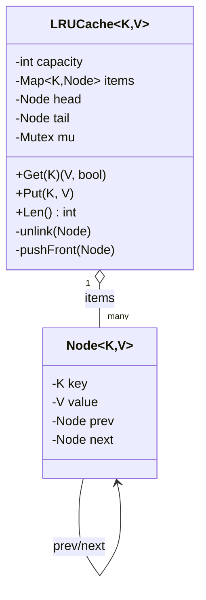

# LRU Cache — Low Level Design

🎯 Asked at: Uber (also one of the most common LLD/coding-hybrid questions industry-wide — LeetCode 146
in coding-interview form, and a recurring LLD warm-up asking for the class design behind it)

## References
- Read first: [Implement LRU Cache — Hello Interview](https://www.hellointerview.com/community/questions/lru-cache-implementation/cmk5avhlo00x708adxjp1vuil)
- Related HLD context: [Design a Distributed Cache Like Redis — Hello Interview](https://www.hellointerview.com/learn/system-design/problem-breakdowns/distributed-cache) and this repo's [`hld/designs/lru-distributed-cache`](../../../hld/designs/lru-distributed-cache/README.md)
- Watch: [LRU Cache Design - System Design & Coding Interview Problem (YouTube)](https://www.youtube.com/watch?v=JEABxEdfV5Q)

## Practice prompt
Before opening the code below: design a fixed-capacity cache with `Get(key) -> (value, found)` and
`Put(key, value)` where both operations must run in O(1) time, and inserting past capacity evicts the
*least recently used* entry. Work out on paper why a hash map alone isn't enough (it has no concept
of recency ordering) and why a plain array/slice isn't enough (moving an entry to "most recent" would
require an O(n) shift). Only then look at the reference design.

## Requirements

**Functional**
1. `Get(key)` returns the value for `key` if present and marks it as most-recently-used; returns
   "not found" otherwise.
2. `Put(key, value)` inserts or updates `key`, marking it most-recently-used.
3. When `Put` would exceed the configured capacity with a brand-new key, evict the least-recently-used
   entry before inserting.

**Non-functional**
- Both `Get` and `Put` must run in O(1) time, not O(log n) or O(n).
- Thread-safe: concurrent `Get`/`Put` from multiple goroutines/threads must not corrupt the internal
  structure or produce inconsistent recency ordering.

## Class design

The implementation combines a hash map (O(1) key -> node lookup) with an intrusive doubly linked list
(O(1) reordering/eviction with sentinel head/tail nodes so there are no nil/null special cases at the
ends of the list).



- `head`/`tail` are sentinel nodes (never hold real data); `head.next` is the most-recently-used real
  node, `tail.prev` is the least-recently-used. This means insert/move/evict never needs a nil-check
  for "am I at the boundary."
- `items` maps `key -> *Node` so a `Get`/`Put` can jump straight to the node instead of walking the list.
- `Get`/`Put` both call `unlink` + `pushFront` to move the touched node to the MRU position in O(1)
  (four pointer reassignments, no list traversal).
- Eviction (`Put` past capacity) removes `tail.prev` — the LRU node — from both the list and the map.

## Design patterns used
- **No structural GoF pattern is central here** — this is a data-structure-composition problem more
  than a pattern problem. The interview signal is knowing *why* HashMap+DLL is the answer, not naming
  a pattern.
- Arguably a small **Facade**: `LRUCache` exposes only `Get`/`Put`/`Len` and hides the linked-list
  bookkeeping (`unlink`/`pushFront`) as private implementation detail.

## Key trade-offs / talking points
- **Why HashMap + doubly linked list, not a `TreeMap`/balanced tree keyed by last-access-time?** A
  tree-based ordering gives O(log n) get/put, not O(1) — the interviewer is specifically testing
  whether you reach for the O(1) structure rather than something that merely works.
- **Why doubly (not singly) linked?** Eviction and `unlink` need to detach a node from the *middle* of
  the list in O(1); a singly linked list would need a predecessor pointer lookup (O(n)) to unlink a
  node without an already-known predecessor.
- **Why sentinel head/tail instead of nil-terminated ends?** Every insert/unlink becomes branch-free —
  no special-casing "list is empty" or "removing the first/last node."
- **Concurrency**: a single mutex guards both the map and the list because they must stay in sync on
  every mutation; a more advanced follow-up (see the distributed-cache HLD doc) is sharding the cache
  into N independently-locked buckets to reduce lock contention under high concurrency.
- **Generics**: the Go version is `LRUCache[K comparable, V any]` and the Java version is
  `LRUCache<K, V>`, so the same structure works for any key/value type without reimplementation.

## Run it

**Go** (from `interview-prep/`):
```bash
go test ./lld/problems/lru-cache/go/...
```

**Java** (from `interview-prep/lld/problems/lru-cache/java/`):
```bash
javac -d out src/*.java
java -cp out Main
```

**Python** (from `interview-prep/lld/problems/lru-cache/python/`):
```bash
pytest test_lru_cache.py -v
python3 lru_cache.py   # runs the demo
```
