# Notification System — Low Level Design

🎯 Asked at: Swiggy

## References
- Read first: [Design a Notification System — Hello Interview](https://www.hellointerview.com/learn/system-design/problem-breakdowns/notification-system)
- Related HLD context (the distributed-systems version of this same problem — fan-out queues,
  per-channel worker pools, burst handling): this repo's
  [`hld/designs/notification-system`](../../../hld/designs/notification-system/README.md). This LLD
  exercise is the single-process object model behind that design's "Fan-out Worker" + per-channel
  "Worker" boxes: `NotificationService.Send` here is what runs *inside* one of those workers.
- Watch: [System Design Part 14 — Design a Notification System: SMS, Email and Push (YouTube)](https://www.youtube.com/watch?v=1E3oeYkJ1P8)

## Practice prompt
Before opening the design below: design the class model for `Send(userId, eventType, templateId,
channels) -> NotificationResult` where a single logical notification fans out to one or more channels
(push/SMS/email), each channel rendered from a shared template but with channel-specific formatting
(a push notification is a short title+body; an email needs a subject+HTML body). Decide how you'd add a
brand-new channel (say, WhatsApp) without touching the dispatch/retry logic, how a failed channel send
retries without re-sending to channels that already succeeded, and how a repeated call with the same
idempotency key never double-notifies the user. Only then look at the design below.

## Requirements

**Functional**
1. `Send(request)` accepts `(userId, eventType, templateId, channels, idempotencyKey)` and renders +
   dispatches one notification per requested channel.
2. Each channel (Push, SMS, Email) renders the shared template into its own channel-specific payload
   and dispatches through its own `ChannelSender`.
3. A channel send that fails transiently is retried up to a bounded number of attempts with backoff;
   attempts are recorded per channel so the caller can see exactly what succeeded/failed.
4. A repeated `Send` call with an already-used `idempotencyKey` returns the stored result instead of
   re-dispatching to any channel.
5. Per-user channel preferences (e.g. "no SMS for this event type") are consulted before dispatch, so a
   disabled channel is skipped rather than attempted-and-failed.

**Non-functional**
- Thread-safe: concurrent `Send` calls with the same idempotency key must result in exactly one
  dispatch per channel; every caller observes the same `NotificationResult`.
- Extensible channel set (Strategy/Observer) — adding a channel means implementing one interface, not
  editing `NotificationService`.
- Per-channel isolation: one channel's failure/retry storm must not block or slow down delivery on the
  other channels for the same notification (mirrors the HLD design's "stuck SMS provider never backs up
  push or email" requirement, at object-model scope — see the HLD doc linked above for the queue-level
  version of this same isolation goal).

## Class design

```mermaid
classDiagram
    class Channel {
        <<enumeration>>
        Push
        SMS
        Email
    }
    class NotificationRequest {
        +string IdempotencyKey
        +string UserID
        +string EventType
        +string TemplateID
        +Channel[] Channels
        +Map~string,string~ TemplateData
    }
    class Template {
        +string ID
        +string TitleTemplate
        +string BodyTemplate
        +Render(data) RenderedContent
    }
    class RenderedContent {
        +string Title
        +string Body
    }
    class DeliveryStatus {
        <<enumeration>>
        PENDING
        SENT
        FAILED
    }
    class Attempt {
        +int Number
        +bool Success
        +string Error
        +DateTime At
    }
    class ChannelResult {
        +Channel Channel
        +DeliveryStatus Status
        +Attempt[] Attempts
    }
    class NotificationResult {
        +string ID
        +NotificationRequest Request
        +ChannelResult[] ChannelResults
        +DateTime CreatedAt
    }
    class ChannelSender {
        <<interface>>
        +Send(userId, RenderedContent) error
    }
    class PushSender {
        +Send(userId, RenderedContent) error
    }
    class SMSSender {
        +Send(userId, RenderedContent) error
    }
    class EmailSender {
        +Send(userId, RenderedContent) error
    }
    class RetryPolicy {
        +int MaxAttempts
        +Duration Delay
    }
    class PreferenceStore {
        +IsChannelEnabled(userId, eventType, Channel) bool
    }
    class IdempotencyStore {
        +ReserveOrWait(key) (NotificationResult, isOwner)
        +Complete(key, NotificationResult)
    }
    class NotificationService {
        -Map~Channel,ChannelSender~ senders
        -RetryPolicy retryPolicy
        -PreferenceStore preferences
        -IdempotencyStore store
        -Mutex mu
        +Send(NotificationRequest) NotificationResult
    }

    ChannelSender <|.. PushSender
    ChannelSender <|.. SMSSender
    ChannelSender <|.. EmailSender
    NotificationService "1" o-- "many" ChannelSender : senders
    NotificationService --> RetryPolicy
    NotificationService --> PreferenceStore
    NotificationService --> IdempotencyStore
    NotificationService ..> Template : renders
    NotificationResult "1" o-- "many" ChannelResult
    ChannelResult "1" o-- "many" Attempt
    ChannelResult --> Channel
    NotificationResult --> NotificationRequest
    Template ..> RenderedContent : produces
```



- `NotificationService.Send` is the single entry point: for each requested `Channel`, it checks
  `PreferenceStore` (skip if disabled), renders the shared `Template` into a channel-appropriate
  `RenderedContent`, then dispatches via the matching `ChannelSender`, independently retrying and
  recording `Attempt`s per channel into that channel's own `ChannelResult` — so one channel's failure
  never touches another's `ChannelResult`.
- `IdempotencyStore` mirrors the payment-gateway exercise's pattern in this repo: it atomically claims
  `idempotencyKey` for exactly one caller; concurrent callers with the same key block on the owner's
  result instead of re-dispatching.
- `Template.Render(data)` is shared across channels — one `Template` produces one `RenderedContent`
  per send, and each `ChannelSender` decides how to map `RenderedContent` onto its own wire format
  (push payload, SMS text, email subject+body).

## Design patterns used
- **Strategy** — `ChannelSender` lets Push/SMS/Email dispatch mechanics vary independently;
  `NotificationService` depends only on the interface, so adding WhatsApp/Slack is "implement
  `ChannelSender`, register it in `senders`" with zero changes to dispatch/retry/idempotency logic.
- **Observer (fan-out)** — one `Send` call conceptually "notifies" every requested channel of the same
  event; each `ChannelSender` reacts independently, which is the same shape as an Observer's
  `notify(event)` fanning out to N subscribers, just synchronous/direct-call rather than an event bus at
  this LLD scope (the HLD doc's Kafka fan-out is the distributed version of this same idea).
- **Idempotent-receiver** — `IdempotencyStore`, identical in spirit to the payment-gateway exercise:
  first caller with a key does the work, every other caller races onto the same result.
- **Template Method (implicit)** — `Send`'s per-channel loop (check preference → render → send-with-
  retry → record result) is the same fixed skeleton for every channel; only the `ChannelSender.Send`
  step varies per channel, which is the Template-Method shape even without a literal base class per
  channel.

## Key trade-offs / talking points
- **Per-channel `ChannelResult`, not one pass/fail per notification**: a notification with `[Push,
  SMS]` can have Push succeed and SMS fail — the caller needs to know which, both to retry only the
  failed channel later and to answer "did the user actually get *anything*." A single boolean result
  would hide this and force either an all-or-nothing retry (re-sending a push the user already saw) or
  silent partial failure.
- **Retry lives inside `Send`, per channel, not as a separate outer retry loop**: retrying the whole
  `Send` call would re-render the template and re-check every channel's preference/idempotency, and
  would re-attempt channels that already succeeded. Scoping `RetryPolicy` to each `ChannelSender.Send`
  call keeps a retry strictly about "this one channel's transient failure."
- **Idempotency key is required, not optional, at the LLD layer**: the HLD doc treats
  idempotency-key-before-enqueue as a request-path concern (dedup at the API); here it's enforced at the
  object-model layer instead, so the class design is correct on its own even before any queue/API sits
  in front of it — a good interview point: idempotency is a property of the domain object, not just the
  transport.
- **What's cut and why**: scheduling (`sendAt`), burst-rate-limiting per provider, and delivery-status
  webhooks (a provider calling back "actually failed after all") are HLD-scope concerns covered in the
  linked design doc — this LLD exercise stays focused on the object model for rendering + multi-channel
  dispatch + retry + idempotency, which is the reusable "zoom in" piece regardless of what sits in front
  of it (direct call, queue consumer, or cron).

## Run it

**Go** (from `interview-prep/`):
```bash
go test ./lld/problems/notification-system/go/...
```

**Java** (from `interview-prep/lld/problems/notification-system/java/`):
```bash
javac -d out src/*.java
java -cp out NotificationSystemTest
```

**Python** (from `interview-prep/lld/problems/notification-system/python/`):
```bash
pytest test_notification_system.py -v
python3 notification_system.py   # runs the demo
```
