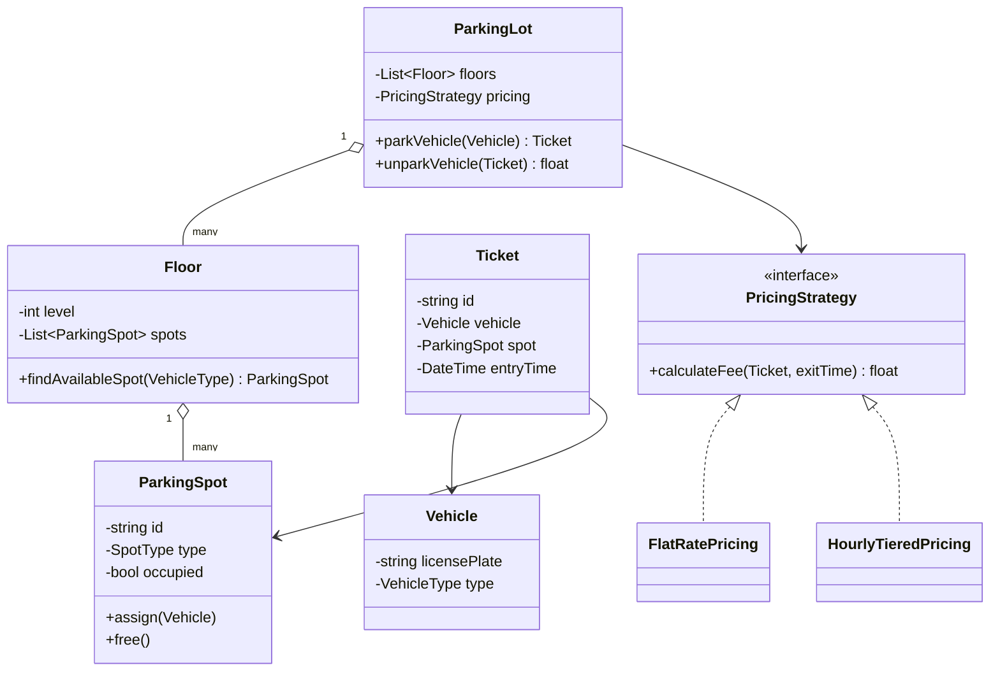

# Parking Lot — Low Level Design

🎯 Asked at: Amazon (also a very common Microsoft/general LLD opener — often called the "Hello World" of LLD interviews)

## References
- Read first: [Parking Lot Low Level Design — Hello Interview](https://www.hellointerview.com/learn/low-level-design/problem-breakdowns/parking-lot)
- Framework refresher: [Low Level Design Interview Delivery Framework — Hello Interview](https://www.hellointerview.com/learn/low-level-design/in-a-hurry/delivery)
- Watch: [Parking Lot System - Low Level Design Interview Question (YouTube)](https://www.youtube.com/watch?v=FC-rVMlsbHk)

## Practice prompt
Before opening the code below: on paper or in a scratch file, design the class model for a parking lot
with multiple floors, multiple spot sizes (motorcycle/compact/large), multiple entry/exit gates, and a
`parkVehicle(vehicle) -> Ticket` / `unparkVehicle(ticket) -> fee` API. Then decide how you'd assign the
*nearest available spot* to a vehicle, and how you'd compute the parking fee on exit. Only then look at
the reference design.

## Requirements (clarify these first, per the framework)
**Functional**
1. A vehicle can enter through any gate and be assigned the nearest available spot that fits its type.
2. A vehicle can exit through any gate; the system computes a fee based on duration and spot type.
3. The lot has multiple floors, each with spots of different sizes (motorcycle, compact, large).
4. The system tracks real-time availability per floor/spot-type.

**Non-functional**
- Thread-safe: two vehicles must never be assigned the same spot concurrently.
- Extensible pricing (flat-rate vs hourly-tiered) without touching core allocation logic.

## Class design



## Design patterns used
- **Strategy** — `PricingStrategy` lets pricing vary (flat rate vs hourly-tiered) without changing `ParkingLot`.
- **Factory (implicit)** — spot allocation picks the right `ParkingSpot` subtype/size for a `VehicleType`.
- **Singleton (optional)** — a real system would make `ParkingLot` a single coordinating instance per building; omitted here to keep the code testable (no hidden global state).

## Key trade-offs / talking points
- **Nearest-spot search**: linear scan per floor is fine at interview scope; at real scale you'd index
  free spots by type in a min-heap or per-floor free-list to avoid O(n) scans.
- **Concurrency**: spot assignment must be atomic (compare-and-swap / mutex) — see the `sync.Mutex` in
  the Go version and `synchronized` in the Java version guarding `assign`/`free`.
- **Ticket as the source of truth**: fee calculation depends only on the ticket (entry time + spot type),
  not on lot-wide state, which keeps `unparkVehicle` easy to test in isolation.

## Run it

**Go** (from `interview-prep/`):
```bash
go test ./lld/problems/parking-lot/go/...
```

**Java** (from `interview-prep/lld/problems/parking-lot/java/`):
```bash
javac -d out src/*.java
java -cp out Main
```

**Python** (from `interview-prep/lld/problems/parking-lot/python/`):
```bash
pytest test_parking_lot.py -v
python3 parking_lot.py   # runs the demo
```
