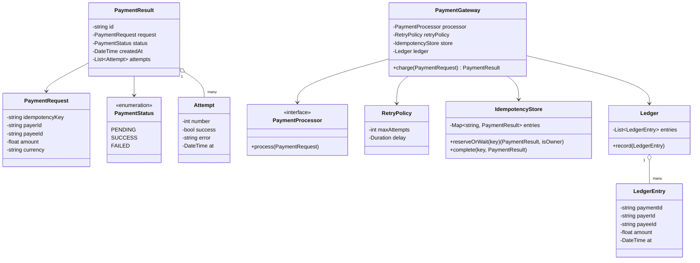

# Payment Gateway — Low Level Design

🎯 Asked at: Razorpay

## References
- Read first: [Design a Payment System like Stripe — Hello Interview](https://www.hellointerview.com/learn/system-design/problem-breakdowns/payment-system) — this is Hello Interview's *system-design* breakdown (distributed idempotency, ledgers, and reconciliation at scale). This exercise is the narrower single-process LLD class-design version of the same idea: the object model, not the distributed architecture.
- Framework refresher: [Low Level Design Interview Delivery Framework — Hello Interview](https://www.hellointerview.com/learn/low-level-design/in-a-hurry/delivery)
- Watch: [Payment Processing System Design Explained: Idempotency, Security | High Level Design | Interview (YouTube)](https://www.youtube.com/watch?v=ai7RH1DuoMg)

## Practice prompt
Before opening the code below: on paper or in a scratch file, design the class model for a payment
gateway with a `charge(request) -> PaymentResult` API. The caller may retry the exact same request
(e.g. after a client-side timeout) using the same idempotency key — decide how you'd guarantee the
payer is never double-charged, even if two threads call `charge` with that key at the same instant.
Then decide how you'd retry a flaky downstream processor without retrying a payment that has already
terminally failed. Only then look at the reference design.

## Requirements
**Functional**
1. `charge(request)` processes a payment given `(idempotencyKey, payerId, payeeId, amount, currency)`.
2. If `idempotencyKey` has already been used, return the previously stored result instead of
   reprocessing — no double charge.
3. A flaky downstream processor is retried a bounded number of times before the payment is marked
   `FAILED`; every attempt is recorded.
4. On success, a ledger entry is recorded so payments can be reconciled/audited after the fact.

**Non-functional**
- Thread-safe: N concurrent `charge` calls with the *same* idempotency key must result in exactly one
  underlying charge being processed; every caller observes the same `PaymentResult`.
- Extensible processing (Strategy pattern) so the retry/idempotency logic can be tested without a real
  payment network.

## Class design



## Design patterns used
- **Strategy** — `PaymentProcessor` lets the actual charge mechanism vary (real network call vs a
  fake that simulates transient/permanent failures) without changing `PaymentGateway`.
- **Idempotent-receiver / dedup-cache** — `IdempotencyStore` maps a client-supplied key to a
  terminal `PaymentResult`, and doubles as an in-flight lock so concurrent callers never race each
  other into two charges.
- **Template-method-ish retry loop** — `RetryPolicy` centralizes attempt-count/backoff decisions so
  `PaymentGateway` doesn't hardcode retry mechanics.

## Key trade-offs / talking points
- **Idempotency = "first writer wins, race the rest onto its result"**: the store atomically claims
  a key for exactly one caller (a map insert guarded by a mutex/`ConcurrentHashMap.putIfAbsent`); every
  other caller with the same key blocks on a future/channel/event until the owner finishes, then
  returns the *same* `PaymentResult` object — this is what makes the concurrency test deterministic
  rather than "probably fine."
- **Same key, same result — even for FAILED**: once a key's result is terminal, this exercise never
  reprocesses it, including on FAILED. Real gateways (Stripe, Razorpay) are split on this — some allow
  retrying a failed idempotency key since no money moved, since retrying can't create a double charge.
  We picked the simpler "terminal result is final" semantics to keep `charge` a pure function of
  `(processor state at first call, key)` and keep the test assertions unambiguous; a real system would
  likely special-case "retry allowed only if status == FAILED."
- **Ledger is single-entry, not double-entry**: a real ledger posts a debit row for the payer and a
  credit row for the payee so the books always balance to zero. We record one `LedgerEntry` per
  successful payment to keep the example focused on idempotency and retries — call out in an
  interview that you know the double-entry version and why it matters for reconciliation.
- **Retry policy is bounded and attempt-logged**: `Attempt` records are appended win-or-lose so the
  final `PaymentResult` is self-explanatory (how many tries, what failed) without needing external
  logs — useful for support/dispute tooling.

## Run it

**Go** (from `interview-prep/`):
```bash
go test ./lld/problems/payment-gateway/go/...
```

**Java** (from `interview-prep/lld/problems/payment-gateway/java/`):
```bash
javac -d out src/*.java
java -cp out Main
```

**Python** (from `interview-prep/lld/problems/payment-gateway/python/`):
```bash
pytest test_payment_gateway.py -v
python3 payment_gateway.py   # runs the demo
```
