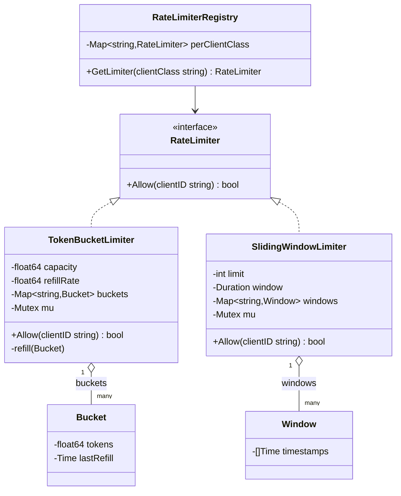

# Rate Limiter — Low Level Design

🎯 Asked at: Razorpay

## References
- Read first: [Rate Limiter Low Level Design — Hello Interview](https://www.hellointerview.com/learn/low-level-design/problem-breakdowns/rate-limiter)
- Related HLD context (multi-server, Redis-backed version of this same idea): this repo's
  [`hld/designs/rate-limiter`](../../../hld/designs/rate-limiter/README.md) — that doc covers the
  distributed-systems problem (shared counter store, hot keys, fail-open/closed); this doc is the
  "zoom in on the classes" single-process version the HLD doc's Go demo is built from.
- Watch: [Design a Distributed Rate Limiter w/ an Ex-Meta Staff Engineer (YouTube)](https://www.youtube.com/watch?v=MIJFyUPG4Z4)

## Practice prompt
Before opening the design below: design a single-process rate limiter with an `Allow(clientID) -> bool`
API that supports at least two algorithms (token bucket, sliding window) behind a common interface, and
tracks limits *per client* rather than globally. Work out on paper why token bucket allows configurable
burst while sliding window doesn't, and why both need to be safe under concurrent calls for the same
client from multiple goroutines/threads.

## Requirements

**Functional**
1. `Allow(clientID) -> bool` decides whether a request from `clientID` is permitted right now.
2. Limits are configurable per client (or per client class) — e.g. 10 req/sec for free tier, 100 req/sec
   for paid tier.
3. Support at least two algorithms interchangeably: token bucket (burst-friendly) and sliding window
   counter (smooth, no boundary burst).

**Non-functional**
- Thread-safe: concurrent `Allow` calls for the same client must not corrupt bucket/window state or let
  through more requests than the configured limit.
- O(1) (or close to it) per `Allow` call — this sits on the hot path of every request.
- Extensible: adding a new algorithm (e.g. leaky bucket) must not require changing calling code.

## Class design



- `RateLimiter` is the common interface every algorithm implements, so calling code (`RateLimiterRegistry`
  or middleware) never branches on which algorithm is active.
- `TokenBucketLimiter` keeps one `Bucket` per client, lazily refilling tokens based on elapsed time since
  `lastRefill` on each `Allow` call (no background goroutine needed — refill is computed on read).
- `SlidingWindowLimiter` keeps a rolling list of recent request timestamps per client (sliding log) or a
  two-bucket counter approximation; `Allow` evicts timestamps older than `window` before checking `len`
  against `limit`.
- `RateLimiterRegistry` maps a client class (free/paid/enterprise) to the `RateLimiter` instance
  configured for that tier, so different tiers can even run different algorithms.

## Design patterns used
- **Strategy** — `RateLimiter` is the strategy interface; `TokenBucketLimiter` and `SlidingWindowLimiter`
  are interchangeable implementations selected at construction time.
- **Registry** — `RateLimiterRegistry` looks up the configured limiter per client class without the
  caller needing to know construction details.
- **Lazy evaluation** — token refill and window pruning happen on read (inside `Allow`), avoiding a
  background ticker goroutine per client.

## Key trade-offs / talking points
- **Token bucket vs sliding window**: token bucket allows controlled bursts up to `capacity` (good for
  bursty-but-fair traffic like a UI batch-loading a page); sliding window enforces a smoother, harder
  cap with no burst allowance. Pick per-route based on whether burst tolerance is desired.
- **Per-client state growth**: a map keyed by `clientID` grows unboundedly with unique clients (e.g.
  IP-based limiting behind NAT, or unauthenticated traffic). A real system needs eviction of idle
  entries (TTL/LRU) to bound memory — this is the single-process analog of the HLD doc's hot-key
  discussion.
- **Lock granularity**: a single mutex over the whole `buckets`/`windows` map serializes all clients on
  every `Allow` call; at high QPS, shard the map (e.g. by hashing `clientID` into N sub-maps each with
  its own lock) to reduce contention — mirrors the HLD doc's key-sharding mitigation for Redis hot keys.
- **Single-process ceiling**: this design is correct only within one process. The moment requests for
  the same client can land on different servers, in-memory state under-counts — see the HLD doc's
  centralized-Redis-counter design for the distributed fix.

## Run it

**Go** (from `interview-prep/`):
```bash
go test ./lld/problems/rate-limiter/go/...
```

**Java** (from `interview-prep/lld/problems/rate-limiter/java/`):
```bash
javac -d out src/*.java
java -cp out RateLimiterTest
```

**Python** (from `interview-prep/lld/problems/rate-limiter/python/`):
```bash
pytest test_rate_limiter.py -v
python3 rate_limiter.py   # runs the demo
```
