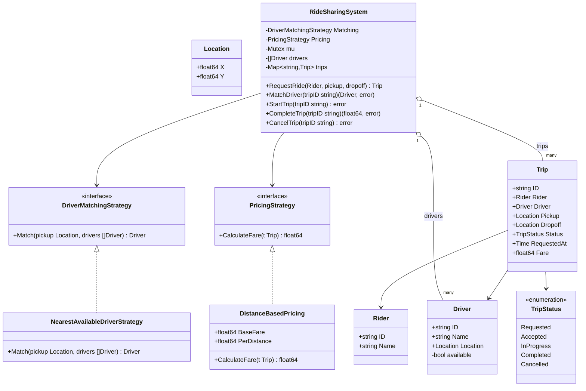

# Ride Sharing — Low Level Design

🎯 Asked at: Uber

## References
- Read first: [Design a Ride-Sharing Service Like Uber — Hello Interview](https://www.hellointerview.com/learn/system-design/problem-breakdowns/uber) *(system-design-level breakdown; this LLD problem is the Trip/Rider/Driver/matching class design underneath it)*
- Related HLD context (city-scale dispatch, geo-sharding, matching at scale): this repo's
  [`hld/designs/uber-ride-sharing`](../../../hld/designs/uber-ride-sharing/README.md) — that doc covers
  the distributed dispatch/geo-indexing problem; this doc is the single-process class design behind the
  matching and trip-lifecycle logic it dispatches to.
- Watch: [Uber System Design - Low Level Design Interview (YouTube)](https://www.youtube.com/watch?v=oX6NRQtqvIY)

## Practice prompt
Before opening the code below: design the class model for requesting a ride, matching the rider to the
nearest available driver, and running the trip through its lifecycle (requested -> accepted -> in
progress -> completed), with fare computed only once the trip completes. Decide how you'd keep driver
matching swappable (nearest-available today, could be a smarter dispatch algorithm later) without
touching the trip state machine, and how you'd prevent two concurrent ride requests from being matched
to the same driver.

## Requirements

**Functional**
1. A rider can request a ride from a pickup to a dropoff location.
2. The system matches the request to an available driver using a pluggable matching strategy.
3. A trip moves through `Requested -> Accepted -> InProgress -> Completed`, or can be `Cancelled` while
   `Requested`/`Accepted`.
4. Fare is computed on trip completion via a pluggable pricing strategy.

**Non-functional**
- Thread-safe: two concurrent match attempts must never assign the same driver to two trips.
- Illegal state transitions (e.g. completing a trip that was never started) must be rejected, not
  silently accepted.
- Matching and pricing algorithms must be swappable without changing the core trip lifecycle code.

## Class design

Built directly from `lld/problems/ride-sharing/go/ride_sharing.go`.



- `DriverMatchingStrategy` decouples "how we pick a driver" from the system; `NearestAvailableDriverStrategy`
  is the only implementation today (linear scan over available drivers by Euclidean distance to pickup).
- `PricingStrategy` decouples fare computation; `DistanceBasedPricing` charges `BaseFare + PerDistance *
  distance(pickup, dropoff)`.
- `RideSharingSystem` is the facade: it owns the driver pool and trip map, and every lifecycle method
  (`RequestRide`/`MatchDriver`/`StartTrip`/`CompleteTrip`/`CancelTrip`) validates `Trip.Status` before
  transitioning, returning `ErrInvalidTransition` otherwise.
- `MatchDriver` does the find-and-mark-unavailable step atomically under `s.mu` so two concurrent match
  calls can never both be assigned the same driver.

## Design patterns used
- **Strategy** — `DriverMatchingStrategy` and `PricingStrategy` are both swappable without touching
  `RideSharingSystem`'s trip-lifecycle logic.
- **State machine** — `TripStatus` plus the explicit transition checks in each method (`ErrInvalidTransition`)
  enforce a strict `Requested -> Accepted -> InProgress -> Completed` (or `Cancelled`) lifecycle.
- **Facade** — `RideSharingSystem` is the single entry point coordinating drivers, trips, matching, and
  pricing; callers never touch `Trip`/`Driver` internals directly.

## Key trade-offs / talking points
- **Nearest-driver matching is O(n) per request**: fine at interview/demo scale; a real system indexes
  drivers geospatially (geohash/quadtree/S2 cells) so matching doesn't scan every driver in the fleet —
  this is exactly the gap the HLD version's geo-sharded dispatch fills.
- **Single mutex over the whole system**: `RequestRide`/`MatchDriver`/`StartTrip`/`CompleteTrip`/`CancelTrip`
  all lock the same `sync.Mutex`, so all trips serialize on one lock. Correct and simple at this scale;
  a production system would shard locking per-driver or per-geo-cell.
- **Fare computed only at completion**: keeps `CompleteTrip` the single source of truth for fare, easy to
  test in isolation, at the cost of not being able to show the rider an estimate before requesting (a
  real system would add a separate fare-estimate path using the same `PricingStrategy`).
- **Driver availability toggling**: `driver.available` is flipped directly inside `MatchDriver`/`CompleteTrip`/
  `CancelTrip` rather than through a separate driver-state service — acceptable in a single-process
  design, but wouldn't survive a driver being tracked by multiple services in a distributed system.

## Run it

**Go** (from `interview-prep/`):
```bash
go test ./lld/problems/ride-sharing/go/...
```

**Java** (from `lld/problems/ride-sharing/java/`):
```bash
mkdir -p out && javac -d out src/*.java && java -cp out Main
```

**Python** (from `lld/problems/ride-sharing/python/`):
```bash
python3 -m pytest test_ride_sharing.py -v
```
