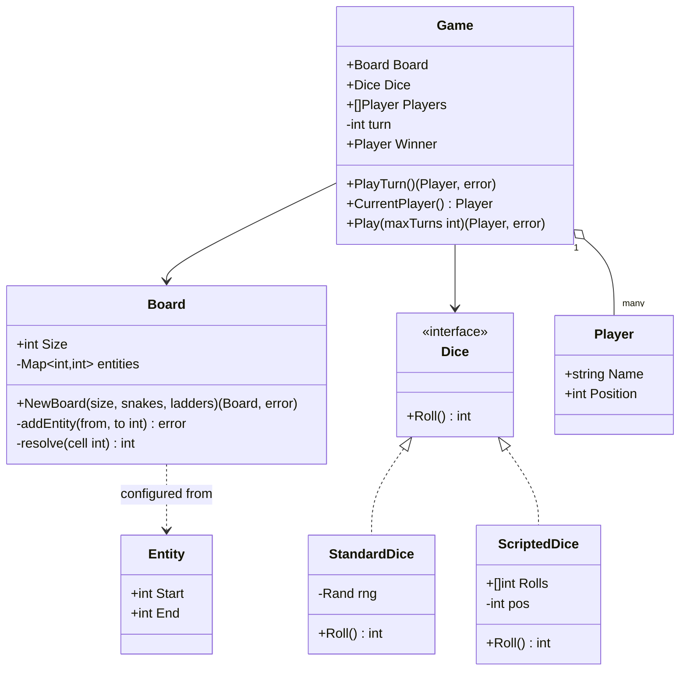

# Snake and Ladder — Low Level Design

🎯 Asked at: Flipkart

## References
- No dedicated hellointerview.com breakdown found for Snake & Ladder specifically at time of writing; the
  same board-game-engine skills are covered by [Elevator Low Level Design — Hello Interview](https://www.hellointerview.com/learn/low-level-design/problem-breakdowns/elevator)
  (state + turn-driven simulation) and [Low Level Design in a Hurry — Hello Interview](https://www.hellointerview.com/learn/low-level-design) (general framework).
- Watch: [Snake and Ladder Game - Low Level Design Interview (YouTube)](https://www.youtube.com/watch?v=nkeXstII8vQ)

## Practice prompt
Before opening the code below: design a class model for a configurable-size board with snakes and
ladders, an injectable dice so games are reproducible in tests, and a turn-based engine that enforces
the "exact landing to win" rule (a roll that would overshoot the last cell is not a legal move). Decide
how snakes and ladders share one underlying concept (both just relocate you from cell A to cell B), and
how you'd make dice rolls deterministic for testing without changing the engine's code path.

## Requirements

**Functional**
1. Board of configurable size with snakes (move down) and ladders (move up) placed at specific cells.
2. 2+ players take turns rolling a dice and moving forward by the roll amount.
3. Landing exactly on a snake's head or a ladder's bottom immediately relocates the player to the
   snake's tail / ladder's top.
4. A roll that would move a player past the last cell is not applied (player stays put) — exact landing
   required to win.
5. First player to land exactly on the final cell wins.

**Non-functional**
- Deterministic/testable: the dice must be swappable with a scripted sequence for reproducible test runs.
- Invalid board configuration (snake start <= end, ladder start >= end, overlapping entities, entity
  outside the valid range) must be rejected at construction time, not discovered mid-game.

## Class design

Built directly from `lld/problems/snake-and-ladder/go/snakeandladder.go` (mirrored by the Java sources
under `java/src/`).



- `Dice` is the single interface the engine depends on; `StandardDice` wraps a seeded `math/rand.Rand`
  for real play, `ScriptedDice` replays a fixed sequence (cycling once exhausted) so tests can assert
  exact outcomes without randomness.
- `Board.entities` is one flat `map[from]to` for both snakes and ladders — a snake is just an entity
  where `Start > End` and a ladder is one where `Start < End`; `resolve(cell)` looks up the map and
  returns `cell` unchanged if there's no entity there, so the engine never needs to know which kind it
  hit.
- `NewBoard` validates snake/ladder direction, in-range placement `(1, Size)`, and rejects a second
  entity starting on a cell that already has one, all at construction time.
- `Game.PlayTurn` rolls the dice, computes `target := player.Position + roll`, and only applies the move
  (`board.resolve(target)`) when `target <= Board.Size` — otherwise the player's position is unchanged
  and the turn still passes, encoding the exact-landing-to-win rule.

## Design patterns used
- **Strategy** — `Dice` is the strategy interface; `StandardDice` and `ScriptedDice` are interchangeable
  implementations, letting the same `Game` engine run randomly or deterministically.
- **Unified entity abstraction** — snakes and ladders are represented as one `Entity`/map concept rather
  than two parallel class hierarchies, which is the key simplification interviewers look for in this
  problem.
- **State machine (implicit)** — `Game.turn` and `Game.Winner` encode turn order and terminal state;
  `PlayTurn` returns `ErrGameAlreadyOver` once a winner exists, refusing further moves.

## Key trade-offs / talking points
- **Why one entity map instead of separate Snake/Ladder types?** Both are "landing on cell X relocates
  you to cell Y" — modeling them as one relation collapses what could be two class hierarchies (and
  duplicated resolve logic) into a single map lookup.
- **Why does an overshoot not consume a smaller move?** Some house-rule variants "bounce back" from the
  last cell; this implementation picks the common competitive-programming rule (invalid roll = no move,
  turn still passes) and documents it explicitly rather than leaving it ambiguous.
- **ScriptedDice for testing**: without an injectable `Dice`, testing "does landing on cell 14 correctly
  send you to cell 4 via a snake" would require rolling until you get lucky. The Strategy pattern turns
  this into a one-line deterministic test.
- **Single-threaded design**: unlike the other LLD problems in this repo, there's no `sync.Mutex` here —
  a turn-based board game has exactly one active player at a time by definition, so no concurrent-write
  hazard exists to guard against.

## Run it

**Go** (from `interview-prep/`):
```bash
go test ./lld/problems/snake-and-ladder/go/...
```

**Java** (from `interview-prep/lld/problems/snake-and-ladder/java/`):
```bash
javac -d out src/*.java
```
*(No `Main`/demo entry point yet — this compiles the class model; see the Go package for a runnable
test suite exercising the same design.)*

**Python** (from `interview-prep/lld/problems/snake-and-ladder/python/`):
```bash
pytest test_snake_and_ladder.py -v
python3 snake_and_ladder.py   # runs the demo
```
