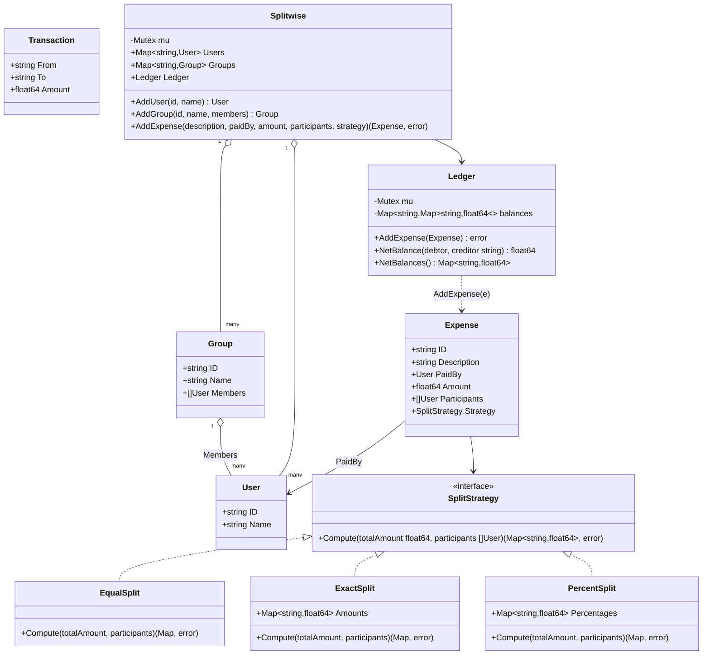

# Splitwise — Low Level Design

🎯 Asked at: PhonePe

## References
- Read first: [Design an LLD of Splitwise — Hello Interview](https://www.hellointerview.com/community/questions/splitwise-lld/cm6jwwh6700bxui4bzs4jmddl)
- Watch: [Design Splitwise - Low Level Design Interview Question (YouTube)](https://www.youtube.com/watch?v=Yhu-1H8UWv4)

## Practice prompt
Before opening the code below: design the class model for group expenses with three ways to split a
bill (equally, by exact amounts, by percentage), a running ledger of who-owes-whom, and a debt
simplification step that minimizes the number of settle-up transactions between a group of people with
tangled pairwise debts. Work out on paper why a naive "record every expense as a separate IOU" ledger
produces far more settling transactions than necessary, and how you'd collapse it down.

## Requirements

**Functional**
1. Add users and groups of users.
2. Record an expense: payer, total amount, participants, and a split strategy (equal / exact amounts /
   percentages) that must validate its own inputs (e.g. exact amounts sum to the total).
3. Maintain a pairwise balance ledger (who owes whom, and how much) that updates as expenses are added.
4. Simplify debts: given each user's net balance, produce the minimum-ish set of transactions that
   settles everyone up, rather than replaying every individual expense as a separate payment.

**Non-functional**
- Thread-safe: concurrent expense additions must not corrupt the ledger's pairwise balances.
- Split strategies must be pluggable — adding a new split type (e.g. split by shares/weights) must not
  require changing `Ledger` or `Splitwise` code.
- Floating-point split amounts must tolerate rounding error (epsilon comparison), not fail on `0.1 +
  0.2 != 0.3`-style mismatches.

## Class design

Built directly from `lld/problems/splitwise/go/splitwise.go` (mirrored by the Java sources under
`java/src/`).



- `SplitStrategy` is the interface every split type implements; each `Compute` validates its own inputs
  (exact amounts sum to `totalAmount`, percentages sum to 100) and returns an error rather than silently
  producing wrong shares.
- `Ledger.balances` is a `map[a]map[b]float64` kept anti-symmetric (`balances[a][b] == -balances[b][a]`)
  — `AddExpense` computes shares via the expense's strategy, then calls `adjust(paidBy, participant,
  share)` for every non-payer participant.
- `SimplifyDebts` (a free function, not shown as a class above since it's algorithmic rather than
  stateful) takes `Ledger.NetBalances()` output and greedily matches the largest creditor against the
  largest debtor each round, producing a small `[]Transaction` settle-up plan instead of one transaction
  per original expense.
- `Splitwise` is the app-level facade: it owns users/groups/ledger and is the only thing calling code
  touches (`AddUser`/`AddGroup`/`AddExpense`); `Ledger` itself has no knowledge of users/groups, only ID
  strings, keeping it independently testable.

## Design patterns used
- **Strategy** — `SplitStrategy` (`EqualSplit`/`ExactSplit`/`PercentSplit`) is the textbook Strategy
  pattern application for this problem: `Ledger.AddExpense` never branches on split type.
- **Facade** — `Splitwise` hides `Ledger`'s pairwise-map internals behind a small user/group/expense API.
- **Greedy algorithm (debt simplification)** — `SimplifyDebts` is the algorithmic centerpiece
  interviewers probe on: sort creditors and debtors descending, repeatedly settle the larger of the
  two amounts, advance whichever list emptied.

## Key trade-offs / talking points
- **Why a pairwise ledger instead of one global balance per user?** `NetBalance(debtor, creditor)` needs
  to answer "how much does X specifically owe Y," which a single aggregate-per-user balance can't answer
  — only `NetBalances()` (summed across the row) gives the aggregate view used for simplification.
- **Debt simplification is greedy, not globally optimal**: `SimplifyDebts` minimizes transactions well
  in the common case but doesn't guarantee the theoretical minimum for every adversarial input (that's
  an NP-hard variant related to minimum transaction settlement) — call this out explicitly, it's exactly
  what real Splitwise-style systems ship anyway.
- **Epsilon comparisons everywhere** (`epsilon = 1e-6`): `ExactSplit`/`PercentSplit` validation and
  `SimplifyDebts`'s creditor/debtor classification all compare against `epsilon` instead of `0`, because
  float64 arithmetic on money will not sum to exactly zero.
- **Concurrency boundary**: `Ledger` has its own mutex independent of `Splitwise`'s, so ledger reads/writes
  aren't serialized behind unrelated user/group mutations — but this means `Splitwise.AddExpense` briefly
  releases its own lock before calling into `Ledger.AddExpense`, which is safe here only because `Expense`
  construction doesn't depend on ledger state.

## Run it

**Go** (from `interview-prep/`):
```bash
go test ./lld/problems/splitwise/go/...
```

**Java** (from `interview-prep/lld/problems/splitwise/java/`):
```bash
javac -d out src/*.java
java -cp out Main
```

**Python** (from `interview-prep/lld/problems/splitwise/python/`):
```bash
pytest test_splitwise.py -v
python3 splitwise.py   # runs the demo
```
