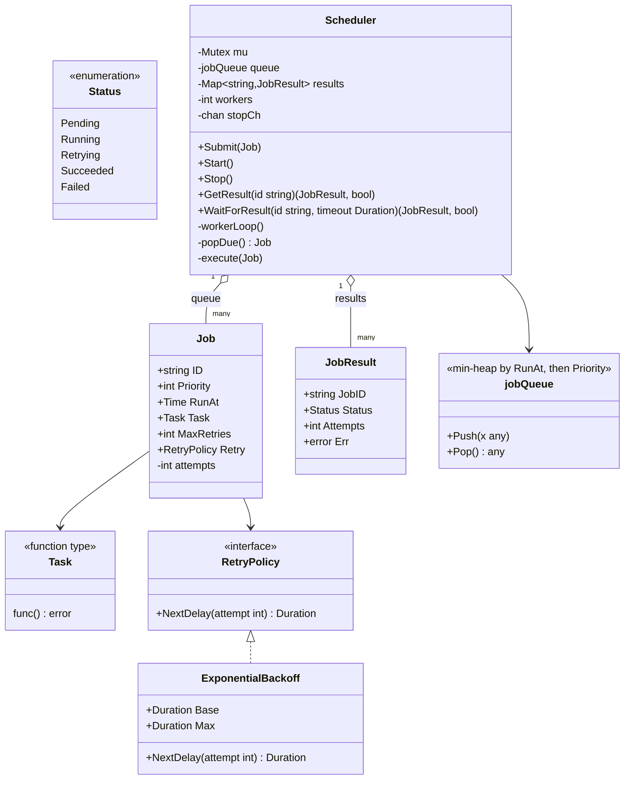

# Task Scheduler — Low Level Design

🎯 Asked at: Spotify

## References
- Read first: [Design a Distributed Job Scheduler Like Airflow — Hello Interview](https://www.hellointerview.com/learn/system-design/problem-breakdowns/job-scheduler) *(system-design-level breakdown — this LLD problem is the class design behind a single scheduling node, not the distributed version)*
- LLD-specific: [Coordination in Low Level Design — Hello Interview](https://www.hellointerview.com/learn/low-level-design/concurrency/coordination)
- Related HLD context (distributed, multi-worker scale): this repo's
  [`hld/designs/task-scheduler`](../../../hld/designs/task-scheduler/README.md) — that doc covers the
  distributed-systems version (leader-elected shards, distributed queue, lease-based at-least-once
  execution across a fleet); this doc is the single-process, in-memory version behind one worker pool.
- Watch: [Design a Job Scheduler - System Design Interview (YouTube)](https://www.youtube.com/watch?v=WTxG5880EH8)

## Practice prompt
Before opening the code below: design an in-memory scheduler that runs submitted jobs on a fixed worker
pool, where each job has a priority, a "not before" time (`RunAt`), and a retry policy. Decide what data
structure lets you efficiently find "the highest-priority job that is due right now" without scanning
every pending job on every tick, and how you'd re-enqueue a failed job for retry without blocking other
workers while it waits out its backoff delay.

## Requirements

**Functional**
1. `Submit(job)` enqueues a job with a priority, a `RunAt` time (may be in the future for delayed jobs),
   and a task function.
2. A fixed-size worker pool executes due jobs (`RunAt <= now`), highest priority first, ties broken by
   earliest `RunAt`.
3. A failed job is retried per its `RetryPolicy` (exponential backoff) up to `MaxRetries`, then marked
   `Failed`.
4. `GetResult(jobID)` / `WaitForResult(jobID, timeout)` let callers query or block on a job's outcome.

**Non-functional**
- Thread-safe: multiple workers popping/executing concurrently, and callers submitting concurrently,
  must not corrupt the job queue or result map.
- Job execution must not hold the scheduler lock — a long-running job must not block other workers from
  popping their next due job.
- `Start`/`Stop` must cleanly spin up and tear down the worker pool (no goroutine leaks).

## Class design

Built directly from `lld/problems/task-scheduler/go/taskscheduler.go`.



- `jobQueue` implements `container/heap.Interface` as a min-heap ordered by `RunAt` (earliest due
  first), tie-broken by higher `Priority` first — this is what makes "find the next due job" O(log n)
  instead of an O(n) scan every tick.
- `Scheduler.workerLoop` polls on a ticker, calling `popDue()` which only pops the heap's root if
  `RunAt <= now`; if the earliest job isn't due yet, it returns `nil` and the worker waits for the next
  tick rather than busy-looping.
- `popDue` and `execute` are deliberately separate critical sections: `popDue` holds `mu` only long
  enough to pop from the heap, then releases it before `execute` runs the (potentially slow) `Task`,
  so one long-running job doesn't block other workers from popping their next job.
- On failure, `execute` re-enqueues the job with `RunAt = now + Retry.NextDelay(attempts-1)` and status
  `Retrying`, up to `MaxRetries`; beyond that it's marked `Failed` and dropped from the queue.

## Design patterns used
- **Strategy** — `RetryPolicy` is pluggable; `ExponentialBackoff` is the only implementation today, but
  a fixed-delay or no-retry policy could be swapped in without touching `Scheduler`.
- **Priority queue / min-heap** — the core data-structure decision for this problem, exactly the same
  shape as an OS scheduler or a delayed-message queue: comparator-based ordering (`RunAt`, then
  `Priority`) instead of FIFO.
- **Worker pool** — a fixed number of goroutines (`workerLoop`) pull work from a single shared queue
  rather than one goroutine per job, bounding concurrency.

## Key trade-offs / talking points
- **Why a heap ordered by `RunAt` first, `Priority` second (not the other way around)?** A job that
  isn't due yet must never run early regardless of priority — `RunAt` has to be the primary sort key,
  with `Priority` only breaking ties among jobs that are simultaneously due.
- **Polling ticker vs a timer per job**: `workerLoop` polls every 2ms rather than scheduling an exact
  `time.Timer` per job. Simpler and bounds goroutine count to `workers`, at the cost of up to ~2ms of
  added latency on when a due job actually fires — an acceptable trade at this scale.
- **Lock scope around `execute`**: only the result-map update at the start/end of `execute` is under
  `mu`; running `j.Task()` itself is unlocked. This is what lets N workers execute N jobs truly in
  parallel instead of serializing on a single scheduler-wide lock.
- **At-least-once vs exactly-once**: like the HLD version, retries mean a job's `Task` could run more
  than once if it fails after partially succeeding — callers should write idempotent tasks, same caveat
  as the distributed version's lease-based re-delivery.
- **Single process, single point of failure**: unlike the HLD design's leader-elected sharded scanners,
  this scheduler dies with its process — appropriate for embedding in one service, not for a durable
  cross-service job platform.

## Run it

**Go** (from `interview-prep/`):
```bash
go test ./lld/problems/task-scheduler/go/...
```

**Java** (from `interview-prep/lld/problems/task-scheduler/java/`):
```bash
javac -d out src/*.java
java -cp out TaskSchedulerTest
```

**Python** (from `interview-prep/lld/problems/task-scheduler/python/`):
```bash
pytest test_task_scheduler.py -v
python3 task_scheduler.py   # runs the demo
```
