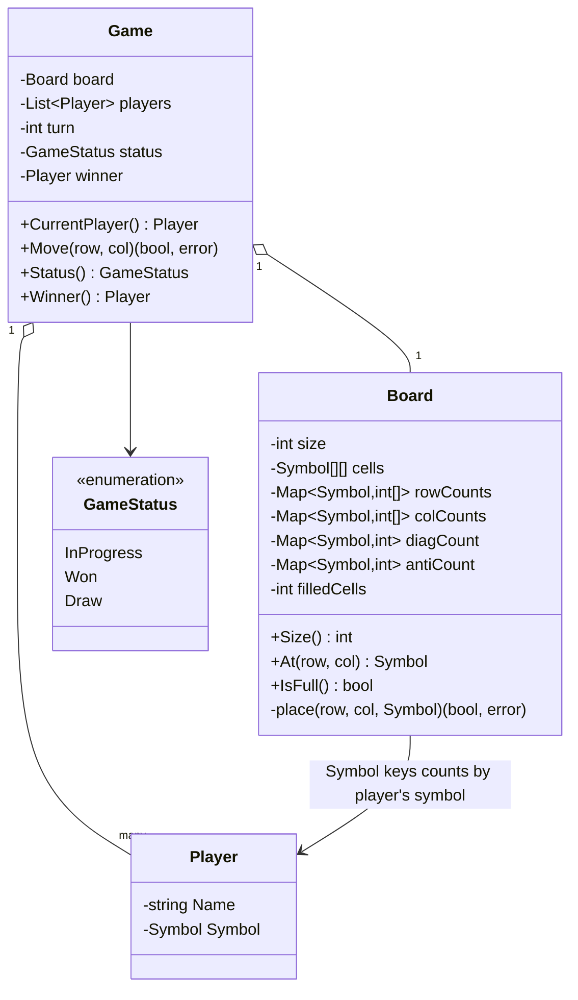

# Tic-Tac-Toe — Low Level Design

🎯 Asked at: Amazon (also a very common Google/general LLD warm-up, comparable in role to Parking Lot —
tests class decomposition and incremental state tracking rather than algorithmic difficulty)

## References
- Read first: [Leetcode 348: Design Tic-Tac-Toe — Hello Interview](https://www.hellointerview.com/community/questions/design-tic-tac-toe/cm5eh7nri04wo838oitc9peu4)
- Framework refresher: [Low Level Design Interview Delivery Framework — Hello Interview](https://www.hellointerview.com/learn/low-level-design/in-a-hurry/delivery)
- Watch: [System Design: Tic Tac Toe (Low Level System Design | LLD | Object Oriented System Design) (YouTube)](https://www.youtube.com/watch?v=V7aFobyuLrU)

## Practice prompt
Before opening the code below: design a `Game` that lets two (or more) players alternate placing
their symbol on an `NxN` board, rejects out-of-bounds or already-occupied moves, and detects a win
(full row/column/diagonal) or draw (board full, no winner) after every move. Specifically design the
win-check so it does **not** rescan the whole board on every move — figure out what incremental state
you'd need to track instead.

## Requirements

**Functional**
1. Players alternate turns placing their symbol on a board; a move is rejected if it's out of bounds,
   the cell is already occupied, or the game has already ended.
2. A player wins by filling an entire row, column, or diagonal with their symbol.
3. The game ends in a draw if the board fills up with no winner.
4. Game state (in progress / won / draw), the current player, and the winner (if any) are queryable.

**Non-functional / extensibility**
- The board is generic **NxN**, not hardcoded to 3x3 — the code accepts `size` at construction and
  the win/draw logic is written in terms of `size`, so a 3x3, 5x5, or 15x15 (Gomoku-style) board works
  without changing `Board` or `Game`.
- The game also generalizes to **more than 2 players**, since turn order is driven by a `players`
  slice/list rather than hardcoded "player 1 / player 2" fields.
- Win detection must be O(1) per move, not O(size) or O(size²) — see the class design below.

## Class design



- **Incremental win detection**: `Board` keeps running counts per symbol — `rowCounts[sym][row]`,
  `colCounts[sym][col]`, `diagCount[sym]`, `antiCount[sym]`. A single `place(row, col, sym)` call only
  ever affects one row count, one column count, and (at most) both diagonal counts, so checking
  `== size` on just those four counters after the move is enough to detect a win — no rescanning the
  board.
- **`Game` is the orchestrator** (turn order, terminal-state tracking, move validation delegation);
  **`Board`** owns grid state and the incremental win/draw bookkeeping; **`Player`** is a plain value
  holding a name and symbol.
- Unlike Parking Lot, `Game`/`Board` carry no mutex: a single tic-tac-toe game has exactly one turn
  owner at a time, so there's no concurrent-writer scenario to guard against (the code's own comments
  call this out explicitly).

## Design patterns used
- **State (implicit)** — `GameStatus` (`InProgress` / `Won` / `Draw`) gates which operations are legal
  (`Move` immediately rejects once the game isn't `InProgress`); a fuller pattern-based version could
  extract each status into its own `GameState` type, but at this scope a plain enum plus a guard clause
  is clearer and this repo's [`state`](../../week-02-03-patterns/state/README.md) pattern folder covers
  the fuller version.
- **Facade (informal)** — `Game` is the single entry point coordinating `Board`, `Player`, and turn
  order, so callers never touch `Board` internals directly.

## Key trade-offs / talking points
- **O(1) win check vs. full rescan**: the naive approach rechecks all rows/cols/diagonals after every
  move — O(size) per move, O(size²) overall. Maintaining per-symbol row/col/diagonal counters turns
  each check into O(1), which is the detail interviewers are listening for.
- **NxN generality cost**: supporting arbitrary board size means `rowCounts`/`colCounts` are
  `map[Symbol][]int` rather than fixed-size arrays, and diagonal membership is computed
  (`row == col`, `row + col == size - 1`) rather than hardcoded to the two 3x3 diagonals — a small
  overhead worth calling out as "generalization tax" if the interviewer only asked for 3x3.
- **N-player generalization**: turn advancement is `turn = (turn + 1) % len(players)`, so extending
  from 2 to N players (and N distinct symbols) needs no structural change — only the win condition
  ("first to complete a line") stays meaningful for small N.
- **No locking needed**: a single game instance has one active mover at a time by construction (moves
  are validated against `CurrentPlayer()`), so the absence of a mutex here is a deliberate design
  choice, not an oversight — worth stating explicitly since Parking Lot in this same repo *does* need one.

## Run it

**Go** (from `interview-prep/`):
```bash
go test ./lld/problems/tic-tac-toe/go/...
```

**Java** (from `interview-prep/lld/problems/tic-tac-toe/java/`):
```bash
javac -d out src/*.java
java -cp out Main
```

**Python** (from `interview-prep/lld/problems/tic-tac-toe/python/`):
```bash
pytest test_tic_tac_toe.py -v
python3 tic_tac_toe.py   # runs the demo
```
