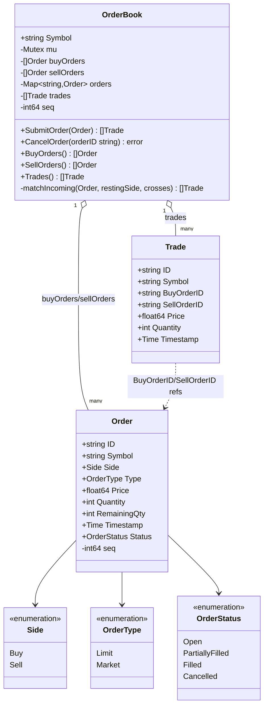

# Trading System — Low Level Design

🎯 Asked at: Microsoft

## References
- Read first: [Design a Stock Trading Platform Like Robinhood — Hello Interview](https://www.hellointerview.com/learn/system-design/problem-breakdowns/robinhood) *(system-design-level breakdown; this LLD problem is the order-book/matching-engine class design underneath it)*
- Watch: [Design a Stock Exchange - Low Level Design Interview (YouTube)](https://www.youtube.com/watch?v=XY6pRVpB1Rw)

## Practice prompt
Before opening the code below: design a per-symbol order book that accepts limit and market buy/sell
orders and matches them under price-time priority (best price first, earliest arrival breaks ties).
Decide what happens to an unfilled market order (does it rest in the book, waiting?) versus an unfilled
limit order, and how you'd guarantee two orders submitted concurrently can never both match against the
same resting liquidity.

## Requirements

**Functional**
1. Submit a limit order (buy/sell, symbol, price, quantity) or a market order (buy/sell, symbol,
   quantity — no price).
2. Match incoming orders against resting opposite-side orders under price-time priority: buy orders
   ranked by price descending then arrival ascending, sell orders by price ascending then arrival
   ascending.
3. Support partial fills — an order can match against multiple resting orders and rest the remainder.
4. Limit orders with a remaining unfilled quantity rest in the book; market orders never rest (unfilled
   remainder is cancelled, not queued).
5. Cancel a still-resting order by ID.

**Non-functional**
- Thread-safe per symbol: concurrent submissions to the same order book must be serialized so two
  incoming orders can never both match (double-fill) against the same resting order.
- Correct price-time priority ordering must be maintained on every insert, not just at read time.

## Class design

Built directly from `lld/problems/trading-system/go/tradingsystem.go`.



- `OrderBook` holds resting orders per symbol in two price-time-sorted slices (`buyOrders` descending by
  price then ascending by arrival `seq`, `sellOrders` the mirror), plus an `orders` map for O(1)
  cancel-by-ID lookup.
- `SubmitOrder` locks the whole book for the duration of matching — this is deliberate: matching mutates
  shared resting-order state (`RemainingQty`, removal from the slice), and letting two submissions
  interleave could double-fill the same resting order.
- `matchIncoming` is shared by both buy and sell submission paths via a `crosses(restingPrice) bool`
  predicate closure, so the crossing rule ("does my price cross this resting price, or is this a market
  order which crosses anything") is expressed once, not duplicated per side.
- A `Market` order that isn't fully filled after matching is `Cancelled` immediately rather than resting
  in the book (line: `if order.Type == Market { order.Status = Cancelled; ... }`) — market orders demand
  immediate execution at best available price, not queued exposure.
- `insertSorted` keeps `buyOrders`/`sellOrders` sorted on every insert (O(n) insert, O(1) best-price
  read) rather than sorting lazily on read.

## Design patterns used
- **Strategy via closures** — the `crosses` predicate parameterizes `matchIncoming` per side without a
  formal interface; a lighter-weight version of Strategy appropriate for a two-variant case.
- **Facade** — `OrderBook` is the only thing external callers touch; internal resting-order slices and
  the matching loop are private.
- **Price-time priority ordering** — the core algorithmic pattern of every real exchange: sort key is
  (price, arrival time), enforced via `buyLess`/`sellLess` comparators used by `insertSorted`.

## Key trade-offs / talking points
- **Linear scan/insert (`insertSorted`) vs a heap or balanced tree per price level**: the code's own
  comment calls this out — "Linear scan is fine at interview scope; a real exchange would index price
  levels with a balanced tree or heap [per price level, aggregating orders at that level]." O(n) insert
  is a deliberate simplification, not an oversight.
- **Why market orders never rest**: resting an unfilled market order would silently convert it into a
  pending limit order at an implicit "any price," which isn't what market-order semantics promise the
  caller — better to fill what's available now and cancel the remainder explicitly.
- **Whole-book lock granularity**: one mutex per `OrderBook` (i.e., per symbol) means high-frequency
  trading on a single hot symbol serializes completely; a multi-symbol venue parallelizes trivially
  since each `OrderBook` is independently locked, but a single hot symbol is still a bottleneck — the
  same shape of trade-off as the LRU cache's single-mutex-vs-sharding discussion in this repo.
- **Trade IDs and order removal from `orders` map on fill**: a fully filled order is deleted from the
  `orders` map (`delete(ob.orders, resting.ID)`), so `CancelOrder` on an already-filled ID correctly
  returns `ErrOrderNotFound` rather than silently no-op'ing on stale state.

## Run it

**Go** (from `interview-prep/`):
```bash
go test ./lld/problems/trading-system/go/...
```

**Java**:
```bash
cd lld/problems/trading-system/java
mkdir -p out && javac -d out src/*.java
java -cp out OrderBookTest
```

**Python**:
```bash
cd lld/problems/trading-system/python
python3 -m pytest test_trading_system.py -v
```
