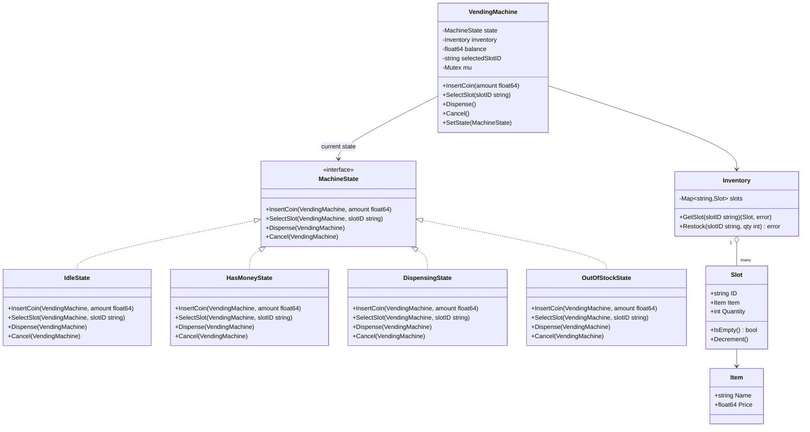

# Vending Machine — Low Level Design

🎯 Asked at: Meesho

## References
- Read first: [Design a Vending Machine System — Hello Interview](https://www.hellointerview.com/community/questions/beverage-vending-system/cmkr2w9l80cph08adwuu5vnfh)
- Watch: [Vending Machine System Design - Low Level Design Interview (YouTube)](https://www.youtube.com/watch?v=Qk2ze3gYQU8)

## Practice prompt
Before opening the design below: model a vending machine as an explicit state machine — idle, has-money
inserted, dispensing, out-of-stock — where the *same* button press (e.g. "select item") behaves
differently depending on which state the machine is in (selecting an item while idle should be
rejected or prompt for payment; selecting while money has been inserted should attempt a dispense).
Decide where inventory and payment-balance bookkeeping should live so that adding a new state later
doesn't mean editing a giant switch statement scattered across the codebase.

## Requirements

**Functional**
1. Track inventory per slot (item, price, quantity remaining).
2. Accept money (coins/notes) incrementally; track the running inserted balance.
3. On item selection: if balance >= price and the slot is in stock, dispense the item and return
   change (balance - price); otherwise reject with a specific reason (insufficient balance / out of
   stock).
4. Support cancel: refund the full inserted balance and return to idle.
5. Restock/refill a slot's quantity (operator-only operation).

**Non-functional**
- Every operation's legality depends on the machine's current state (`Idle`/`HasMoney`/`Dispensing`/
  `OutOfStock`) — invalid operations for the current state must be rejected, not silently ignored.
- Thread-safe: a real machine has one physical keypad/coin slot, but the software model should not
  corrupt inventory or balance under concurrent access (e.g. a network-connected remote-monitoring read
  happening mid-transaction).
- Adding a new state (e.g. `Maintenance`) must not require editing every existing state's logic.

## Class design



- `MachineState` is the interface every concrete state implements; `VendingMachine` delegates every
  public operation (`InsertCoin`/`SelectSlot`/`Dispense`/`Cancel`) straight to `state.<Method>(this,
  ...)`, and never contains an `if machine.state == X` conditional itself — the state object decides
  what's legal.
- `IdleState.InsertCoin` accumulates `balance` and transitions the machine to `HasMoneyState`.
  `IdleState.SelectSlot`/`Dispense` are no-ops or reject ("insert money first").
- `HasMoneyState.SelectSlot` records `selectedSlotID`, checks the slot via `Inventory.GetSlot`, and
  transitions to `DispensingState` if `balance >= item.Price` and the slot isn't empty; otherwise it
  stays in `HasMoneyState` and reports the specific rejection reason.
- `DispensingState.Dispense` decrements the slot's quantity, computes change (`balance - price`),
  resets `balance` to 0, and transitions back to `IdleState` (or to `OutOfStockState` if that
  decrement just emptied the last unit and the machine is configured to flag it).
- `HasMoneyState.Cancel` (and `Idle`'s, trivially) refunds the full `balance` and returns to `IdleState`.
- `Inventory` is a thin facade over `slots` so `VendingMachine`/states never touch the map directly —
  restocking and slot lookups go through it, keeping stock-management logic in one place.

## Design patterns used
- **State** — the central pattern for this problem: `MachineState` implementations
  (`Idle`/`HasMoney`/`Dispensing`/`OutOfStock`) each define which operations are legal and what they do,
  so `VendingMachine` itself has no branching on "what state am I in" — it just delegates.
- **Facade** — `Inventory` hides the slot map behind `GetSlot`/`Restock`.
- **Context object** — `VendingMachine` is the State pattern's "context": it holds the current state
  reference and the shared data (`balance`, `selectedSlotID`, `inventory`) that states read and mutate
  via the methods passed a `VendingMachine` reference.

## Key trade-offs / talking points
- **Why State pattern instead of a `switch` on an enum in `VendingMachine`?** The same button press
  means different things per state (`SelectSlot` while idle vs while money is inserted); a State object
  per state keeps each state's rules colocated and means adding `MaintenanceState` later touches only
  one new file, not every existing `switch` block.
- **Where balance/inventory live**: they live on `VendingMachine` (the shared context), not inside each
  state object, because states are transient (swapped out on every transition) while balance/inventory
  must persist across the full transaction — a common State-pattern pitfall is putting mutable
  transaction data on the state itself and losing it on transition.
- **OutOfStockState scope**: modeled here as a per-slot condition surfaced through rejection messages
  from `HasMoneyState`, with a dedicated `OutOfStockState` reserved for the whole-machine case (every
  slot empty) — a real machine needs to make explicit which of these two OOS variants a given
  interaction hit.
- **Concurrency**: a physical machine only ever serves one buyer, but the class model still needs a
  mutex if a remote-monitoring/telemetry read (`GetSlot` for a stock dashboard) can happen concurrently
  with an in-progress transaction — same justification as the mutex-guarded designs elsewhere in this
  repo (LRU cache, parking lot).

## Run it

**Go** (from `interview-prep/`):
```bash
go test ./lld/problems/vending-machine/go/...
```

**Java** (from `interview-prep/lld/problems/vending-machine/java/`):
```bash
javac -d out src/*.java
java -cp out Main
```

**Python** (from `interview-prep/lld/problems/vending-machine/python/`):
```bash
pytest test_vending_machine.py -v
python3 vending_machine.py   # runs the demo
```
