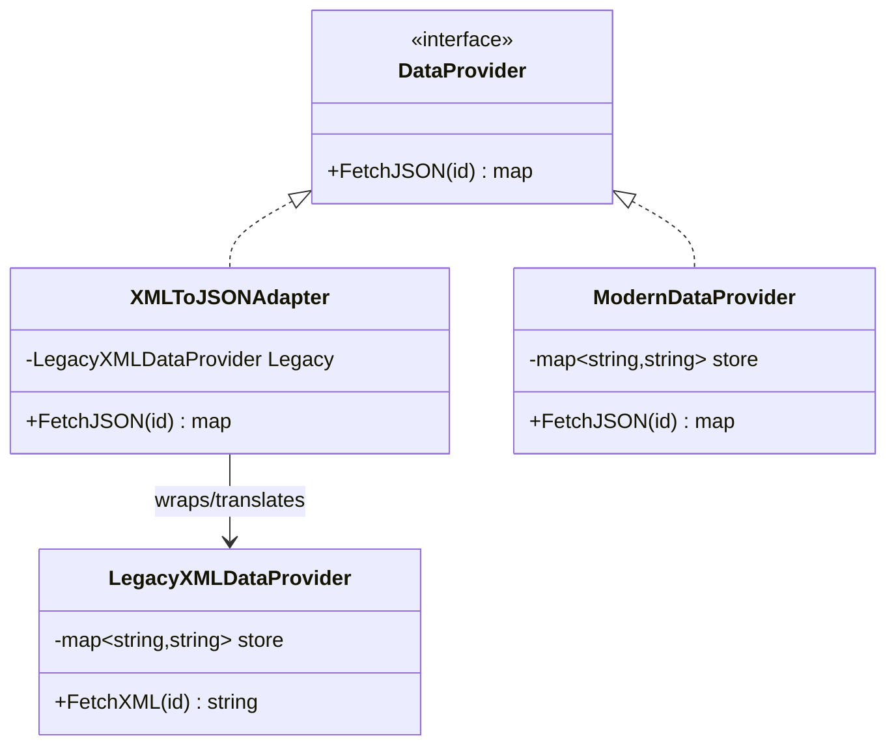

# Adapter — Design Pattern

## Problem it solves
You have an existing class (or a third-party/legacy API) whose interface doesn't match what
the rest of your system expects, and you can't or don't want to modify it — it's owned by
another team, ships as a compiled library, or changing it would break other callers. Adapter
wraps the incompatible class behind a new class that implements the interface your system
actually depends on, translating calls (and data shapes) between the two without touching
either the legacy code or the client code that consumes the target interface.

## When to use it
- You need to integrate a legacy or third-party class whose interface doesn't match the one
  your code is written against, and modifying the source isn't an option.
- You want to introduce a new, cleaner interface for future code while keeping the old
  implementation working underneath, unchanged.
- You're consolidating multiple similar-but-incompatible data sources behind one common
  interface so client code can treat them interchangeably.

🎯 Asked at: a common structural-pattern warm-up, often phrased as "adapt a legacy/third-party
interface to the one your system expects" (e.g. adapting an old XML-based payment gateway to
a new JSON-based interface).

**Example scenario**: a system standardizes on a `DataProvider` interface that returns
JSON-shaped records, but a legacy data source only exposes XML. An `XMLToJSONAdapter` wraps
the legacy provider, satisfies `DataProvider`, and translates every response — so client code
never needs to know XML exists.

## Class design



## Key trade-offs / talking points
- **Object adapter vs class adapter**: this implementation wraps the legacy type by holding a
  reference to it (`Legacy *LegacyXMLDataProvider`) rather than inheriting from it — the
  standard "object adapter" form, which works even in languages without multiple inheritance
  and doesn't require the adapter and adaptee to share a class hierarchy.
- **Where translation errors surface**: `XMLToJSONAdapter.FetchJSON` propagates the legacy
  provider's "not found" error unchanged rather than swallowing it, so callers get the same
  error contract whether they're talking to `ModernDataProvider` or the adapted legacy one —
  the adapter must preserve the target interface's error semantics, not just its method shapes.
- **Adapter vs Facade**: Adapter is a one-to-one wrapper that makes an existing interface look
  like a different, already-expected interface; Facade simplifies access to many classes behind
  a new, simpler interface. `ModernDataProvider` exists in this package specifically to prove
  the adapter is a drop-in substitute wherever `DataProvider` is used.

## How to bring this up in the interview
Propose Adapter as soon as the prompt mentions integrating an existing system, a legacy
component, or a third-party library whose interface you can't change — it's the natural
answer to "how do you plug X into a system built around interface Y." Name the pattern
explicitly and sketch the target interface first, then show the adapter implementing it while
holding a reference to the unmodified legacy type. If the interviewer pushes back with "why
not just change the legacy class to match," point out that it's often not yours to change
(third-party, another team, other live callers depend on its current shape) — and that even
when it is yours, an adapter keeps the translation logic isolated and removable if the legacy
system is retired later.

## References
- [Adapter — Refactoring Guru](https://refactoring.guru/design-patterns/adapter)
- Watch: [Adapter Design Pattern Explained and Implemented in Java — Geekific (YouTube)](https://www.youtube.com/watch?v=e1i4CQCZeaQ)

## Run it

**Go** (from `interview-prep/`):
```bash
go test ./lld/week-02-03-patterns/adapter/go/...
```

**Java** (from `interview-prep/lld/week-02-03-patterns/adapter/java/`):
```bash
javac -d out src/*.java
java -cp out Main
java -cp out AdapterTest
```

**Python** (from `interview-prep/lld/week-02-03-patterns/adapter/python/`):
```bash
pytest test_adapter.py -v
python3 adapter.py   # runs the demo
```
