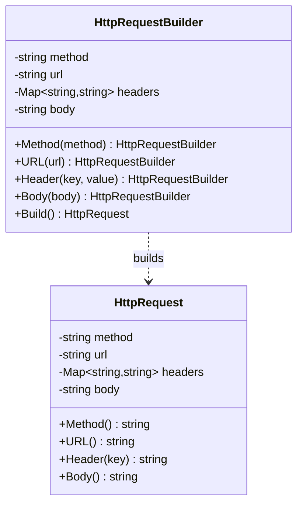

# Builder — Design Pattern

## Problem it solves
Some objects need many optional fields set before they're valid (an HTTP request has a method,
a URL, arbitrary headers, and a body), and you don't want a telescoping constructor with a dozen
parameters, or a mutable object that client code can accidentally leave half-configured. Builder
extracts the step-by-step construction into a separate object that exposes a fluent, chainable API
and only hands back the final object once it's fully assembled — and that final object can then be
made immutable.

## When to use it
- Constructing a complex object has many optional parameters, several of which have sensible
  defaults (an `HttpRequest`, a SQL query, a UI dialog with lots of optional widgets).
- You want the finished object to be immutable, but assembling it requires several intermediate
  steps that themselves need to be mutable.
- You want the same construction process to be reusable/chainable across call sites without
  duplicating validation logic.

🎯 Asked at: a common warm-up/creational-pattern question in Google and Amazon LLD rounds — often
phrased as "design a builder for an HTTP client request" or "design a `Computer`/`Pizza` builder."

**Example scenario**: an HTTP client library needs to let callers do
`request().method("POST").url(...).header(...).body(...).build()` and get back an immutable
`HttpRequest` — mirroring how `OkHttp`'s `Request.Builder` or Java's `HttpRequest.Builder` work.

## Class design



## Key trade-offs / talking points
- **Immutability of the product**: `Build()` copies the builder's mutable header map into a new
  map on the returned `HttpRequest`, so reusing the builder for a second `Build()` call (e.g. to
  produce a slightly different request) never mutates a request already handed to a caller.
- **Fluent chaining vs a director**: the GoF pattern also describes an optional `Director` that
  encodes a fixed build sequence; for a request object with independent optional fields, a bare
  fluent builder is simpler and is what's used here — a director is worth introducing only when
  there are multiple *fixed* recipes worth naming (e.g. `buildJsonPostRequest()`).
- **Validation at `Build()` time**: required fields (like `URL`) are checked once, at the boundary,
  rather than scattering `nil`/empty checks through the rest of the codebase.

## How to bring this up in the interview
Propose Builder as soon as the object you're modeling has more than three or four optional
fields, or the constructor signature starts requiring a run of positional booleans/nulls to
skip parameters — "let me use a builder here so we get a fluent, chainable API and validate
required fields once at `Build()`" is a natural line to say out loud. If the interviewer pushes
back with "why not just use a constructor with default arguments," point out that default
arguments don't scale past a handful of optional fields, don't let you validate combinations of
fields together, and (in languages without named arguments) force callers to pass values
positionally even for fields they don't care about — Builder trades a bit of extra
boilerplate for a construction API that stays readable and safely immutable as the object grows.

## References
- [Builder — Refactoring Guru](https://refactoring.guru/design-patterns/builder)
- Watch: [Builder Design Pattern Explained (with Code Examples) — YouTube](https://www.youtube.com/watch?v=ALzvPK9_r0A)

## Run it

**Go** (from `interview-prep/`):
```bash
go test ./lld/week-02-03-patterns/builder/go/...
```

**Java** (from `interview-prep/lld/week-02-03-patterns/builder/java/`):
```bash
javac -d out src/*.java
java -cp out Main
java -cp out BuilderTest
```

**Python** (from `interview-prep/lld/week-02-03-patterns/builder/python/`):
```bash
pytest test_builder.py -v
python3 builder.py   # runs the demo
```
