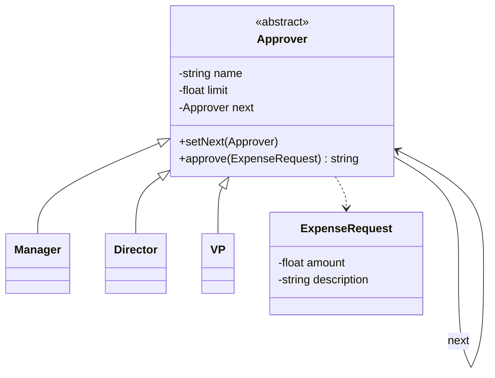

# Chain of Responsibility

## Problem it solves
A request may need to be handled by one of several possible handlers, but the sender
shouldn't need to know which handler will end up processing it, or how many handlers
exist. Chain of Responsibility links handlers into a chain and passes the request along
it: each handler decides either to handle the request or to pass it to the next handler,
decoupling the sender from the concrete set of receivers.

## When to use it
- More than one object may handle a request, and the handler isn't known in advance —
  it's determined by runtime data (e.g. the request's amount, its content, its headers).
- You want to add, remove, or reorder handlers without touching the sender's code.
- **Interview-relevant scenario**: "Design an expense-approval flow: a `Manager` can
  approve up to $1,000, a `Director` up to $5,000, a `VP` up to $20,000 — each request goes
  to the manager first, who either approves it or forwards it up the chain." The same shape
  models an HTTP middleware chain (auth -> rate-limit -> logging -> handler), where each
  middleware can short-circuit or call `next()`.

## Class design



## Key trade-offs / talking points
- The chain must terminate somewhere: either the last handler unconditionally handles the
  request, or (as here) it raises/returns an explicit "unhandled" signal — silently
  swallowing an unhandled request is a common bug.
- Chain of Responsibility vs Decorator: structurally similar (each link wraps/calls the
  next), but Decorator's whole point is that *every* layer runs and adds behavior, while in
  Chain of Responsibility a request typically stops at the *first* handler that can process
  it.
- Order is a design decision with real consequences here — putting `VP` first would let it
  silently approve requests a `Manager` should have declined to escalate; this is worth
  calling out explicitly in an interview.

## How to bring this up in the interview
Propose Chain of Responsibility when a request can be handled by one of several candidate
handlers and the *right* one depends on runtime data the sender shouldn't need to inspect
itself — say "I'd link the handlers into a chain and let each one decide handle-or-forward,
so the sender never needs to know which handler exists or in what order." If the interviewer
pushes back with "why not just have the sender pick the right handler with an `if/else`,"
point out that this couples the sender to every concrete handler and their thresholds, and
that adding, removing, or reordering handlers (a new approval tier, a new middleware step)
then means editing the sender instead of just relinking the chain — Chain of Responsibility
keeps that decision distributed and independently extensible.

## References
- Read first: [Chain of Responsibility — Refactoring.Guru](https://refactoring.guru/design-patterns/chain-of-responsibility)
- Watch: [The Chain of Responsibility Pattern Explained & Implemented — Geekific (YouTube)](https://www.youtube.com/watch?v=FafNcoBvVQo)

## Run it

**Go** (from `interview-prep/`):
```bash
go test ./lld/week-02-03-patterns/chain-of-responsibility/go/...
```

**Java** (from `interview-prep/lld/week-02-03-patterns/chain-of-responsibility/java/`):
```bash
javac -d out src/*.java
java -cp out Main
```

**Python** (from `interview-prep/lld/week-02-03-patterns/chain-of-responsibility/python/`):
```bash
pytest test_chain_of_responsibility.py -v
python3 chain_of_responsibility.py   # runs the demo
```
