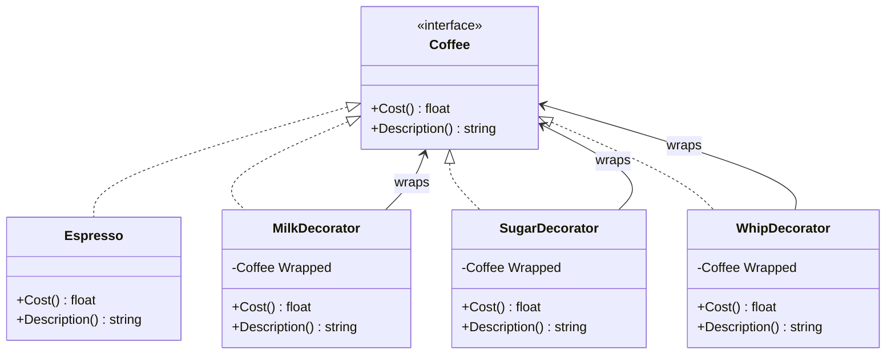

# Decorator — Design Pattern

## Problem it solves
An object needs optional, combinable behavior added at runtime (extra cost/description
layers on a drink, buffering/compression/encryption on a stream, logging around a service
call), but subclassing every combination explodes into `MilkSugarWhipEspresso`,
`MilkEspresso`, `SugarEspresso`... one class per combination. Decorator instead wraps the
object in one or more decorator objects that each implement the same interface as the
component they wrap, forward the call to the wrapped object, and add their own behavior on
top — so any combination of extras is just a matter of stacking wrappers at runtime.

## When to use it
- You need to add responsibilities to individual objects dynamically, without affecting other
  instances of the same class, and subclassing would require one class per combination.
- The extra behavior is meant to be optional and stackable — clients decide at runtime which
  layers to apply and in what order.
- You want to keep the base component simple and push each add-on's logic into its own small,
  single-responsibility class instead of one growing conditional-laden class.

🎯 Asked at: commonly probed via "how would you add optional behavior (e.g. gift-wrapping,
logging, compression) to an object without subclassing explosion" — classic example is a
coffee/beverage ordering system (like Starbucks) with condiment decorators, or an I/O stream
wrapper.

**Example scenario**: a coffee shop's ordering system starts with a base `Espresso` and lets
customers add any combination of milk, sugar, and whip — each addition changes both the price
and the printed description, and new condiments must be addable without touching `Espresso`
or any existing decorator.

## Class design



## Key trade-offs / talking points
- **Stacking order matters for description, not cost**: `Cost()` is commutative (sum of
  layers regardless of order), but `Description()` builds a string by appending each layer's
  suffix, so `Milk(Sugar(Espresso))` and `Sugar(Milk(Espresso))` print differently even though
  they cost the same — worth calling out that not every decorated property is order-independent.
- **Decorator vs Chain of Responsibility**: structurally similar (each wrapper holds a
  reference to the next/wrapped object), but every decorator layer *always* runs and
  contributes to the result, whereas in Chain of Responsibility a request typically stops at
  the first handler that can process it (see the `chain-of-responsibility` folder).
- **Decorator vs Proxy**: identical structure — both wrap an object behind the same interface
  — but they differ in intent: Decorator *adds* behavior/responsibilities, Proxy *controls*
  access or lifecycle to the thing it wraps (see the `proxy` folder).
- Each decorator here is a thin, single-field wrapper, so composing N optional behaviors costs
  O(N) small objects instead of O(2^N) subclasses — the whole point of the pattern.

## How to bring this up in the interview
Raise Decorator the moment a prompt asks for "optional, combinable" behavior on an object —
phrases like "add-ons," "toppings," "middleware," or "wrap a stream with compression/encryption"
are the signal. Sketch the shared component interface first, then show that both the base
object and every decorator implement it, so they're all interchangeable and stackable in any
order the client chooses. If the interviewer pushes back with "why not just add boolean flags
or a few subclasses," point out that flags force every combination's logic into one bloated
class (and every new flag is a cross-cutting change), while subclassing one class per
combination grows exponentially with the number of optional behaviors — Decorator keeps each
behavior in its own class and composes them at runtime instead of at compile time.

## References
- [Decorator — Refactoring Guru](https://refactoring.guru/design-patterns/decorator)
- Watch: [Decorator Design Pattern Explained and Implemented in Java — Geekific (YouTube)](https://www.youtube.com/watch?v=GtWvgTfxRDI)

## Run it

**Go** (from `interview-prep/`):
```bash
go test ./lld/week-02-03-patterns/decorator/go/...
```

**Java** (from `interview-prep/lld/week-02-03-patterns/decorator/java/`):
```bash
javac -d out src/*.java
java -cp out Main
java -cp out DecoratorTest
```

**Python** (from `interview-prep/lld/week-02-03-patterns/decorator/python/`):
```bash
pytest test_decorator.py -v
python3 decorator.py   # runs the demo
```
