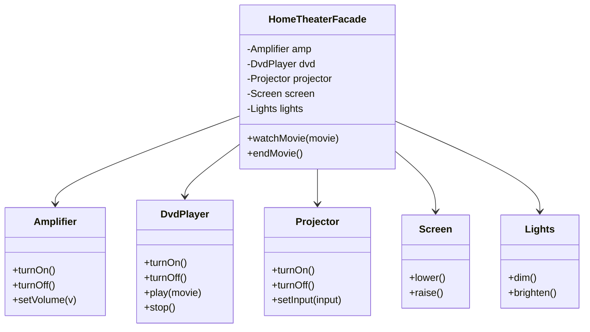

# Facade

## Problem it solves
A client needs to use a subsystem made of several interdependent classes (amplifier, DVD
player, projector, screen, lights — or, in an order-processing system: inventory, payment,
shipping, notifications). Calling them directly forces every client to know the correct
initialization order, error handling, and coupling between subsystem classes. Facade wraps
the subsystem behind one simplified interface that exposes only the operations clients
actually need, without hiding the subsystem classes from callers who still want direct access.

## When to use it
- You want a simple entry point into a complex subsystem, without restricting advanced
  callers from reaching the subsystem classes directly if they need to.
- You're layering a system: the facade becomes the boundary between a subsystem and the
  rest of the application, reducing coupling.
- **Interview-relevant scenario**: "Design a `HomeTheaterFacade.watchMovie()` that turns on
  the projector, dims the lights, powers the amp, and starts the DVD player in the right
  order" — or, equivalently, an `OrderProcessingFacade.placeOrder()` that coordinates
  inventory-check, payment-charge, and shipping-label subsystems behind one call.

## Class design



## Key trade-offs / talking points
- The facade does not prevent clients from bypassing it and calling subsystem classes
  directly — it's a convenience layer, not an access-control mechanism (that's Proxy).
- A facade can become a god-object if it accumulates unrelated responsibilities; keep it
  focused on one workflow (e.g. "watch a movie", not "manage all home electronics").
- Facade vs Adapter: Adapter makes an *existing* interface look like a *different* expected
  interface (one-to-one wrapping); Facade *simplifies* access to *many* classes (one-to-many
  coordination). They can be combined.

## How to bring this up in the interview
Bring up Facade once a workflow requires coordinating several subsystem classes in a specific
order with error handling between steps — say "I'd give callers one `placeOrder()`/
`watchMovie()` entry point that owns the sequencing, while still leaving the subsystem classes
public for callers who need finer control." If the interviewer pushes back with "why not just
let callers call the subsystem classes directly," point out that this pattern doesn't remove
that option — Facade is additive, not restrictive — but without it every caller has to
independently learn and replicate the correct initialization order and error handling, and
that duplicated coordination logic is exactly what tends to drift and break as the subsystem
evolves.

## References
- Read first: [Facade — Refactoring.Guru](https://refactoring.guru/design-patterns/facade)
- Watch: [Facade Design Pattern: Easy Guide for Beginners (YouTube)](https://www.youtube.com/watch?v=xv74RW5IAvo)

## Run it

**Go** (from `interview-prep/`):
```bash
go test ./lld/week-02-03-patterns/facade/go/...
```

**Java** (from `interview-prep/lld/week-02-03-patterns/facade/java/`):
```bash
javac -d out src/*.java
java -cp out Main
```

**Python** (from `interview-prep/lld/week-02-03-patterns/facade/python/`):
```bash
pytest test_facade.py -v
python3 facade.py   # runs the demo
```
