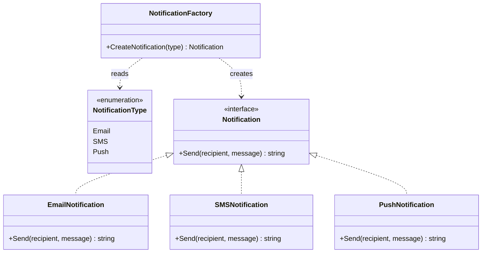

# Factory — Design Pattern

## Problem it solves
Client code often needs to create one of several related object types based on some runtime
input (a type flag, config value, or user selection), but scattering `new EmailNotification()`
/ `new SMSNotification()` / `new PushNotification()` calls (or their Go/Python equivalents)
across every call site tightly couples callers to every concrete type and duplicates the
selection logic. Factory centralizes that decision behind a single creation function/method
that takes a type discriminator and returns the result behind a shared interface, so callers
never construct concrete types directly and adding a new variant means touching one place.

## When to use it
- Client code needs to create objects but shouldn't be coupled to the concrete classes being
  created — it should only depend on the shared interface/abstract product.
- Which concrete type gets created is decided by runtime data (a type enum, a config string, a
  request field), and that decision logic would otherwise be duplicated at every call site.
- You want adding a new product variant to be a localized change (one new `case`) rather than a
  change scattered across the codebase.

🎯 Asked at: a very common creational warm-up, e.g. "design a notification factory that
creates Email/SMS/Push notification objects based on type" or "a shape factory."

**Example scenario**: a notification service needs to send messages through different
channels — email, SMS, push — chosen by a `NotificationType` at runtime. A
`CreateNotification(type)` factory function hides the concrete `EmailNotification` /
`SMSNotification` / `PushNotification` types behind a common `Notification` interface, so the
calling code just does `notification.Send(recipient, message)`.

## Class design



## Key trade-offs / talking points
- **Factory Method vs Abstract Factory**: this is the simpler Factory Method form — one
  function, one product hierarchy, selected by a type flag. Abstract Factory is a step up:
  a *family* of related factories, each producing a *set* of related products (e.g. a
  `LightThemeFactory` producing matching `Button`/`Checkbox`/`Scrollbar`) — worth mentioning
  if the interviewer extends the prompt to "what if notifications also need channel-specific
  retry policies and formatters, and they must all match."
- **Unknown-type handling is part of the design, not an afterthought**: `CreateNotification`
  returns an explicit `ErrUnknownNotificationType` rather than a nil/zero-value notification,
  so a bad type flag fails loudly at the creation boundary instead of causing a nil-pointer
  panic deep inside `Send`.
- **Where the factory should live**: a free function (as in the Go version) works fine for a
  single small product family; if construction needs shared dependencies (a logger, a config
  object) across products, promoting the factory to a struct/class with those dependencies
  injected once (as the Java version's `NotificationFactory` class does) avoids threading them
  through every call site.

## How to bring this up in the interview
Bring up Factory as soon as you see conditional object construction — an interviewer saying
"the type of X depends on Y" is inviting you to centralize that `switch`/`if` behind a factory
rather than let every caller re-implement the selection logic. Name the interface first
(`Notification`), then show the factory returning that interface so callers are decoupled from
the concrete types. If the interviewer pushes back with "why not just let callers call `new
EmailNotification()` directly," point out that this scatters the type-selection logic across
every call site, makes adding a new channel a multi-file change instead of a one-line addition
to the factory, and makes it impossible to swap in mocks or add shared construction logic (a
default sender ID, a logger) in one place later.

## References
- [Factory Method — Refactoring Guru](https://refactoring.guru/design-patterns/factory-method)
- Watch: [Factory Method Design Pattern Explained and Implemented in Java — Geekific (YouTube)](https://www.youtube.com/watch?v=EcFVTgRHJLM)

## Run it

**Go** (from `interview-prep/`):
```bash
go test ./lld/week-02-03-patterns/factory/go/...
```

**Java** (from `interview-prep/lld/week-02-03-patterns/factory/java/`):
```bash
javac -d out src/*.java
java -cp out Main
java -cp out FactoryTest
```

**Python** (from `interview-prep/lld/week-02-03-patterns/factory/python/`):
```bash
pytest test_factory.py -v
python3 factory.py   # runs the demo
```
