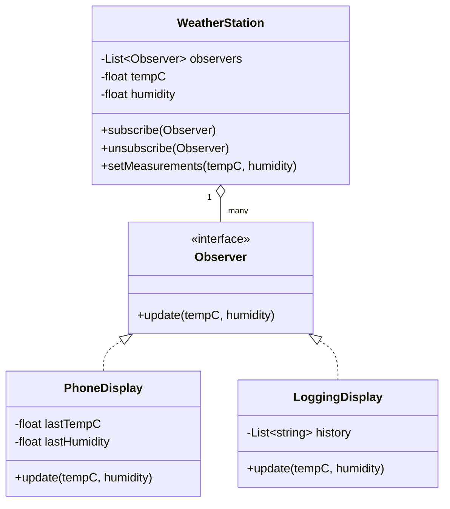

# Observer

## Problem it solves
Some objects need to react whenever another object's state changes, without that object
knowing the concrete types of everything that depends on it. Hardcoding calls into every
dependent class tightly couples the subject to its observers and doesn't scale as new
dependents are added. Observer defines a one-to-many dependency: a subject keeps a list of
observers and notifies them all through one shared interface whenever its state changes.

## When to use it
- Multiple parts of a system need to react to the same state change (a UI displaying
  several widgets bound to one data source; multiple services reacting to one event).
- You want to add or remove dependents at runtime without touching the subject's code.
- **Interview-relevant scenario**: "Design a `WeatherStation` (subject) that pushes
  temperature/humidity updates to any number of registered displays (phone app, website
  widget, logging service) without knowing which displays exist" — or, equivalently, a
  `StockPrice` subject notifying multiple trading-bot subscribers on every tick.

## Class design



## Key trade-offs / talking points
- Push vs pull: this implementation pushes the full new state (`tempC`, `humidity`) to
  observers; an alternative is to push just a reference to the subject and let observers
  pull the fields they need — trades payload size for coupling to the subject's API.
- Notification order is generally undefined/implementation-defined; don't build behavior
  that depends on which observer fires first.
- Beware notification cycles: an observer that mutates the subject during `update` can
  cause reentrant notification loops — keep observers side-effect-free toward the subject.
- Unsubscribing matters for lifecycle management — a subject holding references to
  garbage-collectable observers is a common memory-leak source in long-lived systems.

## How to bring this up in the interview
Propose Observer as soon as multiple, possibly-unknown-in-advance parts of a system need to
react to one object's state changes — say "I'd have the subject keep a list of subscribers
behind a shared interface and notify them all, so it never needs to know their concrete
types." If the interviewer pushes back with "why not just have the subject call each dependent
directly," point out that direct calls hardcode the subject to every current dependent, so
adding or removing a listener (a new display, a new downstream service) means editing the
subject's code — Observer lets dependents subscribe/unsubscribe at runtime without the subject
changing at all.

## References
- Read first: [Observer — Refactoring.Guru](https://refactoring.guru/design-patterns/observer)
- Watch: [The Observer Pattern Explained and Implemented in Java — Geekific (YouTube)](https://www.youtube.com/watch?v=-oLDJ2dbadA)

## Run it

**Go** (from `interview-prep/`):
```bash
go test ./lld/week-02-03-patterns/observer/go/...
```

**Java** (from `interview-prep/lld/week-02-03-patterns/observer/java/`):
```bash
javac -d out src/*.java
java -cp out Main
```

**Python** (from `interview-prep/lld/week-02-03-patterns/observer/python/`):
```bash
pytest test_observer.py -v
python3 observer.py   # runs the demo
```
