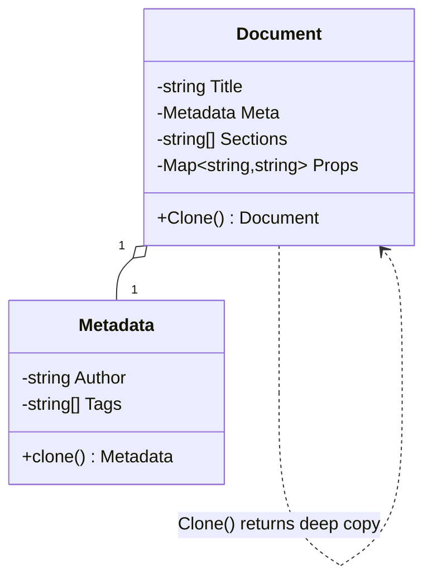

# Prototype — Design Pattern

## Problem it solves
Sometimes creating a new object is expensive or awkward to redo from scratch — the object has a
lot of internal state (a `Document` with metadata, sections, formatting), or its constructor needs
information the caller doesn't have (private fields, computed derived state). Prototype solves this
by cloning an existing, already-configured instance instead of rebuilding one field by field. The
tricky part — and the actual interview content — is that a **shallow copy** only duplicates the
top-level object and leaves nested mutable fields (slices, maps, nested objects) *shared* with the
original, so mutating the clone can silently corrupt the original. Prototype's `Clone()` must do a
**deep copy** of anything mutable and nested.

## When to use it
- You need many variations of a "base" object (a document template, a game entity, a shape) and
  re-running the full constructor/factory each time is wasteful or loses configured state.
- Objects are assembled through a complex process (builders, external I/O, config parsing) and you
  want a fast, in-memory way to get a fresh, independent copy without repeating that process.
- You want copy semantics that don't couple the calling code to the concrete class being copied —
  the interface just exposes `Clone()`.

🎯 Asked at: comes up as a follow-up in creational-pattern-focused LLD rounds ("now the interviewer
asks: what if two threads/features need to edit their own version of this template document
independently?") — a good vehicle for testing whether a candidate actually understands
reference vs. value semantics in their language of choice.

**Example scenario**: a document-editing service keeps a canonical `Document` (with `Metadata` and
a list of `Sections`) as a template; every time a user starts a new document from that template, the
service clones it rather than reconstructing it, and edits to the user's copy must never leak back
into the template.

## Class design



## Key trade-offs / talking points
- **Deep vs shallow copy**: `Document.Clone()` copies the `Sections` slice and `Props` map into new
  backing storage and calls `Metadata.clone()` (itself copying the `Tags` slice) rather than
  reassigning the same pointers/references — that's the difference that makes the pattern actually
  useful instead of a footgun. Each language's test suite here includes a "mutate the clone, assert
  the original didn't change" test for every nested field (tags, sections, props), and the Python
  suite explicitly contrasts `copy.copy` (shallow) against the pattern's deep `clone()` to show the
  shared-state bug shallow copy would introduce.
- **Language-native cloning support**: Go has no built-in clone/copy protocol, so `Clone()` is
  hand-written; Java's `Object.clone()` exists but is notoriously easy to get wrong (it's shallow by
  default and throws checked exceptions), so this implementation defines its own `deepClone()`
  instead of overriding `clone()`; Python's `copy.deepcopy` does the recursive copy for you, which is
  usually the more idiomatic choice there.
- **Cost of cloning vs rebuilding**: Prototype pays a linear copy cost proportional to the object
  graph size, which is still usually far cheaper than re-running whatever process originally
  produced the object (parsing, I/O, complex builder logic).

## How to bring this up in the interview
Raise Prototype when the prompt involves producing many independent variations of an
already-configured object (a template document, a game entity, a config preset) — say "I'd
clone the configured template rather than re-run whatever process built it, but I need to be
careful that `Clone()` deep-copies every nested mutable field so edits to a clone can't leak
back into the template." If the interviewer pushes back with "why not just call the same
constructor/factory again," point out that reconstruction only works if the caller still has
all the original inputs and the process is cheap to repeat (parsing, I/O, builder chains) —
Prototype is strictly better when the object was expensive or awkward to build the first time,
or when the caller only has the finished instance and none of the original construction
context.

## References
- [Prototype — Refactoring Guru](https://refactoring.guru/design-patterns/prototype)
- Watch: [Prototype Design Pattern Introduction — YouTube](https://www.youtube.com/watch?v=f1BG1tkqZQU)

## Run it

**Go** (from `interview-prep/`):
```bash
go test ./lld/week-02-03-patterns/prototype/go/...
```

**Java** (from `interview-prep/lld/week-02-03-patterns/prototype/java/`):
```bash
javac -d out src/*.java
java -cp out Main
java -cp out PrototypeTest
```

**Python** (from `interview-prep/lld/week-02-03-patterns/prototype/python/`):
```bash
pytest test_prototype.py -v
python3 prototype.py   # runs the demo
```
