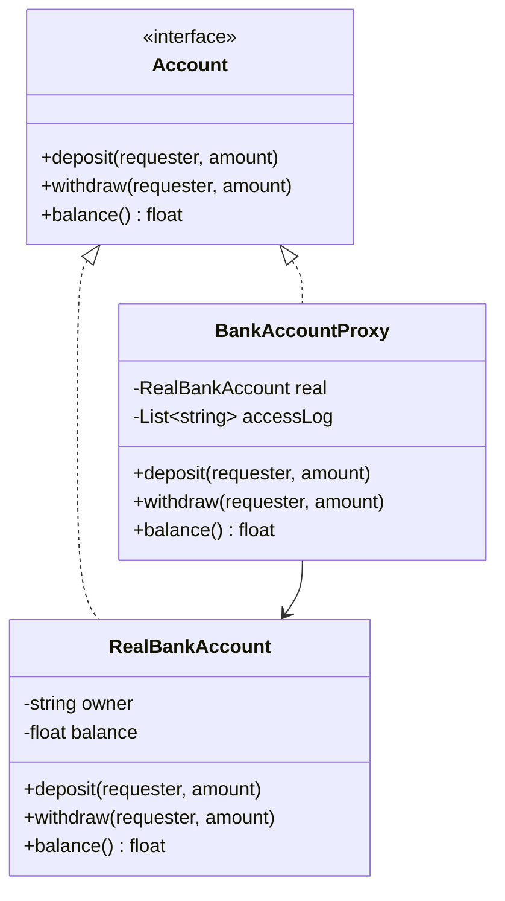

# Proxy

## Problem it solves
Sometimes you need to control access to an object without changing the object itself:
gate access checks in front of a sensitive resource, defer creation of an expensive
object until it's actually needed, or add caching/logging around calls to a remote
service. Proxy creates a substitute object that implements the same interface as the
real subject, and forwards (or blocks, or defers) calls to it.

## When to use it
- **Protection proxy**: restrict access based on caller identity/permissions (e.g. only
  the account owner may withdraw funds) without putting authorization logic inside the
  domain object itself.
- **Virtual proxy**: defer expensive construction (e.g. loading a large image or opening
  a remote connection) until the first real use.
- **Remote/caching proxy**: add a local stand-in for an object that lives elsewhere, or
  cache repeated results.
- **Interview-relevant scenario**: "Design a `BankAccountProxy` that only lets the account
  owner withdraw or deposit, and logs every access attempt" — the proxy sits between the
  caller and `RealBankAccount`, sharing its interface so callers can't tell the difference.

## Class design



## Key trade-offs / talking points
- Proxy and Facade both wrap other objects, but Proxy implements the *same* interface as
  the thing it wraps (so it's a drop-in substitute), while Facade defines a *new*,
  simplified interface over several unrelated subsystems.
- Proxy and Decorator have identical structure (both wrap an object behind a shared
  interface); they differ in *intent* — Proxy controls access/lifecycle, Decorator adds
  behavior/responsibilities.
- Putting authorization in the proxy rather than the real object keeps `RealBankAccount`
  free of cross-cutting concerns — it only knows how to move money, not who's allowed to.

## How to bring this up in the interview
Propose Proxy when a prompt needs access control, lazy/deferred construction, or logging
wrapped around an existing object without changing that object's own code — say "I'd put a
proxy in front of `RealBankAccount` that implements the same interface and checks the
requester before delegating, so authorization never has to live inside the domain object."
If the interviewer pushes back with "why not just add the permission check inside the real
object," point out that this mixes a cross-cutting concern (who's allowed to call this) into
code whose job is the domain logic itself (moving money), makes the real object harder to
reuse in contexts with different access rules, and means every future access-control change
touches the domain class instead of a dedicated wrapper.

## References
- Read first: [Proxy — Refactoring.Guru](https://refactoring.guru/design-patterns/proxy)
- Watch: [The Proxy Pattern Explained and Implemented in Java — Geekific (YouTube)](https://www.youtube.com/watch?v=TS5i-uPXLs8)

## Run it

**Go** (from `interview-prep/`):
```bash
go test ./lld/week-02-03-patterns/proxy/go/...
```

**Java** (from `interview-prep/lld/week-02-03-patterns/proxy/java/`):
```bash
javac -d out src/*.java
java -cp out Main
```

**Python** (from `interview-prep/lld/week-02-03-patterns/proxy/python/`):
```bash
pytest test_proxy.py -v
python3 proxy.py   # runs the demo
```
