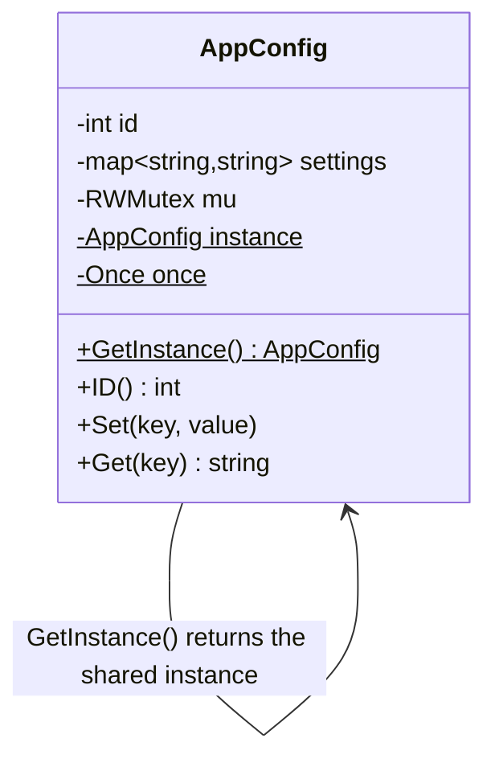

# Singleton — Design Pattern

## Problem it solves
Some objects genuinely must have exactly one instance for the whole process's lifetime — a
configuration manager, a connection pool, a logger — because multiple instances would mean
inconsistent state (two configs disagreeing) or wasted/conflicting resources (two pools
opening their own connections). Singleton guarantees a single shared instance and a single
global access point to it, while making sure that guarantee still holds when multiple threads
race to obtain the instance for the first time.

## When to use it
- Exactly one instance of a class must exist for the application's lifetime, and that
  constraint is a correctness requirement, not just a convenience (a config store, a hardware
  resource handle, a connection pool).
- You need one well-known global access point to that instance, instead of threading a
  reference through every constructor/function that needs it.
- **The actual interview content is almost always thread safety**: any candidate can write
  `if instance == null { instance = new Thing() }`, but that's a race condition under
  concurrent first access — two threads can both see `null` and construct two instances. The
  interview signal is knowing *why* that's broken and which fix to reach for.

🎯 Asked at: near-universal warm-up question, e.g. "design a thread-safe configuration
manager / connection pool / logger that must have exactly one instance" — cover thread-safety
approaches (double-checked locking, eager init, `sync.Once` in Go) since that's the real
interview signal for this pattern specifically.

**Example scenario**: an application-wide `AppConfig` holds runtime settings that every part
of the system reads and occasionally updates. It must be constructed exactly once even if
many goroutines/threads call `GetInstance()` concurrently on first access, and subsequent
calls must all return that same instance.

## Class design



## Key trade-offs / talking points
- **Thread-safety strategies, ranked by what interviewers expect you to know**:
  - *Eager initialization*: construct the instance at program/class load time (a package-level
    `var instance = &AppConfig{...}` in Go, or a `static final` field in Java). Simplest and
    inherently race-free, but pays the construction cost even if the singleton is never used,
    and can't take runtime parameters.
  - *Double-checked locking*: check `instance == nil` unlocked, lock, check again, then
    construct — avoids taking the lock on every call after the first, but is notoriously easy
    to get subtly wrong (needs a memory barrier / `volatile` in Java, or equivalent
    happens-before guarantees, or two threads can observe a partially-constructed object).
  - `sync.Once` (Go) / a static holder class (Java's initialization-on-demand holder idiom):
    lets the runtime guarantee "exactly once, thread-safe, lazy" without hand-rolling the
    locking — this implementation uses `sync.Once.Do`, which is the idiomatic Go answer and
    the one worth naming explicitly.
- **Why this implementation is provably safe under race**: the Go test suite launches many
  goroutines that all call `GetInstance()` concurrently on first access and asserts they all
  observe the same `ID()` — that's the concrete way to demonstrate (not just claim) correctness
  under a race, and it's worth proposing the same kind of test in an interview.
- **Singleton is a widely-criticized pattern**: it introduces global mutable state, makes unit
  testing harder (hidden dependency, hard to substitute a fake), and can hide poor lifecycle
  management. Prefer dependency injection of a single shared instance constructed once at
  startup where the framework/language supports it — reach for Singleton itself mainly when
  there's no DI container and the "exactly one, globally reachable" property is a hard
  requirement, not just a habit.

## How to bring this up in the interview
Singleton usually isn't something you *propose* — the prompt names it directly ("design a
config manager/connection pool/logger"), so the real signal is jumping straight past the naive
null-check to a named thread-safety strategy (`sync.Once`, the holder idiom, or eager init) and
explaining why the naive version races. If the interviewer pushes back with "why not just use a
global variable," explain that a bare global gives you none of the lazy-construction or
thread-safety guarantees — it either pays initialization cost unconditionally or races under
concurrent first access — and that Singleton's real value is bundling "exactly once, safe under
concurrency" behind one access point, not the global-ness itself. Also be ready to volunteer the
pattern's downsides (global state, hard to test/mock) unprompted — acknowledging them is itself
part of what a strong answer looks like here.

## References
- [Singleton — Refactoring Guru](https://refactoring.guru/design-patterns/singleton)
- Watch: [Singleton Design Pattern Explained and Implemented in Java — Geekific (YouTube)](https://www.youtube.com/watch?v=hUE_j6q0LTQ)

## Run it

**Go** (from `interview-prep/`):
```bash
go test ./lld/week-02-03-patterns/singleton/go/...
```

**Java** (from `interview-prep/lld/week-02-03-patterns/singleton/java/`):
```bash
javac -d out src/*.java
java -cp out Main
java -cp out SingletonTest
```

**Python** (from `interview-prep/lld/week-02-03-patterns/singleton/python/`):
```bash
pytest test_singleton.py -v
python3 singleton.py   # runs the demo
```
