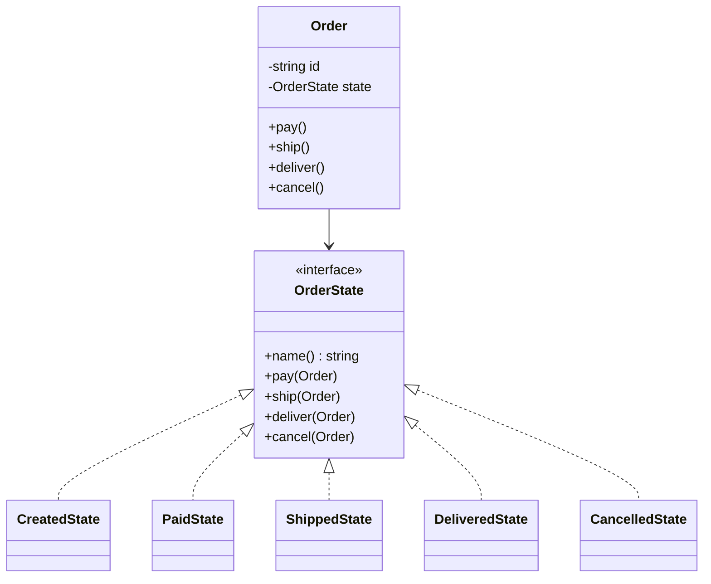
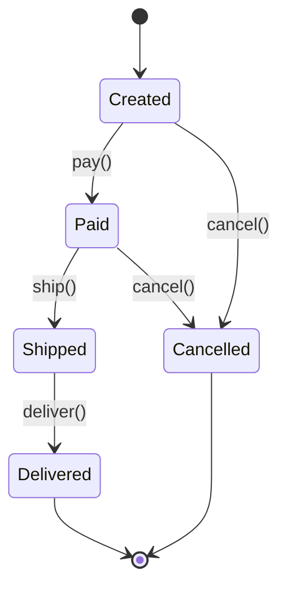

# State

## Problem it solves
An object's behavior needs to change based on its internal state, and the naive
implementation is a pile of `if state == X` / `switch(state)` checks scattered across every
method — which grows unmanageable as states and transitions multiply, and makes illegal
transitions easy to miss. State pattern extracts each state into its own class implementing
a shared interface; the context (the object whose behavior varies) holds a reference to its
current state object and delegates every state-dependent method call to it. Each state
decides which transitions are legal from itself.

## When to use it
- An object's behavior depends on a finite set of states, and switching between them should
  be explicit and centralized rather than scattered conditionals.
- You want illegal transitions to be a first-class error rather than a silently-ignored
  no-op or, worse, a corrupted object.
- **Interview-relevant scenario**: "Design an `Order` whose behavior changes across
  Created -> Paid -> Shipped -> Delivered, where cancellation is only allowed before
  shipping" — or a `TrafficLight` cycling Red -> Green -> Yellow -> Red, where each color
  only permits specific next colors.

## Class design





## Key trade-offs / talking points
- State vs Strategy: identical structure (context delegates to an interchangeable object),
  but State objects represent *what the context currently is* and transition into one
  another as a side effect of context methods; Strategy objects represent *how to do one
  job* and are typically swapped in by the client, not by each other (compare with the
  `strategy` pattern folder).
- Each concrete state here is stateless itself (no fields) so instances are cheap and could
  be singletons/flyweights in a real system — only `Order` carries per-instance data.
- Centralizing the transition table (which states allow which methods) inside the state
  classes makes it trivial to unit-test every illegal-transition case in isolation, which is
  exactly what the test suites below do.

## How to bring this up in the interview
Propose State when an object's allowed operations change depending on which of a *finite,
named* set of states it's currently in — say "I'd extract each state into its own class
implementing a shared interface, and have the context delegate to whichever state it's
currently holding, so illegal transitions are caught by the state itself instead of a
scattered `if` check." If the interviewer pushes back with "why not just keep a state enum and
`switch` on it in every method," point out that the switch approach re-derives "what's legal
from here" independently in every method (pay, ship, cancel, ...), which drifts out of sync as
states and transitions grow — centralizing each state's legal transitions in one class makes
illegal transitions a single, testable failure point instead of N places that all have to agree.

## References
- Read first: [State — Refactoring.Guru](https://refactoring.guru/design-patterns/state)
- Watch: [The State Pattern Explained and Implemented in Java — Geekific (YouTube)](https://www.youtube.com/watch?v=abX4xzaAsoc)

## Run it

**Go** (from `interview-prep/`):
```bash
go test ./lld/week-02-03-patterns/state/go/...
```

**Java** (from `interview-prep/lld/week-02-03-patterns/state/java/`):
```bash
javac -d out src/*.java
java -cp out Main
```

**Python** (from `interview-prep/lld/week-02-03-patterns/state/python/`):
```bash
pytest test_state.py -v
python3 state.py   # runs the demo
```
