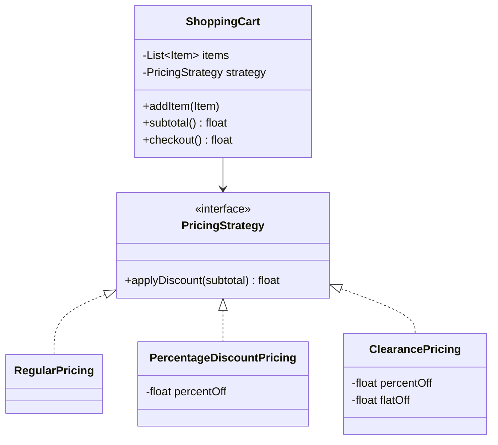

# Strategy

## Problem it solves
An object needs to support multiple interchangeable algorithms for doing the same job
(different pricing schemes, sort orders, route-planning heuristics), but you don't want a
tangle of `if/else` or `switch` branches inside the object, and you want new algorithms to
be addable without modifying existing code (open/closed principle). Strategy extracts each
algorithm into its own class implementing a shared interface, and the context object holds
a reference to one strategy, delegating to it instead of implementing the logic itself.

## When to use it
- You have several variants of an algorithm and need to pick one at runtime.
- A class is bloated with conditional logic that only changes which "way of doing X" is
  used — that logic belongs in separate strategy classes.
- **Interview-relevant scenario**: "Design a `ShoppingCart.checkout()` that applies
  different pricing rules — regular, percentage-off, clearance — chosen at runtime without
  changing `ShoppingCart` itself" — the same shape works for payment-method selection,
  route-finding algorithms, or compression codecs.

## Class design



## Key trade-offs / talking points
- Strategy vs State: both wrap interchangeable behavior behind an interface, but Strategy
  variants are typically chosen once by the client and don't know about each other, while
  State variants often transition into one another and represent the object's identity at
  a point in time (see the `state` pattern folder for the distinction in practice).
- Strategy adds a class per algorithm — for two or three trivial variants, a plain function
  parameter/lambda can be simpler than a full interface hierarchy in languages that support
  first-class functions.
- Because the strategy is injected (constructor or setter), the context is trivially
  testable in isolation from any specific algorithm — mock/stub strategies drop right in.

## How to bring this up in the interview
Propose Strategy the moment you see a method with a `switch`/`if-else` chain selecting between
variants of the same computation (pricing rules, sort orders, payment methods) — say
explicitly that you'd extract each branch into its own class behind a shared interface so new
variants can be added without touching the existing ones (open/closed principle). If the
interviewer pushes back with "why not just keep the `switch` statement, it's simpler," concede
that for two stable variants a `switch` or a first-class function/lambda is genuinely simpler
and cheaper — but note that Strategy earns its keep once variants are expected to grow, need
their own state/config, or need to be independently unit-testable and swappable at runtime
(e.g. injected per request or per customer tier).

## References
- Read first: [Strategy — Refactoring.Guru](https://refactoring.guru/design-patterns/strategy)
- Watch: [The Strategy Pattern Explained and Implemented in Java — Geekific (YouTube)](https://www.youtube.com/watch?v=Nrwj3gZiuJU)

## Run it

**Go** (from `interview-prep/`):
```bash
go test ./lld/week-02-03-patterns/strategy/go/...
```

**Java** (from `interview-prep/lld/week-02-03-patterns/strategy/java/`):
```bash
javac -d out src/*.java
java -cp out Main
```

**Python** (from `interview-prep/lld/week-02-03-patterns/strategy/python/`):
```bash
pytest test_strategy.py -v
python3 strategy.py   # runs the demo
```
